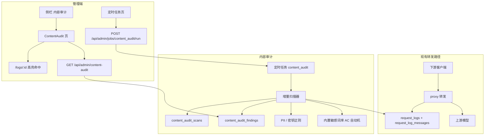

# 内容审计命中清单

Feature Name: log-content-audit
Updated: 2026-08-30

## Description

在现有 LLM 网关管理端增加「内容审计」能力：对已入库的 `request_logs` / `request_log_messages` 做事后扫描，产出命中项。管理员通过独立页面和独立管理 API 浏览命中清单，再钻取到原会话。扫描作为循环定时任务 `content_audit` 接入现有任务框架，默认每 24 小时跑一次，支持在定时任务页手动执行。

转发路径保持不变。第一版检测三类：完整开源敏感词库、PII 正则、密钥正则。

## Architecture

扫描与转发解耦：`proxy` 只写日志；`content_audit` 读日志、写命中。任务进程内单飞，与 `catalog` / `quota` 相同。

## Components and Interfaces

### 1. 扫描服务 `app/services/content_audit.py`

职责：从进度表取出待扫请求记录，抽出消息纯文本，跑三类检测器，去重写入命中项，更新扫描进度。

单轮批次上限建议 200 条请求记录（可按消息量再降）。一轮未扫完则保留游标，下一轮（定时或手动）接着跑。扫描在线程池中执行 CPU 密集匹配，避免堵住 FastAPI 事件循环。

增量条件：

- 请求记录尚无扫描进度行
- 或 `request_logs.updated_at`（无则 `created_at`）晚于该记录 `last_scanned_at`
- 或该记录消息最大 `seq` 大于进度里记录的 `last_message_seq`

已扫过且无变化的记录跳过。

### 2. 检测器

| 检测器 | 实现 | 数据 |
|---|---|---|
| 敏感词 | `pyahocorasick` 一次扫描 | 运行时从 konsheng/Sensitive-lexicon 下载并缓存，扫描时编译自动机 |
| PII | 预编译正则 + 身份证校验位 + 银行卡 Luhn | 代码内规则 |
| 密钥 | 预编译高置信正则 | 代码内规则 |

词库路径：与数据库同级的 `sensitive-lexicon/`。首次扫描若缓存为空，从 GitHub 下载分类 txt；之后复用本地缓存。下载或加载失败时本轮仍跑 PII / 密钥，任务记为部分成功。

文本抽取：把 `content_json` 解成纯文本（字符串、多模态 `text` 字段、tool_calls 参数 JSON 序列化后一并扫）。

命中去重键：`(log_id, message_seq, category, rule_key, start_offset)`。

摘录：命中片段前后合计不超过 120 字。列表接口对 PII / 密钥做遮罩；详情页原文仍走现有 logs 权限。

### 3. 定时任务接入

扩展现有框架，不新建调度器：

- `jobs.py`：`JOB_CONTENT_AUDIT = "content_audit"` 加入 `LOOP_JOBS`
- `job_settings.py`：默认 `interval_seconds: 86400`
- `_execute`：调用 `content_audit.run_scan_batch()`
- `JOB_META`：名称「内容审计扫描」，说明「每 24 小时增量扫描请求正文，产出敏感词 / PII / 密钥命中」
- 忙碌、立即请求、改间隔：复用 `/api/admin/jobs/{id}/run` 与 `PATCH`

启动行为与其它 loop 任务一致：进程起来先跑一轮，之后按间隔等待。正式服存量靠首轮 + 未完成游标分批扫完。

### 4. 管理 API `app/routers/admin_content_audit.py`

前缀 `/api/admin/content-audit`，管理员 JWT。

| 方法 | 路径 | 作用 |
|---|---|---|
| GET | `/findings` | 分页命中项。查询：`category`、`lexicon_category`、`severity`、`api_key_id`、`page`、`page_size` |
| GET | `/summary` | 最近一轮状态、已扫请求数 / 总请求数、命中总数、按类别计数、词库更新时间 |
| POST | `/lexicon/sync` | 强制从上游重新下载词库并覆盖缓存 |

不把命中查询塞进 `/api/admin/logs`。

### 5. 前端

- 路由 `/content-audit`，侧栏「内容审计」，PC 与移动端都进主导航（移动底栏仍保持不超过 5 项，内容审计放侧栏滑动菜单）
- 页顶：扫描状态条（运行中 / 成功 / 失败 / 部分成功 + 进度 + 上次完成时间 + 词库更新时间 + 同步词库按钮），链到 `/jobs`
- 主体：筛选 + 命中表格（PC）/ 卡片（移动）
- 行点击：`/logs/{log_id}?seq={message_seq}&hl={start}-{end}` ，详情页高亮对应气泡与片段
- 定时任务页自动出现新卡片，无需单独「立即扫描」按钮

## Data Models

### `content_audit_findings`

| 字段 | 类型 | 说明 |
|---|---|---|
| id | INTEGER PK | 命中项标识 |
| log_id | INTEGER INDEX | 请求记录 |
| message_seq | INTEGER | 消息序号；请求级正文用 `-1` |
| category | VARCHAR(16) | `sensitive` / `pii` / `secret` |
| lexicon_category | VARCHAR(64) NULL | 敏感词原库分类 |
| rule_key | VARCHAR(128) | 词条或规则名 |
| severity | VARCHAR(16) | `high` / `medium` / `low` |
| excerpt | TEXT | 带上下文摘录（库内原文，列表接口再遮罩） |
| start_offset | INTEGER | 纯文本中的起始偏移 |
| end_offset | INTEGER | 结束偏移 |
| api_key_id | INTEGER NULL | 冗余，便于筛 |
| api_key_name | VARCHAR(128) NULL | 快照 |
| account_name | VARCHAR(128) NULL | 快照 |
| created_at | DATETIME INDEX | 命中写入时间 |

唯一约束：`(log_id, message_seq, category, rule_key, start_offset)`。

严重级别约定：密钥 `high`；PII 中身份证/银行卡 `high`，手机/邮箱 `medium`；敏感词默认 `medium`，词库分类含暴恐/违禁时 `high`。

### `content_audit_scans`

每条请求记录一行进度：

| 字段 | 类型 | 说明 |
|---|---|---|
| log_id | INTEGER PK | 请求记录 |
| last_scanned_at | DATETIME | 上次成功扫完该记录的时间 |
| last_message_seq | INTEGER | 已覆盖到的最大 seq |
| finding_count | INTEGER | 该记录累计命中 |
| status | VARCHAR(16) | `ok` / `error` |
| error_message | TEXT NULL | 单记录失败原因 |

另用任务 `extra` 存本轮汇总：`processed`、`new_findings`、`remaining`、`lexicon_ok`。不必再做全局 runs 表。

## Correctness Properties

- 转发路径在扫描失败或运行中时仍按现有逻辑写日志并回响应。
- 同一去重键不会出现两条命中项。
- 增量扫描在消息未变化时跳过该请求记录。
- `content_audit` 同一时刻只有一个执行者；第二路立即请求得到 409。
- 词库加载失败时 PII 与密钥命中仍写入。
- 列表接口返回的密钥与证件类摘录经过遮罩；偏移量仍指向原文。

## Error Handling

| 场景 | 处理 |
|---|---|
| 词库文件缺失或损坏 | 本轮跳过敏感词，PII/密钥照常，`last_ok=true` 且 `error_message` 说明部分成功 |
| 单条消息 JSON 损坏 | 记该记录 `status=error`，继续下一条 |
| 任务已在运行 | 409，文案与现有任务一致：「任务正在运行」 |
| 进程中途退出 | 已提交命中保留；未更新进度的记录下一轮重扫 |
| 扫描线程异常 | 任务 `last_ok=false`，内容审计页展示失败摘要 |

## Test Strategy

- 检测器单测：敏感词命中与分类、PII 四类正反例（身份证校验位、银行卡 Luhn）、密钥形态、去重键、摘录长度、遮罩。
- 增量：同一记录扫两次不新增命中；追加消息后只对新增 seq 出命中。
- 任务：注册进 `list_jobs`；间隔默认 86400；busy 时 409；词库失败时仍有 PII 命中。
- API：未登录 401；筛选组合；分页上限 100。
- 前端：有独立路由与导航文案即可在实现阶段用现有页面模式覆盖，不强制 E2E。

## References

- 需求：当前工作区 `.monkeycode/specs/2026-08-30-log-content-audit/requirements.md`
- 现有任务框架：当前工作区 `backend/app/services/jobs.py`、`backend/app/routers/admin_jobs.py`
- 现有日志：当前工作区 `backend/app/routers/admin_logs.py`、`frontend/src/pages/Logs.tsx`
- 词库：https://github.com/konsheng/Sensitive-lexicon
- 竞品漏斗：Langfuse / LangSmith Annotation Queue、Helicone 过滤、Portkey Guardrails（本功能只做事后命中，不做实时拦截）
