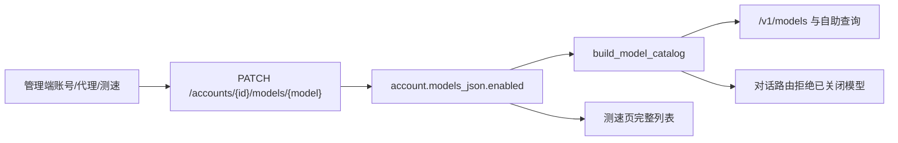

# 按模型启用或关闭

Feature Name: model-enable-toggle
Updated: 2026-08-31

## Description

在已入库的 `ModelRecord` 上增加 `enabled` 标记。管理端账号与网关代理页可切换；公开目录、自助查询和对话路由只使用已启用模型；测速页使用完整模型列表，失败或超时可一键关闭。

## Architecture

刷新上游模型时，`enrich_model_records` 按模型 ID 保留已有 `enabled` 与 `overrides`。

## Components and Interfaces

- `ModelRecord.enabled`：默认 `true`；写入 `models_json`
- `PATCH /api/admin/accounts/{id}/models/{model_id}`：增加 `enabled`
- `build_model_catalog(..., include_disabled=False)`：公开目录默认跳过关闭模型
- 测速接口不检查 `enabled`，可对关闭模型发探测

## Data Models

`models_json` 条目增加 `enabled: bool`，缺省视为启用。该字段独立于 `overrides`，恢复识别不会改变开关。

## Correctness Properties

- 关闭状态在「获取模型 / 刷新模型」后仍在
- `/v1/models`、自助查询、CC Switch 配置只含启用模型
- 测速目标包含关闭模型

## Error Handling

对话请求已关闭模型时返回 400，说明该模型已关闭。账号尚未入库任何模型时保持原有透传行为。

## Test Strategy

覆盖：刷新保留开关、公开目录过滤、对话拒绝、自助查询隐藏、测速仍可调用已关闭模型。
