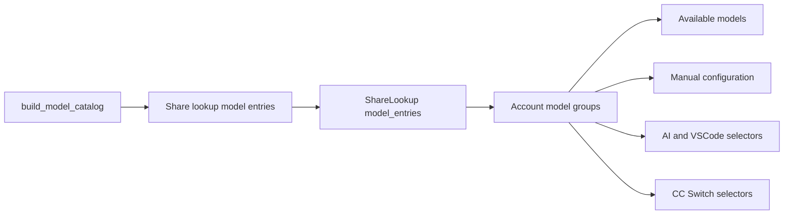

# API Key 自助查询模型账号归属设计

Feature Name: share-model-account-visual
Updated: 2026-08-31

## Description

自助查询页将模型列表从单层标签集合升级为按账号分组的模型目录。后端提供模型与账号的显式映射，前端根据绑定优先级分配稳定的顺序色，并在查询结果、手动配置、AI 配置、CC Switch 和 VSCode 导入流程中复用同一映射。

## Visual Direction

整体延续现有深色工业界面和 IBM Plex 字体。账号分组使用低饱和背景、彩色左边线和小型账号徽标，模型标签使用同色半透明底和边框，避免大面积高亮造成视觉噪声。

### Account Palette

| 优先级索引 | 名称 | 主色 | 用途 |
|---|---|---|---|
| 0 | Signal | `#c8f542` | 第一优先账号 |
| 1 | Info | `#6ec8ff` | 第二账号 |
| 2 | Violet | `#a78bfa` | 第三账号 |
| 3 | Orange | `#fb923c` | 第四账号 |
| 4 | Pink | `#f472b6` | 第五账号 |
| 5 | Cyan | `#22d3ee` | 第六账号 |

账号超过 6 个时按索引循环调色板。所有色彩均与账号名称共同出现，颜色承担快速扫描作用，文字承担准确识别作用。

## Layout

### Query Result Model Directory

- 标题行显示“可用模型”和模型总数。
- 内容区按账号优先级排列。
- 移动端为单列账号卡片。
- `sm` 及以上宽度为两列账号卡片。
- 每张卡片顶部包含账号色点、账号名称、来源标签、“优先 1”等顺序文本和模型数量。
- 卡片主体使用紧凑的模型胶囊标签；公开模型 ID 为主文本，存在前缀转换时可在提示信息中显示原始模型 ID。

### Manual Configuration

手动配置复用相同分组组件，并为模型标签增加按钮交互。点击后复制公开模型 ID，悬停和键盘聚焦时提升同色背景亮度。

### Selection Dialogs

- `ModelPickDialog` 的模型项扩展 `accountName`、`accountIndex` 和 `searchText` 字段。
- 模型项左侧使用账号色边线，模型名下方显示账号徽标和能力提示。
- 搜索同时匹配模型 ID、账号名称和能力提示。
- `CcSwitchDialog` 使用 `optgroup` 按账号分组，组标题格式为“优先 1 · 账号名称”。原生 `option` 负责准确文本识别。
- `VscodeImportDialog` 接收模型归属映射，将账号信息传入 `ModelPickDialog`。

## Architecture



## Components and Interfaces

### Backend Catalog Serialization

在 `backend/app/routers/share.py` 中基于一次 `build_model_catalog(item)` 生成模型 ID、能力信息和账号归属，保持三类数据来自同一目录快照。

新增响应字段：

```json
{
  "model_entries": [
    {
      "id": "account-prefix/model-a",
      "raw_id": "model-a",
      "account_id": 12,
      "account_name": "主账号",
      "account_source": "upstream",
      "provider": "openai_generic",
      "account_index": 0
    }
  ]
}
```

现有 `models` 和 `model_caps` 字段继续保留，供现有调用方使用。

### Frontend Types

`ShareLookup` 增加：

```ts
type ShareModelEntry = {
  id: string
  raw_id: string
  account_id: number
  account_name: string
  account_source: 'upstream' | 'agent'
  provider: string
  account_index: number
}
```

### AccountModelGroups

在 `Share.tsx` 内建立轻量分组组件，输入 `lookup`、可选点击回调和交互模式。该组件仅服务自助查询页，保持改动集中。

分组算法：

1. 按 `lookup.accounts` 建立账号顺序。
2. 使用 `model_entries.account_id` 将模型归入账号。
3. 仅渲染包含模型的账号组。
4. 旧响应缺少 `model_entries` 时创建单个“可用模型”兼容组。

### Shared Account Color

新增纯函数 `accountColor(index)`，返回边框、背景、文字和色点对应的 Tailwind 静态 class 组合。使用静态映射确保 Tailwind 构建能够收集所有类名。

## Data Models

`model_entries` 是派生数据，不写入数据库。每次查询根据 API Key 的活动账号和模型目录生成。

正确性约束：

- 每个 `model_entries.id` 在响应内唯一。
- 每个 `model_entries.id` 均存在于 `models`。
- `account_index` 对应 `accounts` 数组中的账号位置。
- `model_entries` 顺序与 `models` 顺序一致。

## Correctness Properties

1. 同一模型在查询结果和全部导入流程中展示相同账号名称。
2. 同一账号在一次查询结果中始终使用相同账号色。
3. 第一优先账号始终使用 Signal 绿色。
4. 复制和导入始终使用公开模型 ID。
5. 账号状态变化后，下一次查询结果与当前可路由模型目录一致。

## Error Handling

- 缺少 `model_entries`：退化为现有扁平模型列表，页面继续可用。
- 模型条目引用未知账号：使用条目自带账号名称，并按 `account_index` 分配颜色。
- 空模型列表：显示管理员获取模型提示。
- 长账号名或模型名：卡片标题截断并提供 `title`，模型 ID 允许断行。

## Test Strategy

### Backend

- 单账号模型返回完整归属。
- 多账号不同模型按账号顺序返回归属。
- 多账号重复模型返回正确的公开 ID、原始 ID和账号归属。
- 不可用账号的模型不进入 `model_entries`。
- `models`、`model_caps` 与 `model_entries` ID 顺序一致。

### Frontend

- 查询结果按账号分组，第一账号使用 Signal 色。
- 后续账号按顺序使用调色板。
- 手动配置点击模型复制公开模型 ID。
- AI 配置和 VSCode 弹窗显示账号名称并支持按账号搜索。
- CC Switch 下拉框按账号生成 `optgroup`。
- 旧响应缺少 `model_entries` 时显示兼容列表。
- 375px 移动视口使用单列且无横向溢出。
- 1280px 桌面视口使用双列账号组。

## References

- `frontend/src/pages/Share.tsx`：自助查询页面与模型展示。
- `frontend/src/components/ModelPickDialog.tsx`：AI 配置和 VSCode 共用模型选择器。
- `frontend/src/components/CcSwitchDialog.tsx`：CC Switch 模型选择。
- `backend/app/routers/share.py`：自助查询接口。
- `backend/app/services/key_models.py`：公开模型目录及路由归属。
