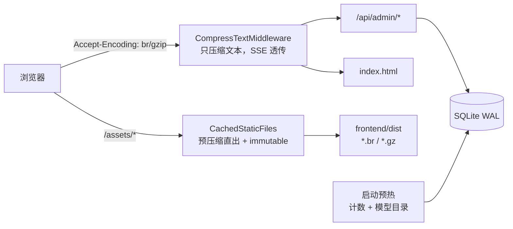

# 后端接口与前端资源加载提速

Feature Name: perf-api-assets-speedup
Updated: 2026-09-10
Branch: `260910-perf-api-assets-speedup`

## Description

线上由单个 uvicorn 进程同时提供管理端 API、网关转发与前端静态资源，前面没有 Nginx/CDN。用户反馈「首次访问有时候接口特别慢，有时候又还行」。本文记录用正式服规模数据（`request_logs` 6156 条、`content_audit_findings` 16489 条、≤5 并发）复现后的根因，以及对应的修复。

## 根因（均有实测数据）

### 1. 首屏传输量：单包未压缩 + 渲染阻塞字体（首因）

| 现象 | 实测 |
| --- | --- |
| 入口 JS 单包 583 KB，明文传输 | 18 个页面全部静态导入；`gzip -9` 后 163 KB、brotli 后 135 KB |
| CSS 63 KB 明文 | gzip 后 11.6 KB |
| Google Fonts 样式表阻塞首屏 | 11.5 KB CSS + 28 条 `@font-face`，且 `fonts.googleapis.com` 在大陆不可靠 |
| SW 首次安装预缓存 990 KB | 其中图标 361 KB，且修订版条目以 `cache:'reload'` 绕过 HTTP 缓存 |
| `/assets/*` 无 `Cache-Control` | 只有 ETag/Last-Modified，浏览器按启发式缓存，部署后窗口≈0，每次访问都回源校验 |

这组问题正好解释「首次访问慢、有时又还行」：第一次要下载全部资源，之后命中浏览器/SW 缓存。

### 2. 进程冷启动：首次请求贵 13 倍

同一进程内实测 `/api/admin/dashboard`：冷启动首次 **121 ms**，预热后 **9 ms**。原因是 SQLite 连接与页缓存冷、模型目录（`data/models_dev_cache.json` 4.9 MB）惰性解析都压在了第一个用户请求上。

### 3. 并发放大：5 个并发把接口拖慢 3–20 倍

| 接口 | 1 并发 | 5 并发 |
| --- | --- | --- |
| `/api/admin/dashboard` | 5.4 ms | 42.5 ms |
| `/api/admin/content-audit/summary` | 7.0 ms | 36.5 ms |
| `/api/admin/benchmark/history` | 1.7 ms | 33.9 ms |
| `/api/admin/logs` | 1.6 ms | 8.5 ms |

原因是少数 `async def` 路由里直接跑同步 DB/CPU 计算（阻塞事件循环，审计实测随并发 1× 线性劣化），以及响应未压缩带来的传输量。

### 4. 随数据增长会持续恶化的查询

- 排行榜/仪表盘每次都把 `benchmark_results` 全表取出再在 Python 去重（2 万条结果时 **153 ms**）。
- `/api/admin/benchmark/history` 用 `selectinload` 把每一行的 results 都读出来只为算两个计数（20 次运行 × 1000 结果时 **162.8 ms**，SQL 聚合只要 **0.48 ms**）。
- 内容审计 `/summary` 被前端每 2 秒轮询一次，每次都跑 `max(seq) GROUP BY log_id`（4.3 万条消息）+ 5 个聚合。
- `request_logs` 缺少 `status`/`model` 过滤索引，`/api/admin/keys` 的用量汇总缺少覆盖索引。

### 5. 用实验排除的假设

- **SQLite 写锁竞争**：在持续写入（模拟网关落库，20 事务/秒）下，管理接口读延迟中位仍为 2.3 ms（WAL 生效），未被阻塞。
- **深分页**：`OFFSET 99,980` 在 50 万行上仅 1.19 ms。
- **序列化 / 加密 / 连接池**：均为 0.1–0.7 ms 量级，不是瓶颈。

## Architecture

## Components and Interfaces

### 后端

- `app/static_assets.py`
  - `CachedStaticFiles`：给静态资源补 `Cache-Control`；存在 `.br`/`.gz` 产物且客户端接受时直接发送，类型仍按原始文件名推断。
  - `CompressTextMiddleware`：按内容类型白名单压缩（`text/*`、`application/json`、`javascript`、`svg`），`text/event-stream` 与图片/字体透传；解析 `Accept-Encoding` 的 q 值，客户端没要求就不压缩。
  - `accepts_encoding()` / `parse_accept_encoding()`：`gzip;q=0`、`*` 等语义。
- `app/main.py`
  - `/assets` 挂载 `CachedStaticFiles`（`public, max-age=31536000, immutable`）。
  - 图标 `public, max-age=86400`；`index.html`/`sw.js`/`manifest`/`workbox-*` 保持 `no-cache`。
  - 静态路由改用 `api_route(..., methods=["GET", "HEAD"])`，修复 HEAD 落到 SPA 兜底的问题；文件缺失返回 404 而不是 500。
  - 启动时 `_warm_up()`：预热主要计数查询与模型目录，把冷启动成本从第一个用户挪到启动阶段。
- `app/services/leaderboard.py`：`_latest_successful_benchmarks` 只回看最近 `BENCHMARK_LOOKBACK_RUNS = 30` 次运行。**没有**把 payload 组装丢进线程池：实测 5 并发下 `asyncio.to_thread` 反而更慢（正式服规模 35 ms vs 15 ms），因为组装是 GIL 绑定的 Python 计算，线程只增加切换与连接争用。
- `app/routers/admin_benchmark_history.py`：列表用 SQL 聚合出 `result_count`/`success_count`，不再 `selectinload` 全量结果。
- `app/routers/admin_logs.py`：列表用 `load_only`，不读 `request_body`/`response_body`/`reasoning_json`。
- `app/db.py`：新增索引（见下）。

### 前端

- `src/App.tsx`：除 Dashboard/Login 外的页面改为 `React.lazy` + `Suspense`；`QueryClient` 设 `staleTime: 30s`、`refetchOnWindowFocus: false`。
- `vite.config.ts`：`build.rolldownOptions.output.advancedChunks` 拆出 `vendor`；`globIgnores` 把图标移出 SW 预缓存，`index.html` 进预缓存并启用 `navigateFallback`。
- `index.html` + `src/index.css`：删除 Google Fonts 阻塞样式表，改为自托管 latin 子集 + `font-display: swap`。
- `src/components/PwaUpdate.tsx`：SW 注册推迟到 `load` 之后，不再和首屏抢带宽。
- 轮询与重复请求：`Tools` 仅在下发中轮询，`ContentAudit` 空闲轮询降到 60 s，`keyAccounts`/`keys` 的重复 query key 合并。

## Data Models

无表结构变更，只新增索引（`db.py::_ensure_columns` 内 `CREATE INDEX IF NOT EXISTS`）：

| 索引 | 支撑的查询 |
| --- | --- |
| `request_logs(status, created_at)` | 记录审计按状态过滤 |
| `request_logs(model)` | 按模型过滤 |
| `request_logs(api_key_id, created_at, total_tokens)` | `/api/admin/keys` 用量汇总（覆盖索引） |
| `skills(updated_at, id)` | Skills 列表排序 |
| `content_audit_findings(category)` / `(severity)` | 命中项过滤与按类别统计 |
| `benchmark_results(ok, output_tokens_per_second)` | 排行榜/仪表盘测速前 N |

## Correctness Properties

- 压缩不得改变解压后的正文；SSE 必须逐块下发，且不做压缩。
- 客户端未声明 `Accept-Encoding`（或 `q=0`）时不压缩。
- `/assets/*` 才允许 `immutable`；`index.html`、`sw.js`、`manifest` 必须保持 `no-cache`。
- HEAD 与 GET 返回同一路径的元数据，绝不回落到 SPA。
- 排行榜「每个模型最新一次成功测速」的排序语义（`created_at DESC, id DESC` 取首条）不变。
- 记录列表不返回正文字段的行为不变；详情接口仍返回正文。

## Error Handling

- 静态文件缺失返回 404（原来是 500）。
- 预热失败只记录、不影响启动。
- 压缩只在响应未带 `content-encoding` 且状态码不是 204/304 时进行。

## Test Strategy

- `tests/test_static_assets.py`：缓存头、br/gzip/identity 协商、q 值、类型白名单、SSE 不压缩、已压缩响应不重复压缩。
- `tests/test_spa.py`：HEAD 与 GET 元数据一致、缺失文件 404、SPA 兜底与 API 不回落的既有约束。
- `tests/test_benchmark.py`：测速历史列表计数与详情一致性。
- 基准：`scripts/perf_bench.py`（正式服规模 + 增长规模两份数据），`scripts/perf_seed_scale.py` 造数。
