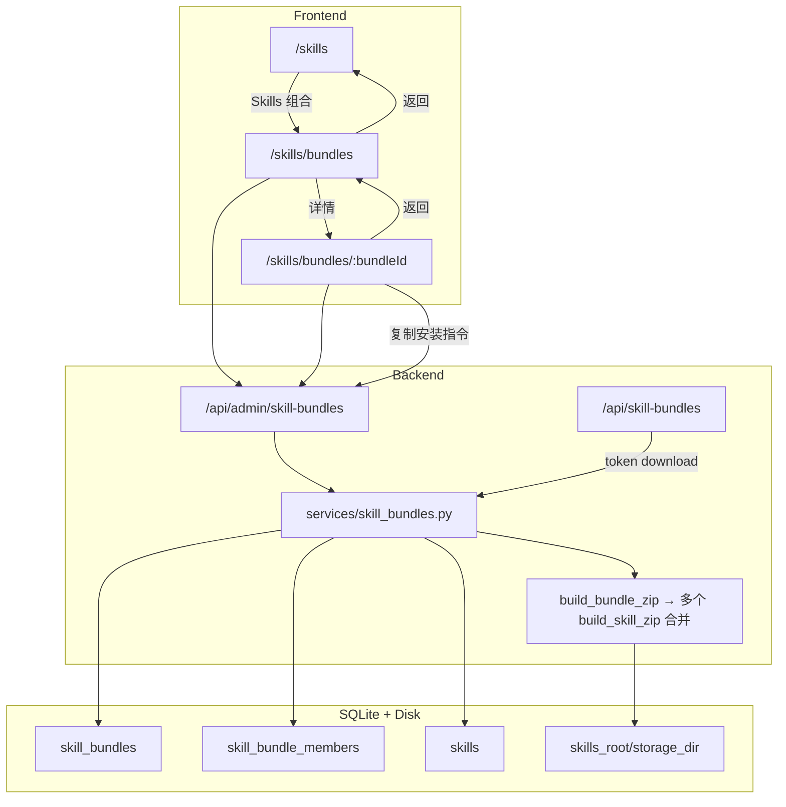

# Skills 组合（Skill Bundles）

Feature Name: skill-bundles  
Updated: 2026-09-13

## Description

在现有 Skills 仓库上增加一等公民「组合包」：管理员将已入库 Skill 编成命名集合，支持 CRUD、成员增删、整包 zip 下载（每个 Skill 一个顶层目录），以及 5 分钟 JWT 安装指令。UI 为 Skills 下的二级列表 + 详情，左上角分层返回。

## Architecture



**决策**

| 项 | 选择 | 理由 |
|----|------|------|
| 路由 | 静态 `/skills/bundles` 写在 `/skills/:skillId` **之前** | 避免 `bundles` 被当成 skillId |
| 成员 | 关联表，不复制文件 | 与需求一致；Skill 删除后成员可失效 |
| Zip | 根下并列 `{slug}/...` | 与单 Skill zip 一致，AI 安装可循环处理子目录 |
| Token | 复用 skills 的 JWT 模式，`scope=skill_bundle` | 与 download/upload token 同构 |
| 模块 | 独立 `admin_skill_bundles` + `skill_bundles` service | 避免 `admin_skills.py` 继续膨胀 |

## Components and Interfaces

### Backend routes

**Admin** `APIRouter(prefix="/api/admin/skill-bundles", dependencies=[get_current_admin])`

| Method | Path | 说明 |
|--------|------|------|
| GET | `/` | 列表；query `q` 匹配 name/description |
| POST | `/` | 创建；body `{name, description?}` |
| GET | `/{bundle_id}` | 详情 + 成员（含 skill 摘要；失效成员 `skill: null` 或 `missing: true`） |
| PATCH | `/{bundle_id}` | 更新 name/description |
| DELETE | `/{bundle_id}` | 删组合 + 成员行，不动 Skill |
| POST | `/{bundle_id}/members` | body `{skill_ids: number[]}`；去重；仅已存在 Skill |
| DELETE | `/{bundle_id}/members/{skill_id}` | 移除关联 |
| GET | `/{bundle_id}/download` | 鉴权整包 zip |
| POST | `/{bundle_id}/download-url` | 签发 token；无有效成员则 400 |

**Public** `APIRouter(prefix="/api/skill-bundles")`（无 admin 依赖）

| Method | Path | 说明 |
|--------|------|------|
| GET | `/{bundle_id}/download?token=` | 校验 JWT 后返回 zip |

在 `main.py` 注册两个 router（与 `admin_skills` / `download_router` 并列）。

### JWT payload（组合包下载）

```text
scope: "skill_bundle"
bundle_id: int
sub: admin.username
ver: admin.token_version
iat, exp: now + 300s
```

校验：签名、exp、scope、bundle_id 路径一致、Admin 存在、`ver` 匹配。

### Zip 构建

```text
build_bundle_zip(bundle, db):
  members = ordered by member.id asc
  for each member:
    skill = db.get(Skill, member.skill_id)
    if skill is None: skip
    append all files from skill storage as "{slug}/relative/path"
  if no files written: raise BundleError("组合包没有可打包的 Skill")
  return zip bytes
```

Content-Disposition：`{bundle_slug_or_id}-skills.zip`（可用 `_slugify(name)` 或 `bundle-{id}`）。

### Frontend

| 文件 | 职责 |
|------|------|
| `App.tsx` | 增加 `/skills/bundles`、`/skills/bundles/:bundleId`；**写在** `/skills/:skillId` 前 |
| `pages/SkillBundles.tsx` | 列表、搜索、创建、删除、入口返回 Skills |
| `pages/SkillBundleDetail.tsx` | 元数据编辑、成员列表、添加（搜索已入库 Skill）、移除、下载、复制安装指令、返回列表 |
| `lib/api.ts` | bundle CRUD / members / download / download-url |
| `lib/skillInstall.ts` | `buildBundleInstallText(bundle, url)` |
| `pages/Skills.tsx` | 顶栏增加「Skills 组合」按钮 → `navigate('/skills/bundles')` |

### 安装文案要点

- 下载组合 zip（5 分钟有效）
- 解压后根目录为多个 `{slug}/`
- 将每个目录安装到本机 Agent skills 根下（示例 `~/.claude/skills/{slug}/`，由 AI 判断实际路径）
- 已存在则备份后覆盖

## Data Models

### `skill_bundles`

| 列 | 类型 | 约束 |
|----|------|------|
| id | Integer PK | |
| name | String(128) | NOT NULL |
| description | Text | NOT NULL default `''` |
| created_at | DateTime | index |
| updated_at | DateTime | |

名称首版不强制唯一。

### `skill_bundle_members`

| 列 | 类型 | 约束 |
|----|------|------|
| id | Integer PK | |
| bundle_id | Integer FK → skill_bundles.id ON DELETE CASCADE | |
| skill_id | Integer | 逻辑引用 skills.id，**不设 FK ON DELETE CASCADE**（Skill 删除后保留行以便展示失效）或设 FK ON DELETE CASCADE 则失效项自动消失——**选用：无 DB FK 到 skills，仅应用层校验添加；Skill 删除后成员行仍在，详情标 missing** |
| created_at | DateTime | |

唯一约束：`(bundle_id, skill_id)`。

SQLite：`Base.metadata.create_all` 建新表即可；无需 `_ensure_columns` 除非后续加列。

### API schema（Pydantic）

- `SkillBundleCreate` / `SkillBundleUpdate` / `SkillBundleOut`（含 `member_count`）
- `SkillBundleDetailOut`（`members: list[BundleMemberOut]`）
- `BundleMemberOut`：`skill_id`, `added_at`, `skill: SkillOut | null`, `missing: bool`
- `BundleMembersAdd`：`skill_ids: list[int]`
- `BundleMembersAddResult`：`added`, `skipped: list[{skill_id, reason}]`

## Correctness Properties

1. 组合包删除不删除任何 `skills` 行与 `storage_dir`。
2. 成员 `skill_ids` 仅能引用添加时存在的 Skill；重复添加跳过。
3. Zip 根目录仅含各 skill 的 `slug/`，无组合包外壳目录。
4. 公开下载与鉴权下载字节结构一致（同一 `build_bundle_zip`）。
5. Token TTL 固定 300 秒；`token_version` 递增后旧 token 失效。
6. 无有效成员时：download 与 download-url 均失败（4xx）。
7. 前端路由 `/skills/bundles` 不与 `/skills/:skillId` 冲突。

## Error Handling

| 场景 | 行为 |
|------|------|
| 名称空 | 400 |
| bundle 不存在 | 404 |
| 添加不存在的 skill_id | skipped 或 部分成功 + skipped 列表 |
| 空包下载 | 400「组合包没有可打包的 Skill」 |
| token 无效 | 401/403，文案与 skills token 风格一致 |
| Skill 文件缺失（磁盘） | 该成员跳过或整包 404；建议单成员 `SkillError` 时 skip 并若全部失败则 400 |

## Test Strategy

**后端** `tests/test_skill_bundles.py`

1. CRUD 创建/列表/详情/改名/删除；删除后 skill 仍在。
2. 添加成员、重复添加 skipped、移除成员。
3. 鉴权 zip：两 skill → zip 内两个顶层目录且含 `SKILL.md`。
4. 空包 download / download-url → 400。
5. download-url + 无 Bearer 公开下载成功。
6. 过期 / 错 scope / 错 bundle_id / token_version 吊销 → 401/403。
7. Skill 删除后详情成员 `missing=true`；zip 仅含剩余有效成员。

**前端**：手工 / 预览——入口、返回层级、长名称不撑破、复制指令 toast。

## Implementation Outline

1. models + schemas + `services/skill_bundles.py`（CRUD、members、zip、token helpers 可内联 router）
2. `routers/admin_skill_bundles.py` + public download router；`main.py` 注册
3. tests
4. frontend api + install text + 两页 + Skills 入口 + 路由顺序
5. README Skills 段补一行

## References

- 需求：`.monkeycode/specs/2026-09-13-skill-bundles/requirements.md`
- 单 Skill zip / token：`backend/app/routers/admin_skills.py`、`backend/app/services/skills.py` `build_skill_zip`
- 安装文案：`frontend/src/lib/skillInstall.ts`
- 路由：`frontend/src/App.tsx`
