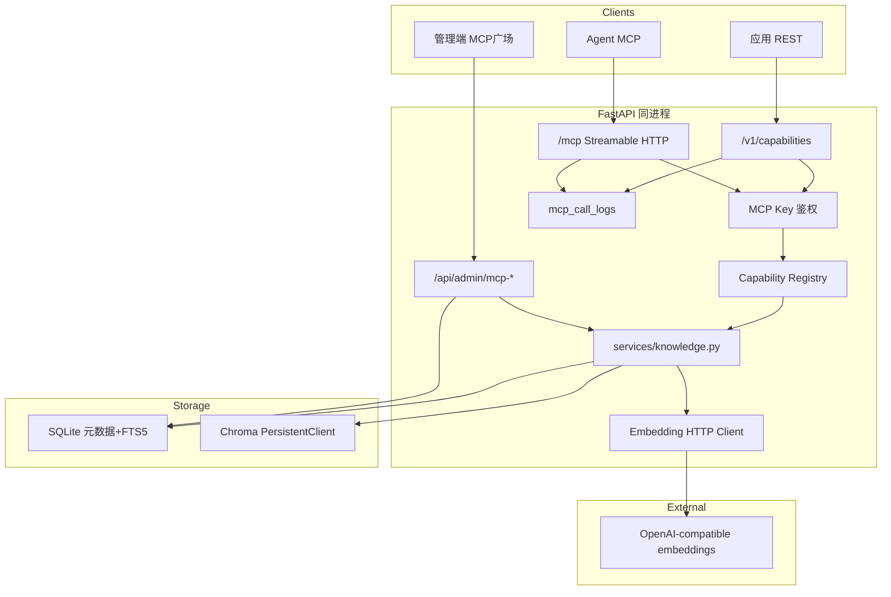

# 能力平面 + MCP 广场 + 知识库 MVP

Feature Name: capability-platform-kb  
Updated: 2026-09-15

## Description

在现有 LLM Gateway 同进程内增加**能力平面**：可插拔 Capability、独立 MCP Key（与聊天 `sk-` 分表）、按 Key 白名单授权、REST + MCP 双协议、统一调用日志。管理端一级入口 **「MCP 广场」**。第一版落地能力 `knowledge`：纯文本入库、SQLite FTS5 全文、Chroma 向量（embedding 走 OpenAI 兼容 HTTP）、`vector` / `fulltext` / `hybrid` 检索（hybrid 向量失败时降级全文）。

## Architecture



**决策**

| 项 | 选择 | 理由 |
|----|------|------|
| 鉴权 | 独立表 `mcp_keys`，前缀 `mcp-` | 需求明确与聊天 Key 隔离 |
| 授权粒度 | Key × `capability_id` | 本版不做知识库级 ACL |
| 协议 | REST + MCP 同业务函数 | 防双份逻辑漂移 |
| MCP 传输 | 官方 `mcp` SDK Streamable HTTP，挂载 `/mcp` | 远程 Agent 友好 |
| 向量库 | Chroma `PersistentClient` | 热门、本地持久、API 简单 |
| 全文 | SQLite FTS5 外部内容表 | 零新中间件，与现库一致 |
| Embedding | env 配置 OpenAI 兼容 HTTP | 用户选定；测试注入 Fake |
| hybrid 降级 | 向量失败 → 全文 + `degraded` | 需求 R8 |
| vector 失败 | 503 + 明确 message | 禁止静默改全文 |
| 入库向量失败 | 文档+FTS 仍保存，`vector_status=failed/pending`，详情页「重新向量化」 | 可运维 |
| 管理入口 | 导航「MCP 广场」`/mcp-plaza` | 用户命名 |
| 移动端 Tab | 不挤进底部 5 Tab；侧栏 + 概览可进 | 遵守「底部不超过 5 项」 |

## Components and Interfaces

### 1. Capability Registry（代码级）

路径建议：`backend/app/capabilities/`

```text
capabilities/
  __init__.py          # get_registry()
  base.py              # CapabilitySpec, Provider protocol
  registry.py          # register / get / list_enabled
  knowledge/
    provider.py        # 实现 Provider
    tools.py           # MCP tool 定义与 handler 绑定
```

```python
# base.py 概念接口
class CapabilitySpec:
    capability_id: str          # e.g. "knowledge"
    name: str
    description: str
    version: str                # "1.0.0"
    category: str               # e.g. "rag"
    status: Literal["enabled", "disabled"]  # 全局开关，可后续落 DB；MVP 代码常量 + 可选 env 覆盖

class Provider(Protocol):
    def list_mcp_tools(self) -> list[ToolDef]: ...
    async def dispatch(self, operation: str, payload: dict, ctx: CallContext) -> dict: ...
```

`CallContext`：`mcp_key_id`、`db` session、`request_id`。

新增能力：实现 Provider → `registry.register` → 自动进入广场目录、REST 路由分发、MCP tools（仍受 Key 白名单过滤）。

### 2. MCP Key 鉴权

路径：`backend/app/services/mcp_auth.py`（**禁止**调用 `resolve_api_key`）

| 函数 | 行为 |
|------|------|
| `generate_mcp_key()` | `mcp-` + `secrets.token_urlsafe(32)` |
| `hash_mcp_key(raw)` | 与现网关相同 SHA-256 风格（可复用 `hash_api_key` 算法，表分离） |
| `resolve_mcp_key(db, raw)` | 查 `mcp_keys`；仅 `active` |
| `assert_capability_allowed(db, key, capability_id)` | 无行 → 403 |
| `extract` | 与 deps 相同：优先 `x-api-key`，否则 `Authorization: Bearer` |

聊天 `sk-` 出现在 MCP 路径 → `resolve_mcp_key` 失败 → **401**（测试锁定）。

### 3. REST：`/v1/capabilities`

Router：`backend/app/routers/capabilities_public.py`（无 admin JWT）

| Method | Path | 说明 |
|--------|------|------|
| GET | `/v1/capabilities` | 当前 Key 已授权且 enabled 的列表 |
| GET | `/v1/capabilities/{capability_id}` | 契约；未授权 403；不存在/disabled 404 |
| POST | `/v1/capabilities/knowledge/search` | body 见下 |
| GET | `/v1/capabilities/knowledge/bases` | 列举知识库（只读；需 knowledge 授权） |

**Search body**

```json
{
  "kb_id": "uuid-or-string",
  "query": "string",
  "mode": "hybrid",
  "top_k": 5
}
```

**Search response**

```json
{
  "kb_id": "...",
  "mode": "hybrid",
  "degraded": false,
  "degraded_reason": null,
  "hits": [
    {
      "chunk_id": "...",
      "document_id": "...",
      "text": "...",
      "score": 0.0,
      "source_name": "notes.md"
    }
  ]
}
```

统一错误：`{"error":{"type":"...","message":"...","code":"..."}}`  
类型约定：`authentication_error` / `permission_error` / `invalid_request` / `not_found` / `vector_unavailable` / `internal_error`。

超时：`settings.mcp_capability_timeout_seconds` 默认 60。

### 4. MCP 挂载

- 依赖：`mcp`（官方 SDK）写入 `requirements.txt`
- 在 `lifespan` 中启动 session manager（与 SDK 文档一致）
- `app.mount("/mcp", mcp_asgi_app)` 或等价 Starlette Mount
- 鉴权：从 HTTP Header 取 MCP Key；无效则 401
- `list_tools`：遍历 Key 白名单 ∩ registry，展开各 Provider 的 tools
- `call_tool`：解析 tool 名 → capability + operation → 同一 `dispatch`，写 `mcp_call_logs`

**MVP tools（capability=knowledge）**

| Tool | 参数 | 对应 |
|------|------|------|
| `knowledge_list` | 无 | 列知识库 |
| `knowledge_search` | `kb_id`, `query`, `mode?`, `top_k?` | 同 REST search |

工具名全局唯一；后续能力用前缀避免冲突（如 `ocr_image`）。

### 5. Admin API

Router 前缀建议：

- `/api/admin/mcp/keys`
- `/api/admin/mcp/knowledge`
- `/api/admin/mcp/calls`
- `/api/admin/mcp/catalog`（可选，只读 registry）

均 `Depends(get_current_admin)`。

**MCP Keys**

| Method | Path | 说明 |
|--------|------|------|
| GET | `/api/admin/mcp/keys` | 列表（无完整明文） |
| POST | `/api/admin/mcp/keys` | `{name, capability_ids: string[]}`；**至少 1 个** capability；响应含一次性 `key` |
| PATCH | `/api/admin/mcp/keys/{id}` | name / status |
| PUT | `/api/admin/mcp/keys/{id}/capabilities` | 全量替换白名单；不允许空列表 |
| DELETE | `/api/admin/mcp/keys/{id}` | 级联授权与（可选）保留日志 |

**Knowledge**

| Method | Path | 说明 |
|--------|------|------|
| GET/POST | `/api/admin/mcp/knowledge/bases` | 列表 / 创建 `{name, description?}` |
| PATCH/DELETE | `/api/admin/mcp/knowledge/bases/{kb_id}` | 改名描述 / 级联删 |
| GET | `/api/admin/mcp/knowledge/bases/{kb_id}/documents` | 文档列表 |
| POST | `/api/admin/mcp/knowledge/bases/{kb_id}/documents` | multipart `file` 或 JSON `{text, source_name?}` |
| DELETE | `/api/admin/mcp/knowledge/bases/{kb_id}/documents/{doc_id}` | 级联 chunk/fts/chroma |
| POST | `/api/admin/mcp/knowledge/bases/{kb_id}/documents/{doc_id}/reembed` | 重新向量化 |
| POST | `/api/admin/mcp/knowledge/bases/{kb_id}/search` | 管理端试检索（管理员 JWT，不消耗 MCP Key） |

**Calls**

| Method | Path | 说明 |
|--------|------|------|
| GET | `/api/admin/mcp/calls` | query: `limit`, `offset`, `capability_id?`, `mcp_key_id?` |

### 6. Knowledge 服务

路径：`backend/app/services/knowledge.py` + `embedding.py` + `chunking.py`

**分块**：字符窗口默认 `chunk_size=700`，`chunk_overlap=100`；按段落优先断开；空块丢弃。

**入库流程**

1. 校验大小 ≤ `mcp_knowledge_max_bytes`（默认 2MiB）
2. 写 `knowledge_documents`
3. 分块 → `knowledge_chunks` + FTS 插入
4. 调 embedding → upsert Chroma（collection 名 `kb_{kb_id}`）
5. 成功 `vector_status=ready`；失败 `failed` + `vector_error`，FTS 仍可用

**检索**

| mode | 行为 |
|------|------|
| fulltext | FTS5 `MATCH` 查询，bm25 或 rank 映射为 score |
| vector | embed(query) → Chroma query；上游失败或 collection 空向量 → **503** `vector_unavailable` |
| hybrid | 两边各取 `top_k`，按 `chunk_id` 去重；score = max 或 0.6*vec+0.4*ft（实现选一种写死）；向量失败 → 仅全文 + `degraded=true` |

**Chroma**：`PersistentClient(path=settings.mcp_chroma_path)`；id=chunk_id；metadata 含 kb_id, document_id, source_name。

**Embedding 客户端**

```text
POST {base}/embeddings
Authorization: Bearer {api_key}
{"model": "...", "input": ["text", ...]}
```

解析 `data[].embedding`。支持 batch（单次最多 64 段，可配置）。  
Settings：

```text
mcp_embedding_base_url
mcp_embedding_api_key
mcp_embedding_model
mcp_chroma_path=data/chroma
mcp_knowledge_max_bytes=2097152
mcp_chunk_size=700
mcp_chunk_overlap=100
mcp_capability_timeout_seconds=60
```

测试：`app.services.embedding.get_embedding_client` 可依赖覆盖为 `FakeEmbeddingClient`（hash 向量固定维 32）。

### 7. Frontend：MCP 广场

| 文件 | 职责 |
|------|------|
| `Layout.tsx` | `links` 增加 `{ to: '/mcp-plaza', label: 'MCP 广场', icon: Store 或 Boxes }` |
| `App.tsx` | 路由见下 |
| `pages/McpPlaza.tsx` | 落地页：子导航 Tab（服务目录 / 知识库 / MCP Key / 调用记录 / 接入说明） |
| `pages/McpKnowledge.tsx` | 库列表 |
| `pages/McpKnowledgeDetail.tsx` | 文档、上传、试检索、重新向量化 |
| `pages/McpKeys.tsx` | Key CRUD、授权勾选、创建后展示一次性明文 |
| `pages/McpCalls.tsx` | 调用日志表 |
| `lib/api.ts` | 上述 admin API 封装 |

路由：

```text
/mcp-plaza
/mcp-plaza/knowledge
/mcp-plaza/knowledge/:kbId
/mcp-plaza/keys
/mcp-plaza/calls
/mcp-plaza/docs
```

PC：左侧栏进广场后页内 Tab；移动：顶部分段或二级列表，避免突破底部 5 Tab。

### 8. main.py / 配置 / 依赖

- `include_router` 注册 public capabilities + admin mcp routers
- lifespan：`init_db` 后确保 FTS 表；启动 Chroma 目录；MCP session manager
- `requirements.txt` 增加：`chromadb`、`mcp`（钉下限版本，实现时查 PyPI 现用稳定版）
- `.env.example` 增加 embedding 与 chroma 配置项
- Vite `proxy`：已有 `/v1`、`/api`；确认 `/mcp` 代理到后端（`vite.config.ts` 增加 `/mcp`）

## Data Models

### mcp_keys

| 列 | 类型 | 说明 |
|----|------|------|
| id | int PK | |
| name | str(128) | |
| key_hash | str(64) unique | |
| key_encrypted | text | Fernet，后台可再展示前缀以外策略：默认不回显全文 |
| key_prefix | str(32) | 如 `mcp-xxxx` |
| status | str(16) | active/disabled |
| created_at | datetime | |
| last_used_at | datetime null | |

### mcp_key_capabilities

| 列 | 类型 | 说明 |
|----|------|------|
| id | int PK | |
| mcp_key_id | FK cascade | |
| capability_id | str(64) | 如 knowledge |
| Unique(mcp_key_id, capability_id) | | |

### mcp_call_logs

| 列 | 类型 | 说明 |
|----|------|------|
| id | int PK | |
| created_at | datetime | index |
| mcp_key_id | int null | |
| mcp_key_name | str | 冗余 |
| mcp_key_prefix | str | 冗余 |
| capability_id | str | |
| operation | str | search/list/... |
| success | bool | |
| latency_ms | int | |
| error_message | str null | 截断 500 |
| request_meta_json | text null | 可选，不含密钥 |

### knowledge_bases

| 列 | 类型 |
|----|------|
| id | str PK (uuid) |
| name | str(128) |
| description | text |
| created_at / updated_at | datetime |

### knowledge_documents

| 列 | 类型 |
|----|------|
| id | str PK |
| kb_id | FK cascade |
| source_name | str(256) |
| content_size | int |
| chunk_count | int |
| vector_status | str | pending/ready/failed |
| vector_error | text null |
| created_at | datetime |

### knowledge_chunks

| 列 | 类型 |
|----|------|
| id | str PK |
| document_id | FK cascade |
| kb_id | index |
| chunk_index | int |
| text | text |
| source_name | str |

### knowledge_chunks_fts（FTS5）

```sql
CREATE VIRTUAL TABLE knowledge_chunks_fts USING fts5(
  text,
  content='knowledge_chunks',
  content_rowid='rowid'
);
-- 或 content 同步触发器；实现选 SQLAlchemy 事件或手写 trigger
```

SQLite 无真正 FK 到 FTS；删除 chunk 时同步删 FTS 行。

## Correctness Properties

1. 聊天 `api_keys` 中任意 active key 调用 `/v1/capabilities/*` 或 `/mcp` → 401。
2. MCP Key 未授权 `knowledge` → search/list/tools 均不可见或 403。
3. 全局 capability disabled → 即使用户白名单有 id，仍 404/不可见。
4. `fulltext` 在 embedding 配置为空时仍可 200。
5. `vector` 在 embedding 失败时不得返回全文 hits 冒充成功。
6. `hybrid` 在 embedding 失败时 `degraded=true` 且 hits 仅来自 FTS。
7. 删除 document/base 后 Chroma 与 FTS 无残留 id（测试可查 collection count / fts count）。
8. 创建 Key 响应外的任何 GET 不返回完整明文 key。
9. REST 与 MCP 对同一 search 参数返回语义一致的 hits 集合（允许 score 浮点误差）。

## Error Handling

| 场景 | HTTP | type |
|------|------|------|
| 无/错 MCP Key | 401 | authentication_error |
| 未授权 capability | 403 | permission_error |
| kb 不存在 | 404 | not_found |
| query 空 | 400 | invalid_request |
| 上传超限 | 413 | invalid_request |
| vector 模式向量不可用 | 503 | vector_unavailable |
| embedding 超时 | 503 | vector_unavailable |
| 内部未捕获 | 500 | internal_error |

调用无论成败写 `mcp_call_logs`（鉴权失败可选不写或写 key_id=null，实现选：**鉴权失败不写**，授权后失败写）。

## Test Strategy

目录：`backend/tests/test_mcp_keys.py`、`test_capabilities_api.py`、`test_knowledge.py`、`test_mcp_protocol.py`（能单测 registry+auth 则优先；完整 MCP 握手可用 httpx ASGI + 最小 fake）。

| 用例焦点 | 断言 |
|----------|------|
| Key 隔离 | sk- → 401；mcp- → 200 |
| 白名单 | 无 knowledge → 403；tools 不含 knowledge_* |
| CRUD kb | 创建/上传/列表/删 |
| FTS | 上传含独特词 → fulltext 命中 |
| Fake embed | vector 命中；关 fake 模拟失败 |
| hybrid 降级 | mock embed raise → degraded |
| 级联删 | chroma/fts 干净 |
| 管理端 API | admin JWT 可试检索 |

CI：`cd backend && pytest -q`；conftest 设临时 `mcp_chroma_path` 与 Fake embedding。

## Implementation Notes（给执行者）

1. **表创建**：沿用 `init_db` / `Base.metadata.create_all`；FTS 用 raw SQL 在 init 钩子执行一次。
2. **不要**把 MCP 逻辑塞进 `proxy.py`；独立 router。
3. Chroma 与 embedding 可能阻塞：`asyncio.to_thread` 或 async httpx。
4. 单机假设：多 worker 时 Chroma 目录锁可能冲突——文档写明建议单 worker 或后续迁远程 Chroma。
5. 前端风格对齐 Skills / Keys 页（卡片、Dialog、notifyOk/Bad）。
6. 接入说明页写清：Cursor MCP URL `https://站/mcp`，Header `Authorization: Bearer mcp-...`。

## References

- 需求：`.monkeycode/specs/2026-09-15-capability-platform-kb/requirements.md`
- 网关原设计：`docs/superpowers/specs/2026-08-14-llm-gateway-design.md`
- 鉴权参考：`backend/app/deps.py`、`backend/app/routers/proxy.py`
- 组合包模块切分参考：`backend/app/routers/admin_skill_bundles.py`
- MCP Python SDK：Streamable HTTP + FastAPI/Starlette mount
- Chroma：`PersistentClient` + collection add/query
