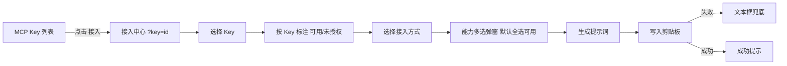
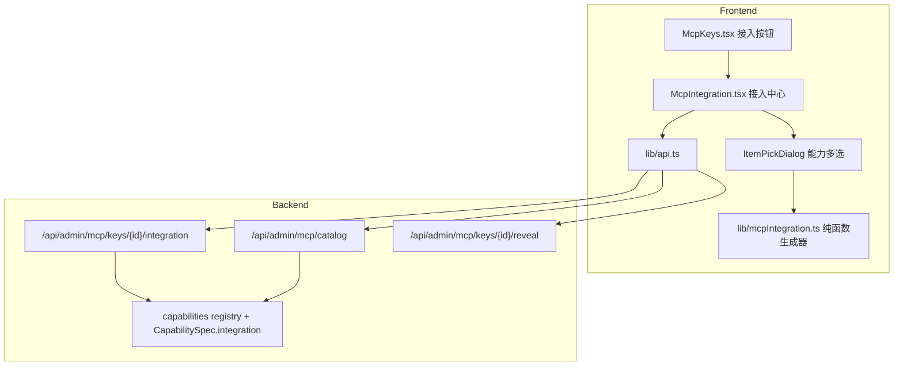

# MCP 接入中心（Integration Center）

Feature Name: 2026-09-26-mcp-integration-center
Updated: 2026-09-26

## Description

把静态「接入说明」页升级为按 MCP Key 生成的**接入中心**。管理员选择一把 Key 后，页面只展示该 Key 已授权的能力，并为 MCP、Skill + REST、客户端配置、快速参考四种接入方式分别生成可整段复制给 AI 的文本。核心交互复用 Share 页「选择模型并复制 AI 配置」：选对象 → 多选能力 → 一键复制 → 失败时文本框兜底。

已确认范围：

- 提示词直接包含明文密钥。
- Skill + REST 只提供「复制提示词」，不产出可下载的 SKILL.md。
- 客户端配置只给通用 MCP JSON，由 AI 自行适配具体客户端。

关键点：

- **按 Key 过滤**：部分 Key 只授权部分能力，接入内容必须与之对齐。
- **双范式**：既支持 MCP，也支持「提示词 + REST」这种不依赖 MCP 的接入。
- **注册表驱动**：端点与约束来自能力元数据，新增能力自动出现，前端不硬编码。
- **复用**：密钥查看复用 `GET /api/admin/mcp/keys/{id}/reveal`，选择弹窗复用 `ModelPickDialog`，复制兜底复用其预览文本框。

## Interaction Design

### 页面结构（`/mcp-plaza/docs`，PC 双栏 / 移动上下堆叠）

```text
┌ 接入中心 ───────────────────────────────────────────────┐
│ Key 选择器 [ agent-prod (mcp-xxxx · active) ▾ ]          │
│ 能力: [knowledge✓] [docparse✓] [site] [未授权项灰显]      │
│ 端点: MCP <origin>/mcp   REST <origin>   [复制密钥]       │
├───────────────────────────┬─────────────────────────────┤
│ 接入方式                   │ 内容区                       │
│  ● MCP                    │ 端点、Header、工具列表        │
│  ○ Skill + REST           │ REST 端点分组                 │
│  ○ 客户端配置              │ 通用 MCP client JSON         │
│  ○ 快速参考                │ 每能力 curl / tools 片段      │
│                           │                              │
│  [复制为 AI 提示词] [复制配置]                            │
└───────────────────────────┴─────────────────────────────┘
```

### 主要流程



### 能力多选弹窗

复用 `ModelPickDialog` 的形态：搜索、全选当前/清空、逐项勾选、统计、复制。把文案参数化（搜索占位、计数单位）后即可承载「能力」而不是「模型」。默认选中该 Key 全部可用能力。

## Architecture



## Components and Interfaces

### 1. 能力接入元数据（后端）

在 `CapabilitySpec`（`backend/app/capabilities/base.py:29`）增加可选字段：

```python
@dataclass
class CapabilitySpec:
    ...
    # 接入中心元数据：REST 端点、注意事项
    integration: dict[str, Any] = field(default_factory=dict)
```

约定结构：

```python
integration = {
    "rest_endpoints": [
        {"method": "POST", "path": "/v1/sites", "summary": "上传 zip 部署站点", "content_type": "multipart/form-data"},
        {"method": "GET", "path": "/v1/sites/{slug}", "summary": "站点详情与版本"},
    ],
    "notes": [
        "MCP archive_base64 解码后不超过 10MB，更大文件走 REST multipart",
        "部署为异步，返回 unpacking 后轮询版本状态到 ready",
    ],
}
```

`registry.catalog_payload()`（`backend/app/capabilities/registry.py:46`）增加 `"integration": spec.integration`，使前端一次拿到所有能力文档。

三个内置能力的元数据补齐：

| 能力 | REST 端点 | 注意事项 |
|------|-----------|----------|
| `knowledge` | `/v1/capabilities/knowledge/search`、`/v1/capabilities/knowledge/bases` | 检索 mode、top_k、受限库白名单 |
| `docparse` | `/v1/capabilities/docparse/jobs` 等 | 格式、30MB、200 页、结果 7 天 |
| `site` | `/v1/sites`、`/v1/sites/{slug}/access` 等 | 异步轮询、10MB MCP 上限、令牌模式 |

### 2. 接入信息接口（后端）

`GET /api/admin/mcp/keys/{key_id}/integration`（管理员鉴权，见 `admin_mcp_keys.py`）：

```json
{
  "origin": "https://站点",
  "mcp_url": "https://站点/mcp",
  "rest_base_url": "https://站点",
  "key": {"id": 1, "name": "agent-prod", "key_prefix": "mcp-xxxx", "status": "active",
          "capability_ids": ["knowledge", "site"]},
  "capabilities": [
    {"capability_id": "knowledge", "name": "知识库", "description": "...",
     "version": "1.0.0", "status": "enabled", "admin_path": "...", "icon": "book",
     "authorized": true, "integration": {"rest_endpoints": [], "notes": []},
     "tools": [{"name": "knowledge_search", "description": "...", "input_schema": {}}]}
  ]
}
```

- `origin` 取 `settings.app_base_url`，为空时回退到请求的 `base_url`，避免前端猜域名。
- 不返回明文密钥；明文仍由 `reveal` 按需获取。
- `authorized` = 该 Key 的 `allowed_capability_ids` 是否包含能力。

### 3. 接入中心页面（前端）

| 文件 | 改动 |
|------|------|
| `frontend/src/pages/McpIntegration.tsx` | 新页面，替换 `McpDocs.tsx`；路由保持 `mcp-plaza/docs` |
| `frontend/src/components/ItemPickDialog.tsx` | 由 `ModelPickDialog` 泛化（文案参数化），供能力多选复用 |
| `frontend/src/lib/mcpIntegration.ts` | 纯函数生成器：MCP 提示词、REST 提示词、通用客户端配置 |
| `frontend/src/lib/api.ts` | 增加 `mcpKeyIntegration(keyId)` |
| `frontend/src/pages/McpKeys.tsx` | 每行增加「接入」按钮 → `/mcp-plaza/docs?key={id}` |
| `frontend/src/App.tsx` | 路由指向 `McpIntegration`（路径不变） |

页面状态：`keyId`（query 同步）、`method`（四种方式）、`dialog`（当前要复制的内容类型）。

### 4. 提示词生成器（纯函数）

`lib/mcpIntegration.ts` 导出：

```ts
buildMcpPrompt(input, selectedIds): string
buildRestPrompt(input, selectedIds): string
buildMcpClientConfig(input, selectedIds): string
```

`input` 含 `origin`、`mcpUrl`、`restBaseUrl`、`keyName`、`keyValue`、`capabilities`。生成器只读取所选且 `authorized` 的能力，纯函数便于核对。

### 5. 提示词模板

MCP 版：

```text
请帮我把下面这个 MCP 服务接入我正在使用的 AI 客户端。
接入信息：
- 名称：{keyName}
- URL：{mcpUrl}
- 传输：Streamable HTTP
- 鉴权：Header "Authorization: Bearer {key}"（也可用 x-api-key）
可用工具（仅这些，不要编造）：
- knowledge_search：{desc}；入参 {schema}
- site_deploy：{desc}；入参 {schema}
约束：
- {每条能力 notes}
请根据我使用的客户端（如 Claude Desktop / Cursor / Cline / OpenCode）给出配置方法；密钥只用于该客户端配置。
```

Skill + REST 版：

```text
你是一个可以使用 HTTP 工具的 AI。请通过 REST 调用「{keyName}」能力完成任务。
环境：
- Base URL：{restBaseUrl}
- 鉴权：Authorization: Bearer {key}
- 错误体：{"error":{"type","message"}}，失败时读取 message
可用接口（仅这些）：
### knowledge
- POST /v1/capabilities/knowledge/search  body: {"kb_id","query","mode","top_k"}
### site
- POST /v1/sites  multipart: file, slug, name
- POST /v1/sites/{slug}/access  body: {"mode","reset_token"}
约束：{notes}
调用前先复述计划；分步执行并反馈结果。
```

客户端配置（通用 JSON）：

```json
{
  "mcpServers": {
    "{keyName}": {
      "url": "{mcpUrl}",
      "headers": {"Authorization": "Bearer {key}"}
    }
  }
}
```

## Data Models

不新增数据库表。新增/扩展的数据结构：

`CapabilitySpec.integration`（内存注册表）：`{rest_endpoints: [{method, path, summary, content_type?}], notes: [string]}`。

`catalog_payload` 单项新增字段：`integration`。

`McpKeyItem`（前端已有）用于选择器：`id`、`name`、`key_prefix`、`status`、`capability_ids`。

## Correctness Properties

- 生成的提示词只包含所选且已授权的能力；未授权能力既不出现在正文也不出现在计数。
- MCP URL、REST Base URL、鉴权 Header 与后端实际端点一致，`origin` 来自服务端而非浏览器猜测。
- 能力多选默认选中该 Key 的全部可用能力；无可用能力时禁用复制。
- 新增能力后，接入中心无需改动前端代码即可展示；目录接口返回其 `integration`。
- 复制成功与预览内容一致；复制失败时文本框内容与应复制内容一致。
- 接入信息接口不返回明文密钥。

## Error Handling

| 场景 | 处理 |
|------|------|
| 系统无 MCP Key | 空状态引导创建，隐藏复制按钮 |
| Key 已停用 | 顶部警告，仍允许查看与复制配置 |
| Key 无可用能力 | 对应接入方式显示空状态，禁用复制 |
| 剪贴板被拒绝 | 弹出可全选文本框 |
| reveal 解密失败 | 提示「APP_SECRET_KEY 可能已更换」 |
| 能力缺少 integration | 降级为仅展示名称与说明，不阻断页面 |
| 请求能力目录失败 | 显示错误并提供重试 |

## Test Strategy

后端（`backend/`，`PYTHONPATH=. python3 -m pytest tests/test_mcp_integration.py`）：

- 目录接口返回每个能力的 `integration`，且 `rest_endpoints` 非空。
- 接入信息接口：`authorized` 标记与该 Key 白名单一致；未授权能力 `authorized=false`。
- `origin` 等于 `APP_BASE_URL`；未配置时回退到请求 origin。
- 响应不含明文密钥；`reveal` 仍可单独取回（`test_mcp_keys_admin.py` 已覆盖）。
- `knowledge`/`docparse`/`site` 三个内置能力均带 `integration`。

前端：

- `cd frontend && npx tsc -b` 与 `npm run lint`。
- 生成器为纯函数，新增能力通过类型与人工用例核对；项目暂无前端测试运行器，不新增依赖。
- 手工验证：Key 选择、能力默认全选、复制成功/失败兜底、`?key=` 预选、移动端布局。

## References

[^1]: (Filename#L29) - 能力规格定义 `backend/app/capabilities/base.py`
[^2]: (Filename#L46) - 目录载荷 `backend/app/capabilities/registry.py`
[^3]: (Filename#L1) - 现有静态接入说明 `frontend/src/pages/McpDocs.tsx`
[^4]: (Filename#L284) - Share 页 AI 配置文案生成 `frontend/src/pages/Share.tsx`
[^5]: (Filename#L1) - 通用选择弹窗 `frontend/src/components/ModelPickDialog.tsx`
[^6]: (Filename#L1) - 安装类提示词风格参考 `frontend/src/lib/skillInstall.ts`
[^7]: (Filename) - MCP Key 查看明文接口 `backend/app/routers/admin_mcp_keys.py`
