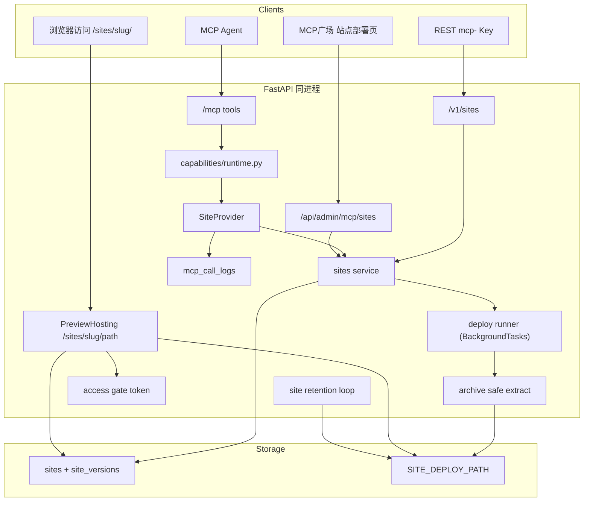

# MCP 广场站点部署（Site Deploy）

Feature Name: 2026-09-26-site-deploy
Updated: 2026-09-26

## Description

在现有能力平面上新增 `site`：管理员或已授权 MCP Key 上传前端构建产物 `.zip`，系统校验、安全解包并落盘为一个不可变版本，随后通过 `{APP_BASE_URL}/sites/{slug}/` 提供静态访问。站点维护版本历史，可一键回滚；访问模式支持公开与令牌保护。所有调用复用能力平面的 `mcp_keys`、白名单与调用日志。

部署采用**轻量异步流水线**：接口只做入参校验并创建 `unpacking` 状态的版本行，解包落盘交给 FastAPI `BackgroundTasks` 在响应后执行，管理端与 REST 轮询版本状态获得 `ready` / `failed` / `duplicate`，不引入独立任务表与 worker。MCP 因是请求-响应传输且归档较小，`site_deploy` 内联等待完成后再返回。

本能力是**纯静态托管**：不执行服务端代码、不负责构建、不提供自定义域名与独立 TLS。预览地址与平台共用同一端口，路由必须注册在现有 SPA 兜底路由之前（`backend/app/main.py:332`）。

关键约束：

- 预览内容可能来自非管理员（MCP Key），因此解包必须防御路径穿越、符号链接与 zip 炸弹。
- 站点文件按版本目录隔离，回滚只切换指针，不改文件；缓存可利用版本目录的不可变性。
- 协议面 REST 路径使用 `/v1/sites` 前缀，避开通用能力分发路由 `POST /v1/capabilities/{capability_id}/{operation}`（`backend/app/routers/capabilities_public.py:57`）对两段式路径的遮蔽。[^5]

## Architecture



**决策**

| 项 | 选择 | 理由 |
|----|------|------|
| 能力标识 | `site` | 与 `knowledge`、`docparse` 并列，工具名前缀 `site_` |
| 预览地址 | 路径式 `/sites/{slug}/` | 单端口、无泛域名与证书能力；静态路径优先于 SPA 兜底 |
| 版本模型 | 每次上传新版本，指针回滚 | 归档不可变，回滚是 O(1) 改指针，天然支持并发读 |
| 落盘布局 | `{SITE_DEPLOY_PATH}/{site_id}/v{version_no}/` | 版本目录不可变，可对非 HTML 资源长缓存 |
| 归档处理 | 内存/临时目录校验后原子 `os.replace` | 校验失败不产生半成品，不污染当前版本 |
| 执行模式 | 管理端/REST 异步（`BackgroundTasks` + 轮询），MCP 内联同步 | 不引入任务表与 worker，同时满足 UI 进度展示与 MCP 请求-响应语义 |
| 版本状态 | `unpacking` / `ready` / `failed` / `duplicate` | 覆盖上传后到完成之间的可观测中间态 |
| 访问控制 | `public` / `token` 两模式 | 用户明确要求默认公开、可加令牌 |
| 令牌存储 | hash 校验 + 加密存储用于一次性展示 | 与 `mcp_keys` 的存储思路一致 |
| 令牌会话 | HMAC 签名 Cookie（绑定 site_id 与 token hash） | 无状态；重置令牌后旧 Cookie 自动失效 |
| REST 前缀 | `/v1/sites` | 规避通用分发路由对 `/v1/capabilities/site/...` 的遮蔽 |
| MCP 挂载 | 注册进现有 `/mcp`，不新开端口 | `register_all_tools()` 按 registry 动态展开 |
| 管理入口 | `/mcp-plaza/sites` | 复用广场卡片与子路由 |

## Components and Interfaces

### 1. Provider

路径：`backend/app/capabilities/site/`

```text
capabilities/site/
  provider.py    # CapabilitySpec + dispatch + MCP tools
  sites.py       # 站点/版本 CRUD、部署、回滚、删除
  archive.py     # 归档校验与安全解包
  hosting.py     # 预览请求处理：解析 slug、鉴权、文件定位、SPA 回退
  storage.py     # 版本目录布局与原子落盘
  errors.py      # SiteError
```

```python
spec = CapabilitySpec(
    capability_id="site",
    name="站点部署",
    description="上传前端静态资源 zip，生成可回滚、可令牌保护的预览站点",
    version="1.0.0",
    category="hosting",
    status="enabled",
    admin_path="/mcp-plaza/sites",
    icon="globe",
)
```

在 `capabilities/registry.py` 的 `ensure_defaults()` 追加 `register(SiteProvider())`（参考 `backend/app/capabilities/registry.py:76`）。在 `runtime._normalize_error` 的 `isinstance` 元组内加入 `SiteError`（参考 `backend/app/capabilities/runtime.py:18`）。

### 1.1 MCP 工具

`backend/app/mcp_server.py` 的 `register_all_tools()` 遍历 `list_tool_defs()`，Provider 注册后工具自动出现在 `/mcp`。

| Tool | operation | 入参 | 返回 |
|------|-----------|------|------|
| `site_deploy` | `deploy` | `archive_base64`、`filename`、可选 `slug`、`name`、`entry`、`activate` | `site`、`version_no`、`status`、`preview_url` |
| `site_list` | `list` | 无 | 该 Key 自有站点列表 |
| `site_status` | `status` | `slug` | 站点详情与版本列表 |
| `site_rollback` | `rollback` | `slug`、`version_no` | 新当前版本 |
| `site_delete` | `delete` | `slug` | `deleted=true` |
| `site_access` | `access` | `slug`、`mode`(`public`/`token`)、可选 `reset_token` | 站点信息 + 一次性令牌明文或 `null` |

`archive_base64` 解码后受 `SITE_MCP_MAX_BYTES` 限制（默认 10MB，base64 膨胀后仍低于 REST 归档上限）。超限返回 400 并提示改用 REST multipart。`activate=false` 时部署后不切换当前版本，仅入库供审阅。

MCP 无轮询能力，`site_deploy` 在本次调用内完成解包后返回终态（`ready` / `failed` / `duplicate`）；需要观察进度的场景使用管理端或 REST。

### 1.2 REST（`/v1/sites`，MCP Key 鉴权，需 `site` 授权）

| Method | Path | 说明 |
|--------|------|------|
| POST | `/v1/sites` | `multipart/form-data`：`file`、可选 `slug`、`name`、`entry`、`activate`；返回 `202` + `site_id`、`version_id`、`status=unpacking` |
| GET | `/v1/sites` | 仅返回该 Key 创建的站点 |
| GET | `/v1/sites/{slug}` | 站点详情（含版本列表与进度） |
| GET | `/v1/sites/{slug}/versions/{version_no}` | 轮询单个版本状态与进度 |
| POST | `/v1/sites/{slug}/rollback` | body：`version_no` |
| POST | `/v1/sites/{slug}/access` | body：`mode`(`public`/`token`)、可选 `reset_token`；返回一次性令牌或 `null` |
| POST | `/v1/sites/{slug}/token` | 重置令牌，返回一次性明文 |
| DELETE | `/v1/sites/{slug}` | 删除站点及其版本 |

鉴权复用 `_mcp_key_dep` 与 `allowed_capability_ids`（参考 `backend/app/routers/capabilities_public.py:28`）。跨 Key 访问返回 404，不泄露存在性。

### 1.3 Admin（`Depends(get_current_admin)`）

| Method | Path | 说明 |
|--------|------|------|
| GET | `/api/admin/mcp/sites` | 分页列表，支持 `q`、`status` |
| POST | `/api/admin/mcp/sites` | 部署：`slug` 为空则新建，存在则加版本；返回 `202` + `version_id`、`status=unpacking` |
| GET | `/api/admin/mcp/sites/{site_id}` | 详情 + 版本列表（含状态与进度） |
| GET | `/api/admin/mcp/sites/{site_id}/versions/{version_id}` | 轮询单个版本状态与进度 |
| PATCH | `/api/admin/mcp/sites/{site_id}` | 改 `name`、`description`、`access_mode`、`entry_file`、`status` |
| DELETE | `/api/admin/mcp/sites/{site_id}` | 删除站点与全部版本 |
| POST | `/api/admin/mcp/sites/{site_id}/versions` | 上传新版本；返回 `202` |
| POST | `/api/admin/mcp/sites/{site_id}/versions/{version_id}/activate` | 回滚/切换当前版本（仅 `ready` 版本） |
| POST | `/api/admin/mcp/sites/{site_id}/versions/{version_id}/retry` | 重试 `failed` 版本 |
| DELETE | `/api/admin/mcp/sites/{site_id}/versions/{version_id}` | 删除非当前版本 |
| POST | `/api/admin/mcp/sites/{site_id}/token` | 生成或重置访问令牌，返回一次性明文 |

### 1.4 预览托管路由

注册在 SPA 兜底之前，且不依赖 `FRONTEND_DIST` 是否存在：

```text
GET|HEAD /sites/{slug}          -> 308 重定向到 /sites/{slug}/
GET|HEAD /sites/{slug}/{path}   -> hosting.serve(slug, path, request)
```

处理顺序（`hosting.serve`）：

1. 按 `slug` 查站点；不存在或 `status != active` → 404。
2. 取 `current_version_id`；版本缺失或 `purged=1` → 503。
3. `access_mode == "token"` 时校验 Cookie 签名，或从 `?token=` 校验并回落写 Cookie；失败 → 401 + 令牌输入页。
4. 归一化 `path`，拼接版本目录；命中文件则返回。
5. 未命中且路径无扩展名且 `spa_fallback` 为真 → 返回入口文件。
6. 仍未命中 → 404。

文件响应按 `mimetypes` 推断类型；HTML 用 `no-cache`，其余用 `public, max-age=31536000, immutable`（版本目录不可变），统一加 `X-Content-Type-Options: nosniff`。全局 `CompressTextMiddleware` 已按内容类型压缩文本响应（`backend/app/static_assets.py:141`），无需站点侧重复处理。

#### 根绝对资源路径改写（`hosting._rewrite_html` / `_rewrite_css`）

Vite / CRA 默认 `base: '/'`，产物引用形如 `<script src="/assets/index-xxxx.js">`。根相对 URL 由浏览器按源站根解析，会命中平台自有的 `/assets` 挂载（`backend/app/main.py` 的 `app.mount("/assets", ...)`），导致 404 或加载到管理端 JS，页面黑屏。`<base href>` 只影响相对 URL，无法修正以 `/` 开头的路径，因此必须在托管时改写：

- HTML：对 `src` / `href` / `poster` / `action` 中以单个 `/` 开头的值，改写到 `/sites/{slug}/` 前缀；未声明 `<base>` 时在 `<head>` 后注入指向文件所在目录的 `<base href="/sites/{slug}/[子目录/]">`。
- CSS：对 `url(/...)` 与 `@import "/..."` 做同样的前缀改写。
- 已是站点前缀的 URL 不重复改写；`//` 协议相对 URL 与带 scheme 的绝对 URL 不改写。
- 改写后的 HTML/CSS 仍按版本目录返回，站点 zip 无需改动；`base: './'` 的产物同样兼容。

#### Platform Service Worker 导航兜底

平台前端是 PWA，Workbox `NavigationRoute` 会接管整个源站的文档导航。若 `navigateFallback` 未排除 `/sites/`，已安装 SW 的浏览器打开预览地址会被预缓存的管理端 `index.html` 劫持成黑屏（后端 `hosting.serve` 根本收不到请求）。修复：`frontend/vite.config.ts` 的 `workbox.navigateFallbackDenylist` 增加 `/^\/sites\//`（同时排除 `/api/`、`/v1/`、`/mcp`、`/anthropic/`、`/health`）。改动后需重新构建前端以更新 `sw.js`。

### 2. 归档校验与解包（archive.py）

对 `zipfile.ZipFile.infolist()` 逐条校验：

- 名称拒绝绝对路径、`..` 段、反斜杠、盘符；只允许相对 POSIX 路径。
- `external_attr` 指示符号链接的条目直接拒绝。
- 文件数 `<= SITE_MAX_FILES`（默认 5000）。
- 解压后单文件 `<= SITE_MAX_FILE_BYTES`（默认 50MB），总字节 `<= SITE_MAX_TOTAL_BYTES`（默认 200MB）。
- 解压比 `总解压字节 / 归档字节 <= SITE_MAX_RATIO`（默认 100），拦截 zip 炸弹。
- 归档必须含可用入口：显式 `entry` 存在，或根目录 `index.html`，或根目录唯一 `.html`。

目录归一化：若全部条目位于同一顶层目录，去掉该层作为站点根。解包写入 `{SITE_DEPLOY_PATH}/.tmp/{version_id}/`，校验与写入全部成功后由 `storage.commit` 原子 `os.replace` 到目标版本目录。

### 3. 站点服务（sites.py）

- `create_deploy(db, *, archive, actor, slug, name, entry, activate)`：只做文件名、扩展名与大小等快速校验，创建或定位站点，写入 `site_versions` 行（`status=unpacking`，`percent=0`）并 `commit`，返回 `site` 与 `version`。归档字节暂存到 `{SITE_DEPLOY_PATH}/.upload/{version_id}.zip`。
- `run_deploy(db, version_id, activate)`：解包、校验、计算 `content_hash`、落盘、置终态，并在需要时切换当前版本。
- 归属靠显式 `slug`：带 slug 即给该站点加版本，不带则新建；不用名称或内容推断归属。slug 被他人占用返回 409。
- 去重靠 `content_hash`：对归一化文件树（排序后的「相对路径 + 文件内容 sha256」）合成摘要，忽略 zip 元数据。同站点已有相同摘要的 `ready` 版本时，把新版本置为 `duplicate` 并指向被复用版本，不重复占盘，必要时把当前版本切到被复用版本。
- `rollback(db, site, version_no)`：校验版本属于站点、`status=ready` 且未清理，改 `current_version_id`。
- `retry(db, version)`：仅接受 `failed` 且归档仍在的版本，重置为 `unpacking` 后重新调度 `run_deploy`。
- `delete_site` / `delete_version`：先删文件后删记录；当前版本拒绝删除。
- `list_sites` 支持按 `mcp_key_id` 过滤（协议面）与全量（管理端）。
- 版本序号分配：同一站点内取 `max(version_no) + 1`，配合 `UniqueConstraint(site_id, version_no)`，冲突时重试。

### 3.1 异步部署流水线

流程：

```text
1. POST /api/admin/mcp/sites 或 /v1/sites
   -> create_deploy() 建 unpacking 版本行，commit
   -> background_tasks.add_task(run_deploy, version_id, activate)
   -> 202 { site_id, version_id, status: "unpacking" }
2. run_deploy() 在响应之后执行
   -> percent 0->40 解包到临时目录
   -> 40->80 校验并计算 content_hash
   -> 80->100 原子移动落盘、置 ready/failed/duplicate
3. 前端每 1s 轮询版本状态，直到终态
```

- 进度字段：复用 `stage`、`percent`、`message`，与知识库采集任务保持一致的展示语义。
- 状态机：`unpacking` → `ready`；`unpacking` → `failed`；`unpacking` → `duplicate`。仅 `ready` 版本可成为当前版本或被回滚。
- `ready` 版本会写入 `sites.current_version_id`；`duplicate` 版本不成为当前版本，而是把当前版本切到其复用的 `ready` 版本；`failed` 不影响站点当前版本。
- 进程重启恢复：启动时把残留 `unpacking` 版本标记为 `failed`（`message=进程重启，请重试`），并清理 `.upload/.tmp` 残留。在 `main.py` lifespan 中调用 `reconcile_stuck_site_versions(session)`，参考 `reconcile_stuck_knowledge_jobs`（`backend/app/main.py:101`）。
- MCP 路径不使用 `BackgroundTasks`：`site_deploy` 内联调用 `create_deploy` 后直接 `await run_deploy`，返回终态。

### 4. 保留清理

新增 `services/site_retention.py`，仿 `docparse_retention` 每日循环：

- 只清理 `ready` / `duplicate` 且非当前的版本；`unpacking` 版本永不清理。
- 超过 `SITE_MAX_VERSIONS`（默认 10）的、非当前的旧版本，删除文件目录并置 `purged=1`，保留行。
- 超过 `SITE_RETENTION_DAYS`（默认 30）且非当前的版本同样清理文件。
- 顺带清理 `.upload` 与 `.tmp` 下超过 1 天的残留文件。
- 在 `backend/app/main.py` 的 lifespan 内追加 `asyncio.create_task(site_retention_loop())`（参考 `backend/app/main.py:117`）。

### 5. 前端

| 文件 | 改动 |
|------|------|
| `frontend/src/pages/McpPlaza.tsx` | `iconMap` 增加 `globe: Globe` |
| `frontend/src/App.tsx` | 懒加载并注册 `mcp-plaza/sites` 与 `mcp-plaza/sites/:siteId`（参考 `frontend/src/App.tsx:113`） |
| `frontend/src/pages/McpSites.tsx` | 站点列表 + 新建/上传对话框 |
| `frontend/src/pages/McpSiteDetail.tsx` | 版本列表、回滚、令牌生成、访问模式、删除 |
| `frontend/src/lib/api.ts` | 增加站点 CRUD 与上传方法（参考 MCP 小节 `frontend/src/lib/api.ts:966`） |
| `frontend/src/pages/McpDocs.tsx` | 增加 Site Deploy 接入小节与 `site_*` 工具说明 |

管理页交互：列表展示名称、slug、访问模式、状态、当前版本、预览链接与更新时间；详情页顶部为预览地址与状态，中部版本时间线（含状态徽标、「设为当前」、重试与删除），侧栏为访问模式与令牌管理。

部署进度展示分两段：

- 上传中：用 `XMLHttpRequest` 的 `upload.onprogress` 显示字节百分比，这是浏览器侧状态，服务端不感知。
- 解压中：接口返回 `202` 后按 `version_id` 每 1s 轮询，映射 `stage`/`percent`/`message`，`ready` 时提示预览地址，`failed` 时展示 `error_message` 与重试按钮，`duplicate` 时提示「内容与 vX 相同，已复用」。
- 列表页对 `unpacking` 站点显示进度徽标，避免用户重复提交。

## Data Models

表 `sites`：

| 列 | 类型 | 说明 |
|----|------|------|
| id | varchar(36) pk | uuid |
| slug | varchar(64) unique | URL 安全标识 |
| name | varchar(128) | 显示名 |
| description | text | 说明 |
| access_mode | varchar(16) | `public` / `token` |
| access_token_hash | varchar(64) null | 令牌 SHA-256 |
| access_token_encrypted | text null | Fernet 加密，用于一次性展示 |
| current_version_id | varchar(36) null | 当前版本 |
| entry_file | varchar(128) | 默认 `index.html` |
| spa_fallback | boolean | 默认 true |
| status | varchar(16) | `active` / `disabled` |
| created_by | varchar(16) | `admin` / `key` |
| mcp_key_id | int null | 协议面归属 Key |
| total_bytes | int | 当前版本字节数 |
| created_at / updated_at | datetime | 时间戳 |

表 `site_versions`：

| 列 | 类型 | 说明 |
|----|------|------|
| id | varchar(36) pk | uuid |
| site_id | varchar(36) fk | 级联删除 |
| version_no | int | 站点内递增，唯一约束 `(site_id, version_no)` |
| content_hash | varchar(64) null | 归一化文件树摘要，普通索引（去重由服务层判断，避免并发唯一冲突） |
| status | varchar(16) | `unpacking` / `ready` / `failed` / `duplicate` |
| stage | varchar(16) | `stored` / `extracting` / `finalizing` / `done` |
| percent | int | 0-100 |
| message | varchar(256) | 当前阶段文案 |
| reused_version_id | varchar(36) null | `duplicate` 时被复用的版本 |
| entry_file | varchar(128) | 本版本入口 |
| file_count | int | 文件数 |
| total_bytes | int | 解压总字节 |
| source_name | varchar(256) | 上传归档文件名 |
| error_message | text null | 失败原因 |
| created_by / mcp_key_id | | 同站点 |
| purged | int | 文件已清理 |
| created_at / started_at / finished_at / updated_at | datetime | 时间戳 |

索引：`site_versions(site_id, version_no)`、`sites(mcp_key_id, created_at)`、`sites(slug)`。模型定义追加到 `backend/app/models.py`，参考 `DocParseJob`（`backend/app/models.py:687`）。

## Correctness Properties

- 版本目录一经写入不再修改；回滚只更新 `sites.current_version_id`。
- 解包路径始终位于该版本目标目录内；任何越界条目使整次部署失败且不落盘。
- 只有 `ready` 版本能成为当前版本；`duplicate` 把当前指向被复用的 `ready` 版本；`failed` 不改变站点当前版本，只保留行与错误信息。
- 版本状态只能按 `unpacking -> ready|failed|duplicate` 迁移；终态不再回到 `unpacking`，重试是新建一次执行。
- 同一版本 `run_deploy` 至多完成一次；进程重启时残留 `unpacking` 版本被置为 `failed`。
- 协议面查询同时匹配 `slug` 与 `mcp_key_id`；不匹配返回 404。
- 令牌 Cookie 的 HMAC 绑定 `site_id + access_token_hash`，重置令牌后旧 Cookie 立即失效。
- 令牌明文只在生成/重置响应中出现一次；列表与详情仅返回掩码。
- 版本序号在站点内唯一；并发部署由唯一约束兜底，冲突重试。
- 同站点重复提交相同 `content_hash` 时，新版本置 `duplicate` 并指向被复用版本，不重复占用磁盘。
- 保留清理绝不删除当前版本；删除站点先删文件后删记录。
- 预览路径归一化后必须落在版本目录内，禁止 `..` 逃逸。
- 能力可见性与调用授权一致：`tools/list` 只展开该 Key 的 `site` 工具，`tools/call` 再次校验白名单。

## Error Handling

| 场景 | 状态 | 对用户 |
|------|------|--------|
| 非 `.zip`、缺入口、超大小/文件数/压缩比 | 400 | 说明具体限制 |
| 归档含越界路径或符号链接 | 400 | `unsafe_archive` |
| MCP base64 超上限 | 400 | 提示改用 REST multipart |
| 未授权 `site` | 403 | 权限错误 |
| 聊天 `sk-` 访问协议面 | 401 | 需 MCP Key |
| 访问他人站点 | 404 | 不泄露存在性 |
| 站点停用、slug 不存在 | 404 | 统一 Not Found |
| 令牌缺失或不匹配 | 401 | 令牌输入页 |
| 当前版本已清理 | 503 | 提示重新部署 |
| 删除当前版本或非终态版本 | 409 | 先等待或切换当前版本 |
| 解包或落盘 IO 失败 | 版本 `failed` | 版本行保留错误信息，当前版本不变，可重试 |
| 进程重启遗留 `unpacking` | 启动时置 `failed` | 提示重试 |
| 回滚到非 `ready` 版本 | 400 | 仅可切换到已就绪版本 |

## Test Strategy

后端在 `backend/` 下执行 `PYTHONPATH=. python3 -m pytest tests/test_sites.py`：

- 用 `io.BytesIO` + `zipfile` 构造最小站点包（含 `index.html`、`assets/app.js`），上传返回 `202` 与 `unpacking`，直接调用 `run_deploy` 后断言 `/sites/{slug}/` 返回 HTML、`/assets/app.js` 返回 `application/javascript`。
- 顶层目录归一化：包内全部位于 `dist/` 时，站点根为 `dist` 内容。
- 不安全归档：含 `../evil`、绝对路径、符号链接、超大压缩比，逐条断言部署置 `failed` 且目标目录无落盘、当前版本不变。
- 版本与回滚：连续部署两次，`version_no` 为 1、2；回滚到 1 后预览返回旧内容；删除当前版本返回 409，回滚到 `failed` 版本返回 400。
- 去重：同一归档连续部署两次，第二次 `status=duplicate` 且 `reused_version_id` 指向第一次，磁盘不新增版本目录。
- 异步状态：`create_deploy` 后版本为 `unpacking`，`run_deploy` 后为 `ready`；启动恢复把残留 `unpacking` 置为 `failed`。
- 失败重试：mock 解包抛错后版本 `failed`，`retry` 后可再次进入 `unpacking` 并成功。
- 访问控制：`token` 模式下无凭证 401、错误令牌 401、正确令牌通过并下发 Cookie，重置令牌后旧 Cookie 失效。
- 鉴权：未授权 Key 403，`sk-` 401，跨 Key 查询 404；`site_deploy` base64 超限 400。
- MCP 一致性：已授权 Key `tools/list` 可见 `site_deploy`；`tools/call` 内联返回终态且业务数据与 REST 一致。
- 保留：伪造多个旧版本并触发清理，断言非当前旧版本 `purged=1` 且当前版本仍在。
- 前端：`cd frontend && npx tsc -b`。页面沿用广场卡片进应用页，PC 双栏（站点/版本），窄屏上下堆叠。

## References

[^1]: (Filename#L29) - 能力规格与 dispatch 契约 `backend/app/capabilities/base.py`
[^2]: (Filename#L76) - 内置能力注册点 `backend/app/capabilities/registry.py`
[^3]: (Filename#L18) - 错误归一化 `backend/app/capabilities/runtime.py`
[^4]: (Filename#L687) - 任务型数据模型参考 `backend/app/models.py`
[^5]: (Filename#L57) - 通用能力分发路由，说明 `/v1/sites` 前缀的必要性 `backend/app/routers/capabilities_public.py`
[^6]: (Filename#L332) - SPA 兜底路由，站点托管必须注册在其之前 `backend/app/main.py`
[^7]: (Filename#L141) - 文本响应压缩中间件 `backend/app/static_assets.py`
[^8]: (Filename#L166) - 数据路径解析样板 `backend/app/config.py`
