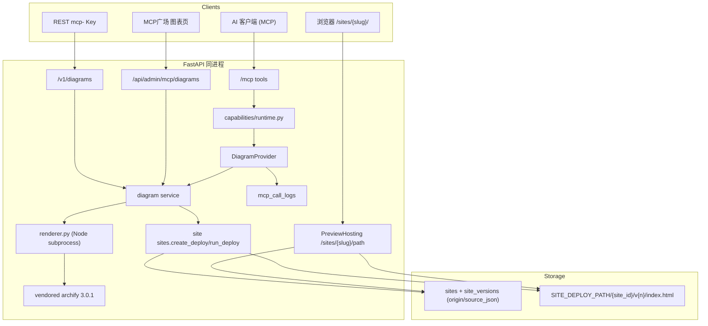

# Archify 图表 MCP 能力（Diagram）

Feature Name: 2026-09-30-archify-diagram-mcp
Updated: 2026-09-30

## Description

在现有能力平面上新增 `diagram` 能力。已授权的 MCP Key 提交 [Archify](https://github.com/tt-a1i/archify) 的类型化 JSON 源（`architecture` / `workflow` / `sequence` / `dataflow` / `lifecycle`），平台调用内置渲染器生成**单文件、自包含、零外部资源**的交互式 HTML，随后复用既有的站点托管平面（`site` 能力）发布为 `{APP_BASE_URL}/sites/{slug}/`，并完整继承站点的版本历史、回滚、元信息编辑与令牌访问控制。

结论先行：**方案可行且改造成本低**。两项关键事实已在真实仓库中验证：

- **Archify 是可脱离 Agent 独立运行的 Node CLI**：`node bin/archify.mjs deliver <type> <source.json> <out.html> --quality showcase --json` 在无 `npm install`、无 `node_modules`、无网络（关闭更新检查后）的情况下成功渲染（实测输出 762,310 字节自包含 HTML，校验档位 `showcase` 通过）。运行时仅依赖 Node 内置模块，无第三方运行时依赖；输出 HTML 无任何外部 `src`/`href` 引用。
- **平台已具备托管/编辑/令牌的全部基础设施**：`sites` + `site_versions` 提供不可变版本、指针回滚与去重（`backend/app/capabilities/site/sites.py:237`、`:282`），`sites_public.hosting_router` 提供托管路由（`backend/app/routers/sites_public.py:221`），`site_access` 提供 `public`/`token` 两模式与 HMAC Cookie 会话（`backend/app/capabilities/site/sites.py:521`）。

因此本设计**不新建托管、鉴权、密钥与任务体系**，只新增「源 → HTML 渲染」这一段，并把产物接入既有站点流水线。唯一的部署前置是运行阶段镜像需要 Node.js（当前 `python:3.11-slim` 不含 Node，`Dockerfile:13`）。

与站点部署的差异：

| 维度 | `site` 能力 | `diagram` 能力 |
|------|-------------|----------------|
| 入参 | 前端构建产物 `.zip`（base64 / multipart） | 类型化 JSON 源 + `type` + `quality` |
| 产物 | 多文件静态站点 | 单文件 `index.html` |
| 落盘前处理 | 安全解包 zip | 调 Renderer 渲染并校验 |
| 编辑源 | 重新上传 zip | `diagram_get_source` 取回源 → 改 → `diagram_create` 追加版本 |
| 托管/版本/令牌 | 站点平面 | 完全复用站点平面 |

## Architecture



**决策**

| 项 | 选择 | 理由 |
|----|------|------|
| 能力标识 | `diagram`，工具前缀 `diagram_` | 与 `knowledge`、`docparse`、`site` 并列，见 `backend/app/capabilities/registry.py:77` |
| 渲染方式 | 后端以子进程调用 vendored Archify CLI | Archify 是本地 CLI（`preview` 仅绑定 loopback），无 HTTP 服务；子进程隔离且无第三方运行时依赖 |
| 渲染器集成 | 把 Archify 精简子集 vendor 进 `capabilities/diagram/vendor/archify/` | 免去运行期 `npm install`；固定版本可复现；约 3.3MB |
| 托管复用 | 产物包成单文件 zip 走 `sites.create_deploy` | 零新增托管代码，自动获得版本/回滚/去重/令牌 |
| 图表与普通站点区分 | `sites` 增加 `origin` 判别列（`upload`/`diagram`） | 让 `site_list` 与 `diagram_list` 各自只列自己的资产 |
| 源持久化 | `site_versions.source_json` 存 JSON 源，不入发布目录 | 源不可被公网访问；支撑 `diagram_get_source` 编辑闭环 |
| 编辑语义 | 同 slug 再次 `create` 追加版本；元信息走 `update` | 复用站点不可变版本与指针回滚 |
| 令牌 | 直接复用 `set_access` / `reveal_token` / HMAC Cookie | 与站点部署行为完全一致 |
| REST 前缀 | `/v1/diagrams` | 规避通用分发路由 `/v1/capabilities/{id}/{op}` 的遮蔽（`backend/app/routers/capabilities_public.py`） |
| 执行模式 | MCP 内联同步返回终态；管理端可后台任务 | 与站点部署既有约定一致（`site_deploy` 内联，REST 异步） |
| Node 运行时 | 运行镜像 apt 安装 `nodejs`（Debian bookworm ≥18） | 最小改动；本机开发环境已有 Node 22 |
| 更新检查 | 渲染时注入 `ARCHIFY_UPDATE_CHECK_DISABLED=1` | 关闭外联，避免每次渲染发起对 GitHub Pages 的 GET |

## Components and Interfaces

### 1. 能力目录与注册

路径：`backend/app/capabilities/diagram/`

```text
capabilities/diagram/
  __init__.py
  provider.py      # CapabilitySpec + dispatch + MCP tools
  service.py       # 创建图表、版本、源读写、访问控制（薄封装 site service）
  renderer.py      # 调 Archify CLI，解析 deliver --json 回执
  errors.py        # DiagramError
  vendor/archify/  # vendored 渲染器（bin/renderers/schemas/... + LICENSE）
```

```python
spec = CapabilitySpec(
    capability_id="diagram",
    name="图表生成",
    description="提交 Archify 类型化 JSON 源，渲染为自包含交互式 HTML 并发布为可回滚、可令牌保护的图表站点",
    version="1.0.0",
    category="diagram",
    status="enabled",
    admin_path="/mcp-plaza/diagrams",
    icon="shapes",
    input_schema={"create": {...}, "update": {...}, "access": {...}},
    integration={"rest_endpoints": [...], "notes": [...]},
)
```

注册点：`capabilities/registry.py` 的 `ensure_defaults()` 追加 `register(DiagramProvider())`（参考 `backend/app/capabilities/registry.py:77`）。错误归一化：在 `capabilities/runtime.py` 的 `_normalize_error` 元组加入 `DiagramError`（参考 `backend/app/capabilities/runtime.py:19`）。

### 1.1 vendored Archify 渲染器

从 Archify `3.0.1`（MIT）复制以下子集到 `vendor/archify/`，并保留 `LICENSE`、`THIRD_PARTY_NOTICES.md`、`package.json`：

```text
bin/ renderers/ schemas/ assets/ recipes/ references/ migrations/ delta/ brand-marks/ scripts/
```

- 实测该子集共约 3.3MB，`examples/`（4MB）与 `test/`（3.6MB）不复制。
- 渲染 CLI 仅 `import 'node:*'` 内置模块，无需 `npm install`；`deliver` 的校验档位 `showcase` 通过，退出码 0。
- 版本与 SHA256 记录到 `vendor/archify/VERSION`，升级时人工替换并回归。

`renderer.py` 关键契约：

```python
@dataclass
class RenderOutcome:
    html: bytes | None
    diagnostics: list[dict]   # Archify deliver --json 的 diagnostics[]

async def render_diagram(type_: str, source: dict, quality: str) -> RenderOutcome:
    # 1. source 写入沙箱临时目录 candidate.json
    # 2. subprocess: node <vendor>/bin/archify.mjs deliver <type> <src> <out> --quality <q> --json
    #    env: ARCHIFY_UPDATE_CHECK_DISABLED=1, HOME=TMPDIR=沙箱目录, cwd=沙箱目录
    #    不传 --repo-root / --open
    # 3. exit==0 -> 读取 <out> 字节；exit!=0 -> 解析 stdout JSON 的 diagnostics
    # 以 asyncio.to_thread + Semaphore(diagram_render_concurrency) 调度，subprocess timeout 控制
```

沙箱约束：每次渲染使用 `{SITE_DEPLOY_PATH}/.diagram-tmp/{uuid}/` 独立目录；不把宿主仓库路径传给渲染器（`--repo-root` 会读本机源码，禁用）；超时终止整个进程组；渲染超时/可执行缺失分别映射为 `diagram_render_timeout` / `renderer_unavailable`。

### 1.2 MCP 工具

`mcp_server.py` 的 `register_all_tools()` 遍历 `list_tool_defs()`，Provider 注册后工具自动出现在 `/mcp`，并按 `mcp_key_capabilities` 白名单过滤（`backend/app/mcp_server.py:162`、`:176`）。

| Tool | operation | 入参 | 返回 |
|------|-----------|------|------|
| `diagram_create` | `create` | `type`、`source`(object/string)、可选 `slug`、`name`、`quality`(`showcase`/`standard`)、`entry`、`activate` | `site`、`version`、`preview_url` |
| `diagram_list` | `list` | 无 | 该 Key 的图表列表 |
| `diagram_status` | `status` | `slug` | 图表详情 + 版本列表 |
| `diagram_get_source` | `get_source` | `slug`、可选 `version_no` | `type`、`source`、`version_no` |
| `diagram_update` | `update` | `slug` + 待改字段（`name`/`description`/`new_slug`/`entry_file`/`spa_fallback`/`status`/`access_mode`） | 更新后的详情 |
| `diagram_rollback` | `rollback` | `slug`、`version_no` | 新当前版本 |
| `diagram_access` | `access` | `slug`、`mode`、可选 `reset_token` | 站点信息 + 明文令牌/URL |
| `diagram_access_info` | `access_info` | `slug` | 当前模式、令牌、可访问 URL |
| `diagram_delete` | `delete` | `slug` | `deleted=true` |

与站点一致，MCP 无轮询能力，`diagram_create` 内联完成「渲染 + 落盘」后返回终态；源非法时返回结构化诊断，供 AI 修复后重试。

### 1.3 REST `/v1/diagrams`（MCP Key 鉴权，需 `diagram` 授权）

后缀式路径避开通用分发路由遮蔽，鉴权复用 `_mcp_key_dep` 与 `allowed_capability_ids`（参考 `backend/app/routers/sites_public.py:22`）。

| Method | Path | 说明 |
|--------|------|------|
| POST | `/v1/diagrams` | body：`type`、`source`、可选 `slug`、`name`、`quality`、`activate`；返回 `202` + `site`、`version`、`preview_url` |
| GET | `/v1/diagrams` | 仅返回该 Key 的图表 |
| GET | `/v1/diagrams/{slug}` | 详情 + 版本 |
| GET | `/v1/diagrams/{slug}/source` | 可选 `version_no`；返回源 JSON |
| PATCH | `/v1/diagrams/{slug}` | 更新元信息 |
| POST | `/v1/diagrams/{slug}/rollback` | body：`version_no` |
| POST | `/v1/diagrams/{slug}/access` | body：`mode`、`reset_token` |
| GET | `/v1/diagrams/{slug}/access` | 当前访问信息 |
| POST | `/v1/diagrams/{slug}/token` | 重置令牌 |
| DELETE | `/v1/diagrams/{slug}` | 删除图表与全部版本 |

### 1.4 Admin API 与管理端

Admin：`/api/admin/mcp/diagrams`（`Depends(get_current_admin)`），镜像站点管理端点并固定 `origin="diagram"`：列表、详情、源查看、PATCH 元信息、激活/回滚、删除、令牌生成。

| 文件 | 改动 |
|------|------|
| `frontend/src/pages/McpPlaza.tsx` | `iconMap` 增加 `shapes` 图标映射 |
| `frontend/src/App.tsx` | 注册 `mcp-plaza/diagrams` 与 `mcp-plaza/diagrams/:siteId`（参考 `frontend/src/App.tsx:117`） |
| `frontend/src/pages/McpDiagrams.tsx` | 图表列表 + 手动创建（粘贴 JSON 源）对话框 |
| `frontend/src/pages/McpDiagramDetail.tsx` | 预览、版本时间线、源查看、元信息编辑、令牌管理、删除 |
| `frontend/src/lib/api.ts` | 增加图表 CRUD 封装（参考 `frontend/src/lib/api.ts:997`） |
| `frontend/src/pages/McpDocs.tsx` | 增加 Diagram 接入小节与 `diagram_*` 工具说明 |

### 1.5 复用站点服务与托管

- 发布：`service.create_diagram()` 把渲染得到的 HTML 打成内存 zip（仅含入口文件），调用 `sites.create_deploy(...)` 与 `sites.run_deploy(...)`（`backend/app/capabilities/site/sites.py:237`、`:282`），并写入 `origin="diagram"` 与源字段。
- 托管：完全不动 `hosting.py`；访问 `GET /sites/{slug}/` 返回入口 `index.html`（`backend/app/routers/sites_public.py:221`）。
- 编辑/令牌：`diagram_update` 委托 `sites.update_site`，`diagram_access` 委托 `sites.set_access` / `access_info` / `reset_token` / `access_url`（`backend/app/capabilities/site/sites.py:464`、`:521`、`:539`）。
- 归属：图表 Site 的 `mcp_key_id` 即调用 Key；`sites._assert_owner` 已按 `mcp_key_id` 校验归属（`backend/app/capabilities/site/sites.py:66`），无需新增隔离逻辑。

## Data Models

在既有 `sites` / `site_versions` 上做增量扩展（模型见 `backend/app/models.py:716`、`:740`）：

### sites 新增列

| 列 | 类型 | 说明 |
|----|------|------|
| origin | varchar(16) default `upload` NOT NULL | `upload`（zip 站点）/ `diagram`（图表） |

索引：`sites(origin, mcp_key_id, created_at)`。

### site_versions 新增列

| 列 | 类型 | 说明 |
|----|------|------|
| diagram_type | varchar(16) null | `architecture`/`workflow`/`sequence`/`dataflow`/`lifecycle` |
| source_json | text null | 类型化 JSON 源（不进入发布目录） |
| quality | varchar(16) null | `showcase` / `standard` |

迁移沿用既有 `_ensure_columns` 的 `ALTER TABLE ... ADD COLUMN` 幂等模式（`backend/app/db.py:110`），对已存在库补列并给旧行回填 `origin='upload'`。

### 配置项（`backend/app/config.py`）

| 变量 | 默认 | 说明 |
|------|------|------|
| `diagram_enabled` | `true` | 能力全局开关 |
| `archify_home` | 空（解析为内置 vendor 目录） | 覆盖渲染器路径，便于测试 |
| `diagram_node_binary` | `node` | Node 可执行文件 |
| `diagram_render_timeout_seconds` | `60` | 单次渲染超时 |
| `diagram_render_concurrency` | `2` | 并发渲染上限 |
| `diagram_max_source_bytes` | `262144` | 源 JSON 大小上限 |
| `diagram_default_quality` | `showcase` | 默认校验档位 |

## Correctness Properties

- 同一 `slug` 的每次成功创建产生一个新的不可变 Site Version；回滚只改 `sites.current_version_id`。
- 源未通过 Archify 校验时，不产生 Site Version 文件、不改变当前版本；错误回执携带 Archify 诊断规则码。
- 渲染在受限沙箱目录内进行；每次调用使用独立临时目录，结束后清理；不向渲染器传入宿主仓库路径。
- 单次渲染遵守超时与并发上限；超时终止进程组，不留僵尸进程。
- 图表 Site 的 `mcp_key_id` 恒等于创建它的 Key；跨 Key 访问返回 404 且不泄露存在性。
- `diagram_list` 只返回 `origin='diagram'` 且归属该 Key 的 Site；`site_list` 只返回 `origin='upload'`。
- `site_versions.source_json` 不通过任何托管路由暴露；仅通过 `diagram_get_source` / 管理端详情返回。
- 令牌沿用站点的 SHA-256 校验与 HMAC Cookie；重置令牌后旧 Cookie 立即失效；明文只在生成/重置响应出现一次。
- 内容去重（`content_hash`）对同一源重复渲染同样生效：重复版本置 `duplicate` 并复用既有 `ready` 版本。
- 白名单一致性：`tools/list` 与 `tools/call` 均校验 `diagram` 授权。

## Error Handling

| 场景 | 状态 | 对用户 |
|------|------|--------|
| `type` 非法或缺失 | 400 | `invalid_request`，列出允许类型 |
| `source` 非 JSON / 超 `diagram_max_source_bytes` | 400 | `invalid_request` |
| Archify 校验失败 | 400 | `diagram_invalid` + `diagnostics[]`（规则码、subject、supportedFixes） |
| 渲染超时 | 504 | `diagram_render_timeout` |
| Node/渲染器不可用 | 503 | `renderer_unavailable` |
| 未授权 `diagram` | 403 | `permission_error` |
| 聊天 `sk-` 访问协议面 | 401 | 需 MCP Key |
| 访问他人图表 | 404 | 不泄露存在性 |
| slug 被占用 | 409 | `conflict` |
| 回滚到非 `ready`/非本站点版本 | 400 | 仅可切换到已就绪版本 |
| 渲染成功但落盘 IO 失败 | 500 | 版本置 `failed`，当前版本不变，可重试 |

## Test Strategy

后端在 `backend/` 执行 `PYTHONPATH=. python3 -m pytest tests/test_diagrams.py`：

- **渲染器单元**：用 monkeypatch 替换 `renderer._run_cli`，覆盖 exit 0 / 校验失败 / 超时 / 可执行缺失四条分支，断言诊断映射与异常类型。
- **真实渲染冒烟（可选，检测到 Node + vendor 才运行）**：以 `examples/web-app.architecture.json` 为源渲染，断言退出码 0、HTML 含图表容器、无外部 `src`/`href` 引用。
- **创建闭环**：创建图表后断言 `/sites/{slug}/` 返回 HTML，`sites.origin='diagram'`，`site_versions.source_json` 等于入参源。
- **版本与回滚**：两次创建 `version_no` 为 1、2；回滚到 1 后托管返回旧内容。
- **源读写**：`diagram_get_source` 默认返回当前版本源，指定 `version_no` 返回历史源；源不出现在托管响应的任何路径。
- **隔离**：`diagram_list` 不含上传站点；`site_list` 不含图表；跨 Key 查询 404；未授权 Key 403；`sk-` 401。
- **令牌**：`token` 模式无凭证 401、正确令牌通过并下发 Cookie、重置后旧 Cookie 失效。
- **去重与保留**：同一源二次创建置 `duplicate`；保留清理不删当前版本。
- **鉴权一致性**：已授权 Key `tools/list` 可见 `diagram_*`，未授权不可见。
- 前端：`cd frontend && npx tsc -b`。

## Risks and Alternatives

| 风险 | 影响 | 缓解 |
|------|------|------|
| 运行镜像无 Node | 无法渲染 | Dockerfile 运行阶段 `apt-get install -y --no-install-recommends nodejs`（bookworm ≥18）；`diagram_node_binary` 可覆盖 |
| 未安装 Node 时能力暴露 | 调用报错 | `renderer_unavailable` 明确回执；启动日志探测 Node 并提示 |
| 子进程渲染被恶意源拖垮/越权读文件 | 资源与信息安全 | 沙箱 cwd + 禁 `--repo-root` + 超时 + 并发上限 + 源大小上限 |
| Archify 版本漂移 | 校验规则变化 | vendor 固定 `3.0.1` + SHA256 记录；升级走人工回归 |
| 每次渲染外联更新检查 | 隐私与网络抖动 | `ARCHIFY_UPDATE_CHECK_DISABLED=1` |
| 输出体积（约 762KB/图） | 磁盘增长 | 复用站点保留策略（`site_max_versions`、`site_retention_days`） |
| 许可证合规 | 分发风险 | Archify 为 MIT；保留 `LICENSE` 与 `THIRD_PARTY_NOTICES.md` |

替代方案：

- **Node 渲染 sidecar/微服务**：把渲染独立为常驻服务经 HTTP 调用。隔离更好、可横向扩展，但需新增服务与运维，与「同进程能力平面」不符；当前单机规模下子进程更简单，后续可平滑迁移。
- **不落 Node，纯 Python 重写渲染**：Archify 渲染逻辑复杂且持续演进，重写不现实，故排除。
- **新建 `diagram_sites` 独立表**：隔离更彻底，但需复制托管/版本/令牌/保留全部逻辑，重复度高；采用 `origin` 判别列复用站点平面。

## References

[^1]: (Filename#L30) - 能力规格与 Provider 契约 `backend/app/capabilities/base.py`
[^2]: (Filename#L77) - 内置能力注册点 `backend/app/capabilities/registry.py`
[^3]: (Filename#L19) - 错误归一化元组 `backend/app/capabilities/runtime.py`
[^4]: (Filename#L14) - 现有站点能力规格与工具集 `backend/app/capabilities/site/provider.py`
[^5]: (Filename#L237) - 站点部署创建入口 `backend/app/capabilities/site/sites.py`
[^6]: (Filename#L282) - 站点部署执行与终态 `backend/app/capabilities/site/sites.py`
[^7]: (Filename#L521) - 访问模式与令牌 `backend/app/capabilities/site/sites.py`
[^8]: (Filename#L221) - 站点托管路由，图表复用 `backend/app/routers/sites_public.py`
[^9]: (Filename#L162) - MCP 工具注册与白名单过滤 `backend/app/mcp_server.py`
[^10]: (Filename#L716) - `sites` / `site_versions` 模型 `backend/app/models.py`
[^11]: (Filename#L110) - 幂等列迁移 `_ensure_columns` `backend/app/db.py`
[^12]: (Filename#L117) - 前端广场路由注册 `frontend/src/App.tsx`
[^13]: (Filename#L13) - 运行镜像，需补 Node.js `Dockerfile`
[^14]: (Website) - Archify 仓库与 CLI 用法（`deliver`/`validate`/`finalize`、类型与 schema） https://github.com/tt-a1i/archify
