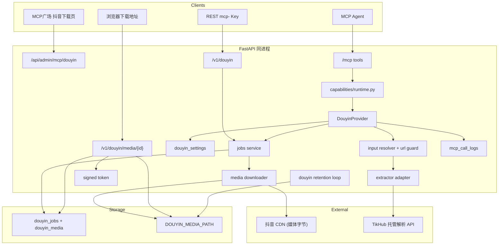

# MCP 广场抖音视频下载（Douyin Downloader）

Feature Name: 2026-10-03-douyin-downloader
Updated: 2026-10-03

## Description

在现有能力平面上新增 `douyin`：输入端接收抖音分享文案或直链，解析出作品元数据与媒体（视频、图集图片、音频），把媒体转存到平台数据卷，输出稳定的平台下载地址。能力同时注册进 REST 与现有 MCP 端点，复用 `mcp_keys`、能力白名单与调用日志。

核心取舍：

- **转存而非只回直链**：抖音 CDN 直链带时效签名且可能受地域/风控限制，无法作为稳定交付物。平台拉流落盘后，由 `/v1/douyin/media/{media_id}` 统一提供下载，配合签名令牌与保留清理。
- **解析固定走 TikHub 托管 API**：唯一解析来源是 TikHub 托管 API，不再自研解析器，也不在本地安装任何解析依赖。抖音对服务端请求有 WAF/签名拦截（`ArgusSecurityPlugin`），平台侧反爬由 TikHub 处理。Base URL 与 API Key 持久化在数据库单例设置中，管理页可写入/清除，Key 加密存储、不回显。
- **零本地凭据**：不再维护会话 Cookie 或依赖管理面板，管理页只保留 TikHub 配置与任务列表。
- **提交即返回的异步流水线**：管理端/REST `POST` 只入库并返回任务标识（`queued`/`resolving`），解析（`resolving`）与下载（`downloading`，含字节进度）全部在后台执行；前端按阶段轮询进度。MCP 单次调用内等待有限时长，超时返回任务标识供 `douyin_job` 轮询继续推进。

本能力**只做内容拉取与转存**：不执行抖音端任何写操作，不提供去水印绕过、反风控或批量抓取手段，不改变作品版权归属。使用范围限定为个人合规留存，部署方需自行确认对目标作品的使用授权。

关键约束：

- 外部输入是任意文本与 URL，转存会向远端发起请求，必须做 **SSRF 防护**（主机白名单 + 逐跳校验 + 私有/回环 IP 拒绝 + 流式大小上限）。
- 媒体存储与站点部署同构：任务目录隔离、系统生成安全文件名、保留期清理。
- 协议面 REST 使用 `/v1/douyin` 前缀，避开通用分发路由 `POST /v1/capabilities/{capability_id}/{operation}`（`backend/app/routers/capabilities_public.py:61`）对两段式路径的遮蔽，沿用 `/v1/sites` 的做法。

## Architecture



**决策**

| 项 | 选择 | 理由 |
|----|------|------|
| 能力标识 | `douyin` | 与 `knowledge`、`docparse`、`site` 并列，工具名前缀 `douyin_` |
| REST 前缀 | `/v1/douyin` | 规避通用分发路由对 `/v1/capabilities/douyin/...` 两段式路径的遮蔽 |
| 提取方式 | 仅 TikHub 托管 API | TikHub 在服务侧处理反爬/签名，本机零依赖 |
| 解析配置 | DB 单例（Base URL + 加密 API Key），管理页可写/清，环境变量兜底 | Key 不落明文，改版时管理页即时生效 |
| 交付方式 | 平台转存 + 稳定下载地址 | 抖音直链有时效，转存后才能稳定分发 |
| 执行模式 | 提交即返回，解析+下载均后台执行（`BackgroundTasks` + 轮询），MCP 限时内联 | 不引入任务表 worker；提交不阻塞，进度按阶段展示；MCP 无轮询能力但可返回任务标识 |
| 媒体存储 | `{DOUYIN_MEDIA_PATH}/{job_id}/{index}.{ext}` | 任务目录隔离，系统生成文件名，避免路径穿越 |
| 下载鉴权 | 签名令牌（HMAC，绑定 `media_id` + 过期）或归属 MCP Key | 令牌可让地址直接在浏览器打开，Key 鉴权覆盖 API 场景 |
| 状态 | `queued` / `downloading` / `succeeded` / `partial` / `failed` / `expired` | 覆盖部分成功与保留清理后的过期态 |
| 镜像放置（图集） | 逐项转存并保序编号 | 图集展示顺序与源一致 |
| 管理入口 | `/mcp-plaza/douyin` | 复用广场卡片与子路由 |

## Components and Interfaces

### 1. Provider

路径：`backend/app/capabilities/douyin/`

```text
capabilities/douyin/
  provider.py     # CapabilitySpec + dispatch + MCP tools
  resolver.py     # 分享文案/直链解析 + 主机白名单与 SSRF 校验
  extractor/
    __init__.py   # build_extractor()：构造 TikHub 适配器
    base.py       # Extractor 协议 + ExtractedWork / ExtractedMedia 数据类
    tikhub.py     # TikHub 托管 API 适配器（唯一提取器）
    aweme.py      # 作品 JSON → ExtractedWork 的容错映射
  provider_config.py  # TikHub base_url / api_key 加密存储
  jobs.py         # 任务 CRUD、调度、重试、结果组装
  downloader.py   # 流式下载 + 大小/类型校验 + 落盘
  storage.py      # 任务目录布局与临时文件清理
  tokens.py       # 签名下载令牌生成与校验
  errors.py       # DouyinError
```

```python
spec = CapabilitySpec(
    capability_id="douyin",
    name="抖音视频下载",
    description="解析抖音分享链接或文案，转存视频/图集并提供稳定下载地址",
    version="1.0.0",
    category="media",
    status="enabled",
    admin_path="/mcp-plaza/douyin",
    icon="download",
)
```

在 `capabilities/registry.py` 的 `ensure_defaults()` 追加 `register(DouyinProvider())`（参考 `backend/app/capabilities/registry.py:76`）。在 `runtime._normalize_error` 的 `isinstance` 元组内加入 `DouyinError`（参考 `backend/app/capabilities/runtime.py:29`）。

### 1.1 MCP 工具

`backend/app/mcp_server.py` 的 `register_all_tools()` 遍历 `list_tool_defs()`，Provider 注册后工具自动出现在 `/mcp`（参考 `backend/app/mcp_server.py:165`）。

| Tool | operation | 入参 | 返回 |
|------|-----------|------|------|
| `douyin_parse` | `parse` | `url` 或 `share_text` 二选一；`rehost`(默认 true)；`wait_seconds`(可选) | 任务标识、元数据、媒体列表与下载地址 |
| `douyin_job` | `job` | `job_id` | 任务状态、阶段、进度与错误 |
| `douyin_result` | `result` | `job_id` | 终态任务的完整元数据与媒体下载地址 |
| `douyin_list` | `list` | 可选 `limit` | 该 Key 的任务列表 |

`douyin_parse` 在单次调用内最多等待 `DOUYIN_MCP_MAX_WAIT_SECONDS`（默认 45s）：若在等待窗口内完成转存则直接返回终态；超时返回 `status=downloading` 与 `job_id`，调用方改用 `douyin_job` 轮询。`rehost=false` 时跳过下载，立即返回元数据与原始直链。

`rehost=true` 且任务过大或超时，返回 `partial`，成功媒体项带下载地址，失败项带原因。

### 1.2 REST（`/v1/douyin`，MCP Key 鉴权，需 `douyin` 授权）

| Method | Path | 说明 |
|--------|------|------|
| POST | `/v1/douyin/parse` | body：`{"url"|"share_text": "...", "rehost": true}`；返回任务标识与初始状态 |
| GET | `/v1/douyin/jobs` | 仅返回该 Key 创建的任务，支持 `limit` / `offset` |
| GET | `/v1/douyin/jobs/{job_id}` | 任务状态与进度 |
| GET | `/v1/douyin/jobs/{job_id}/result` | 终态任务的元数据与媒体列表 |
| POST | `/v1/douyin/jobs/{job_id}/retry` | 重试 `failed` 任务 |
| DELETE | `/v1/douyin/jobs/{job_id}` | 删除任务与媒体文件 |
| GET | `/v1/douyin/media/{media_id}` | 下载媒体：`?token=` 或归属 MCP Key |

鉴权复用 `_mcp_key_dep` 与 `allowed_capability_ids`（参考 `backend/app/routers/capabilities_public.py:32`）。跨 Key 访问返回 404。

### 1.3 Admin（`Depends(get_current_admin)`）

| Method | Path | 说明 |
|--------|------|------|
| GET | `/api/admin/mcp/douyin/jobs` | 分页列表，支持 `q`、`status` |
| POST | `/api/admin/mcp/douyin/jobs` | 发起解析/转存；返回 `202` + `job_id`、`status=queued` |
| GET | `/api/admin/mcp/douyin/jobs/{job_id}` | 详情 + 媒体列表 |
| POST | `/api/admin/mcp/douyin/jobs/{job_id}/retry` | 重试 `failed` 任务 |
| DELETE | `/api/admin/mcp/douyin/jobs/{job_id}` | 删除任务与媒体文件 |
| GET | `/api/admin/mcp/douyin/provider` | TikHub base_url / 是否配置 Key / 来源 / 更新时间（不回显 Key） |
| PUT | `/api/admin/mcp/douyin/provider` | body：`{"base_url"?, "api_key"?}`；Key 加密存储，`api_key` 省略则不改 |
| DELETE | `/api/admin/mcp/douyin/provider` | 清除 TikHub 配置 |

`GET provider` 返回 `{"base_url", "configured", "has_key", "source": "page"|"env"|"", "updated_at"}`；`configured` 表示 Base URL 与 API Key 均已就绪。

### 2. 输入解析与安全校验（resolver.py）

`resolve_target(raw: str) -> Target`：

1. 用正则从任意文本提取抖音链接。优先级：`v.douyin.com/{code}`、`www.douyin.com/video/{id}`、`www.iesdouyin.com/share/video/{id}`、`www.douyin.com/note/{id}`。
2. 用 `urllib.parse` 解析出 scheme/host；只允许 `http` / `https`。
3. 主机白名单：`host == 白名单项` 或以 `.白名单项` 结尾；白名单含 `douyin.com`、`v.douyin.com`、`www.douyin.com`、`www.iesdouyin.com`、`iesdouyin.com`。
4. SSRF 校验：对目标主机做 DNS 解析，任何解析结果落在回环、私有、链路本地、组播、保留网段则拒绝（`ipaddress` 判定）。
5. 返回标准化 `Target(kind, host, url, aweme_id?)`。

重定向在提取器/下载器内自行处理逐跳校验：使用 `httpx` 时关闭自动重定向，手动逐跳 `Location` 并重复步骤 3-4，设置最大跳数。

### 3. 外部提取器适配器（仅 TikHub）

`extractor/base.py` 定义统一协议：

```python
class Extractor(Protocol):
    name: str
    def available(self) -> bool: ...
    def extract(self, target: Target) -> ExtractedWork: ...
```

- `tikhub.py` 是唯一适配器，调用 TikHub 托管 API；`build_extractor(tikhub_config)` 在未配置 API Key 时抛出 `extractor_unavailable`。
- 适配器只负责“解析出直链与元数据”，**不负责下载**；下载统一走 `downloader.py`，保证 SSRF、大小、类型校验只在一处生效。

### 3.1 TikHub 托管解析（extractor/tikhub.py + provider_config.py）

抖音 WAF 拦截服务端请求，解析统一走第三方托管 API：

- 配置：`douyin_settings.tikhub_base_url` + `tikhub_api_key_encrypted`；`provider_config.get_config(db)` 页面优先、环境变量兜底。管理页可写入/清除，API Key 加密存储且不回显。
- 调用：`GET {base}/api/v1/hybrid/video_data?url=<分享文案或直链>`，头 `Authorization: Bearer <key>`，超时 60s。接口接受短链、直链或整段分享文案。
- 映射：响应 `data` 无固定 schema，用 `aweme.py` 递归定位作品对象（含 `aweme_id` 且带 `video`/`images`/`image_post_info`），再映射视频 `video.play_addr.url_list`（回退 `bit_rate[].play_addr` / `download_addr`）、图集 `images[].url_list` 或 `image_post_info.images[].url_list`、标题 `desc`、作者 `author.nickname/uid`、时长 `video.duration`（毫秒）。
- 错误：HTTP ≥ 400 或 `success=false` → `upstream_error` / `content_unavailable`；未配 Key → `extractor_unavailable`。

### 5. 任务与转存（jobs.py / downloader.py）

提交即返回，解析与下载全部在后台执行，管理页/REST/前端按阶段轮询：

- `create_job(db, *, raw_input, rehost, actor, mcp_key_id)`：只做轻量校验（`resolve_target` 提取链接与 SSRF 校验）并写入 `douyin_jobs` 行（`status=queued`、`stage=resolving`、`percent=0`、`message=排队中，等待解析`），随后 `commit` 并向后台调度 `run_job_task`。REST `POST /v1/douyin/parse` 返回 `202` 时即为该 `queued` 快照。
- `run_job(db, job, deadline=None, persist=False)`：
  1. **阶段一：解析中**（`stage=resolving`）：先把 `stage=resolving`、`message=解析中…` 立即提交（`persist=True`），再调用 `build_extractor` 走 TikHub 解析作品，写入作品元数据与 `douyin_media` 行（`status=pending`）。因此解析耗时期间轮询能看到「解析中」而非停留在「等待解析」。失败调用 `_fail_job` 置 `failed` 并记录错误。
  2. **阶段二：下载中**（`stage=downloading`）：逐媒体项调用 `downloader.fetch_to_file(remote_url, dest, max_bytes=..., kind=..., on_progress=...)`：
     - `on_progress(written, content_length)` 汇报字节进度；`content_length` 已知时 `percent` 按字节推进，未知时按完成项数推进，下载中封顶 99%。回调到达调用方等待窗口（`deadline`）时抛出 `_JobDeadline` 中断当前项并保留 `pending`，保证 MCP 等待时长不被单个大文件突破，后续 `douyin_job` 续传。
     - 流式读取，累计字节；超过单文件上限置该项 `failed`，继续下一项。
     - 校验 `Content-Type` 属于 `video/*`、`image/*`、`audio/*`，否则该项 `failed`。
     - 写入 `{job_id}/{index}.{ext}`，计算 `sha256` 与 `size_bytes`。
  3. `job.downloaded_bytes` 记录已下载字节、`job.expected_bytes` 记录已探测到的预期总量；`persist=True` 时按 0.5s 节流提交，保证独立轮询会话能看到进度。
  4. 全部成功置 `succeeded`、部分成功置 `partial`、全部失败置 `failed`，`stage=done`、`percent=100`；为成功媒体生成平台下载地址（含签名令牌，见 §6）。
- `retry_job`、`delete_job`、`list_jobs`、`reconcile_stuck` 与站点部署同构（参考 `backend/app/capabilities/site/sites.py`）。
- `rehost=false`：仍走阶段一解析，解析后媒体行置 `ready` 并直接 `succeeded`，不下载、只存原始直链。

并发保护：用 `DOUYIN_MAX_CONCURRENT_PER_KEY` 限制同一 Key 同时处于 `queued/downloading` 的任务数，超限返回 429。

### 6. 下载地址与签名令牌（tokens.py / media API）

下载地址：相对路径 `/v1/douyin/media/{media_id}?token=...`（`download_url`，浏览器经前端/反代按当前 origin 解析），同时给出带网关根地址的绝对地址 `absolute_download_url`（`{APP_BASE_URL}/v1/douyin/media/{media_id}`）供脚本/服务端直接使用。

令牌生成：`token = base64url(media_id.exp).hmac_sha256(app_secret_key)`；校验时比对签名并按 `exp` 判过期。有效期 `DOUYIN_DOWNLOAD_TOKEN_TTL_SECONDS`（默认 3600）。

`GET /v1/douyin/media/{media_id}` 处理顺序：

1. 查 `douyin_media`；不存在 → 404。
2. 若带 `Authorization` 且为有效 MCP Key，校验该媒体归属该 Key → 通过；否则进入令牌校验。
3. 校验 `?token=`：签名与有效期；失败 → 401。
4. 媒体 `purged=1` 或文件缺失 → 410。
5. `FileResponse` 返回，`Content-Type` 用存储时探测值，`Content-Disposition: attachment; filename="..."`（文件名由 `aweme_id + index + ext` 生成，不含远程名称）。
6. 附加 `Cache-Control: private, max-age={TTL}` 与 `X-Content-Type-Options: nosniff`。

MCP/REST 结果里同时给出 `original_url`（抖音直链）、`download_url`（含令牌的相对路径）与 `absolute_download_url`（含网关根地址）。

### 7. 保留清理（services/douyin_retention.py）

仿 `site_retention`（参考 `backend/app/services/site_retention.py:23`）：

- 清理超过 `DOUYIN_RETENTION_DAYS`（默认 7）的媒体文件，置 `purged=1`，保留任务与媒体元数据。
- 清理超过 1 天的 `.tmp` 残留。
- 任务在全部媒体被清理后，状态保持原值，下载返回 410。
- 在 `backend/app/main.py` 的 lifespan 内追加 `asyncio.create_task(douyin_retention_loop())`（参考 `backend/app/main.py:126`），启动时调用 `reconcile_stuck(db)` 把残留 `queued/downloading` 任务置 `failed`（参考 `backend/app/main.py:107`）。

### 8. 配置（config.py）

| 变量 | 默认 | 说明 |
|------|------|------|
| `DOUYIN_MEDIA_PATH` | 数据目录下 `douyin` | 媒体落盘目录，经 `_resolve_data_path` 解析 |
| `DOUYIN_MAX_MEDIA_BYTES` | 5GB | 单次任务总字节上限 |
| `DOUYIN_MAX_ITEM_BYTES` | 5GB | 单媒体项字节上限 |
| `DOUYIN_MAX_ITEMS` | 60 | 单作品媒体项数量上限 |
| `DOUYIN_HTTP_TIMEOUT_SECONDS` | 20 | 单次 HTTP 请求超时 |
| `DOUYIN_MCP_MAX_WAIT_SECONDS` | 45 | MCP 内联等待上限 |
| `DOUYIN_MAX_REDIRECTS` | 5 | 短链最大跳数 |
| `DOUYIN_DOWNLOAD_TOKEN_TTL_SECONDS` | 3600 | 下载令牌有效期 |
| `DOUYIN_RETENTION_DAYS` | 7 | 媒体保留天数 |
| `DOUYIN_MAX_CONCURRENT_PER_KEY` | 2 | 单 Key 并发任务上限 |
| `DOUYIN_USER_AGENT` | 桌面 Chrome UA | 拉取媒体 CDN 所用 UA |
| `DOUYIN_TIKHUB_BASE_URL` | `https://api.tikhub.io` | TikHub API 根地址（管理页可覆盖） |
| `DOUYIN_TIKHUB_API_KEY` | 空 | TikHub API Key（环境变量兜底，管理页可加密存储） |
| `DOUYIN_TIKHUB_TIMEOUT_SECONDS` | 60 | TikHub 请求超时 |

`resolved_douyin_media_path` 属性追加到 `Settings`（参考 `backend/app/config.py:191` 的 `resolved_site_deploy_path`）。

### 9. 前端

| 文件 | 改动 |
|------|------|
| `frontend/src/pages/McpPlaza.tsx` | `iconMap` 增加 `download: Download` |
| `frontend/src/App.tsx` | 懒加载并注册 `mcp-plaza/douyin` 与 `mcp-plaza/douyin/:jobId`（参考 `frontend/src/App.tsx:129`） |
| `frontend/src/pages/McpDouyin.tsx` | 任务列表 + 粘贴分享文案/直链对话框 + 进度轮询 + TikHub 配置面板 |
| `frontend/src/pages/McpDouyinDetail.tsx` | 元数据、媒体网格、预览、复制下载地址、重试、删除 |
| `frontend/src/lib/api.ts` | 增加抖音下载相关方法（参考 MCP 小节 `frontend/src/lib/api.ts`） |
| `frontend/src/pages/McpDocs.tsx` | 增加 Douyin 接入小节与 `douyin_*` 工具说明 |

页面交互：列表展示封面缩略图、标题、作者、状态徽标、媒体数与创建时间，进行中任务额外展示阶段文案与百分比进度条；提交后进入详情页轮询 `stage/percent/message/downloaded_bytes`，以「解析中 → 下载中 → 完成」步骤条展示阶段，下载中展示「已下载 x / y」。媒体卡片默认不加载播放器，点击「预览」才按类型渲染视频/图片/音频，「复制地址」复制带令牌的完整公网 URL（`window.location.origin + download_url`）。

设置区展示 TikHub 配置：Base URL 输入框、API Key 输入框（留空则不修改，不回显，已配置时占位提示）、配置状态徽标与来源（管理页/环境变量）、更新时间，提供「保存」与「清除」；保存后即时对后续解析生效，无需重启。

## Data Models

表 `douyin_jobs`：

| 列 | 类型 | 说明 |
|----|------|------|
| id | varchar(36) pk | uuid |
| mcp_key_id | int null | 协议面归属 Key，索引 |
| created_by | varchar(16) | `admin` / `key` |
| raw_input | text | 原始分享文案或直链 |
| source_url | varchar(512) | 解析出的标准 URL |
| aweme_id | varchar(64) null | 作品 ID，索引（同作品去重/复用可后续扩展） |
| extractor | varchar(16) | 实际使用的提取器 |
| kind | varchar(16) | `video` / `gallery` / `mixed` |
| title | varchar(512) | 标题或文案 |
| author_name | varchar(128) | 作者昵称 |
| author_id | varchar(64) | 作者 ID |
| cover_url | varchar(1024) | 封面原始地址 |
| duration_ms | int | 视频时长 |
| rehost | boolean | 是否转存 |
| status | varchar(16) | `queued` / `downloading` / `succeeded` / `partial` / `failed` |
| stage | varchar(16) | `resolving`（解析中）/ `downloading`（下载中）/ `done`（完成） |
| percent | int | 0-100（下载中封顶 99，完成置 100） |
| downloaded_bytes | int | 已下载字节数（下载进度） |
| expected_bytes | int | 已探测到的预期总字节（content-length 之和，可能小于最终值） |
| message | varchar(256) | 阶段文案 |
| media_count | int | 媒体项总数 |
| success_count | int | 成功媒体项数 |
| total_bytes | int | 已落盘总字节 |
| error_message | text null | 失败原因 |
| created_at / started_at / finished_at / updated_at | datetime | 时间戳 |

表 `douyin_media`：

| 列 | 类型 | 说明 |
|----|------|------|
| id | varchar(36) pk | uuid，即 `media_id` |
| job_id | varchar(36) fk | 级联删除，索引 |
| index_no | int | 展示顺序，唯一约束 `(job_id, index_no)` |
| kind | varchar(16) | `video` / `image` / `audio` |
| remote_url | varchar(1024) | 抖音 CDN 原始直链 |
| filename | varchar(256) | 平台生成文件名 |
| content_type | varchar(128) | 落盘时探测 |
| size_bytes | int | 文件字节数 |
| sha256 | varchar(64) null | 内容摘要 |
| width / height | int null | 图片/视频尺寸 |
| duration_ms | int | 媒体时长（视频/音频） |
| status | varchar(16) | `pending` / `ready` / `failed` |
| error_message | text null | 单项失败原因 |
| purged | int | 文件已清理 |
| created_at | datetime | 时间戳 |

表 `douyin_settings`（全局单例，仅存 TikHub 配置）：

| 列 | 类型 | 说明 |
|----|------|------|
| id | int pk | 固定为 1 |
| tikhub_base_url | varchar(256) | TikHub Base URL |
| tikhub_api_key_encrypted | text null | Fernet 加密的 TikHub API Key |
| tikhub_updated_at | datetime null | TikHub 配置最近更新时间 |
| updated_at | datetime | 最近修改时间 |

索引：`douyin_jobs(mcp_key_id, created_at)`、`douyin_jobs(aweme_id)`、`douyin_media(job_id, index_no)`。模型定义追加到 `backend/app/models.py`，参考 `DocParseJob`（`backend/app/models.py:687`）、`SiteVersion`（`backend/app/models.py:742`）与单例设置表 `SkillClassificationSettings`（`backend/app/models.py:271`）。

## Correctness Properties

- 只有主机名属于白名单且解析 IP 非私有/回环的 URL 会发起外部请求；每一跳重定向都重新校验。
- 落盘路径始终位于 `{DOUYIN_MEDIA_PATH}/{job_id}/` 内，文件名由系统生成，远程文件名不参与路径拼接。
- 单个媒体项转存要么产出完整文件并置 `ready`，要么不落盘并置 `failed`，不存在半成品被当作成功。
- 任务终态为 `succeeded` 当且仅当所有媒体项 `ready`；`partial` 当且仅当至少一项 `ready` 且至少一项 `failed`；`failed` 当且仅当无 `ready` 项（且 `rehost=true`）。
- 任务状态只能按 `queued -> downloading -> succeeded|partial|failed` 迁移；终态不再回到 `downloading`，重试是新建一次执行。
- 下载令牌 HMAC 绑定 `media_id` 与过期时间；篡改或过期令牌一律 401。
- 到期清理后媒体文件不存在且 `purged=1`，下载返回 410；删除任务同时清理文件与记录。
- 协议面查询同时匹配 `id` 与 `mcp_key_id`；不匹配返回 404。
- 能力可见性与调用授权一致：`tools/list` 只展开该 Key 的 `douyin_*` 工具，`tools/call` 再次校验白名单。
- 解析固定走 TikHub；未配置 API Key 时返回 `extractor_unavailable`，不发起上游请求。
- TikHub API Key 明文不出现在任何响应、日志或错误信息中；`get_config` 顺序固定为页面配置（解密）> 环境变量，解密失败时回退环境变量，不抛错阻塞解析。
- 任务创建时把提取器名固化到 `extractor` 字段（固定为 `tikhub`）。

## Error Handling

| 场景 | 状态 | 对用户 |
|------|------|--------|
| 输入中无抖音链接 | 400 | 未找到可识别的抖音链接 |
| 链接主机不在白名单 / 解析到私有 IP | 400 | `blocked_host` |
| 重定向超出跳数或跳转到非白名单主机 | 400 | `unsafe_redirect` |
| 作品删除、私密或不可访问 | 422 | `content_unavailable` |
| 媒体项数量超过上限 | 400 | 说明上限 |
| 单次总字节超过上限 | 413 | 说明上限 |
| 单媒体项超过上限 | 该项 `failed` | 调整上限或改用原始直链 |
| `Content-Type` 非媒体类别 | 该项 `failed` | `unsupported_content_type` |
| 未授权 `douyin` | 403 | 权限错误 |
| 聊天 `sk-` 访问协议面 | 401 | 需 MCP Key |
| 并发任务超过上限 | 429 | 稍后重试 |
| 下载令牌缺失或无效 | 401 | 需有效令牌或归属 Key |
| 媒体已过期清理 | 410 | 文件已过期，请重新解析 |
| TikHub 未配置 API Key | 400 | `extractor_unavailable`，提示在管理页配置 |
| TikHub 上游 HTTP ≥ 400 或 `success=false` | 502 / 422 | `upstream_error` / `content_unavailable`，附上游摘要 |
| TikHub 请求超时 | 502 | `upstream_error`，不无限重试 |
| 转存网络超时 | 任务 `failed`/`partial` | 保留阶段与错误信息，可重试 |
| 进程重启遗留非终态任务 | 启动时置 `failed` | 提示重试 |

## Test Strategy

后端在 `backend/` 下执行 `PYTHONPATH=. python3 -m pytest tests/test_douyin.py`：

- **输入解析**：从示例分享文案 `5.84 复制打开抖音… https://v.douyin.com/K6QsRUZrYJ4/ …` 提取短链；非抖音文本返回 400；伪造 `http://127.0.0.1/...`、`http://10.0.0.1/...`、`https://evil.com/...` 逐一断言 400。
- **提取器契约**：用假 `Extractor` 注入视频作品与三图图集，断言 `douyin_media` 行数与 `index_no` 顺序、`kind` 正确。
- **TikHub 适配器**：mock `httpx.get` 返回 `data.aweme_detail`，断言 URL 路径、查询参数、`Authorization` 头与字段映射；`aweme.build_work` 从 `image_post_info.images` 构造图集。
- **TikHub 配置**：`PUT/GET/DELETE /provider` 的保存、状态（`configured`/`has_key`/`source=page`）与清除，响应不回显 Key 明文。
- **转存与下载**：mock `downloader.fetch` 或 `httpx` 传输，断言文件落在 `{job_id}/{index}.ext`、`size_bytes`/`sha256` 正确、平台下载地址可带令牌 200 返回且 `Content-Disposition` 文件名正确。
- **鉴权与令牌**：无令牌无 Key 401、错误令牌 401、过期令牌 401、归属 Key 200、跨 Key 404、`sk-` 401、未授权 Key 403。
- **部分失败**：一项超限置 `failed`、其余成功，任务 `partial`；全部失败任务 `failed`；重试后重新进入 `downloading` 并成功。
- **上限与类型**：超总字节 413、超媒体项数 400、非媒体 `Content-Type` 单项失败。
- **保留与过期**：伪造旧媒体触发清理，断言 `purged=1`、文件删除、下载 410；删除任务清理文件与记录。
- **启动恢复**：残留 `queued/downloading` 任务启动后被置 `failed`。
- **MCP 一致性**：已授权 Key `tools/list` 可见 `douyin_parse`；`tools/call` 在等待窗口内返回终态或返回 `job_id` 且业务数据与 REST 一致。
- **前端**：`cd frontend && npx tsc -b`。

## References

[^1]: (Filename#L29) - 能力规格与 dispatch 契约 `backend/app/capabilities/base.py`
[^2]: (Filename#L76) - 内置能力注册点 `backend/app/capabilities/registry.py`
[^3]: (Filename#L29) - 错误归一化 `backend/app/capabilities/runtime.py`
[^4]: (Filename#L61) - 通用能力分发路由，说明 `/v1/douyin` 前缀的必要性 `backend/app/routers/capabilities_public.py`
[^5]: (Filename#L32) - 协议面 MCP Key 依赖 `backend/app/routers/capabilities_public.py`
[^6]: (Filename#L165) - MCP 工具动态注册 `backend/app/mcp_server.py`
[^7]: (Filename#L191) - 数据路径解析样板 `backend/app/config.py`
[^8]: (Filename#L687) - 任务型数据模型参考 `backend/app/models.py`
[^9]: (Filename#L742) - 版本型数据模型参考 `backend/app/models.py`
[^10]: (Filename#L23) - 每日保留清理循环样板 `backend/app/services/site_retention.py`
[^11]: (Filename#L126) - 保留清理任务挂载点 `backend/app/main.py`
[^12]: (Filename#L107) - 启动恢复残留任务样板 `backend/app/main.py`
[^13]: (Filename#L129) - 广场子路由注册参考 `frontend/src/App.tsx`
