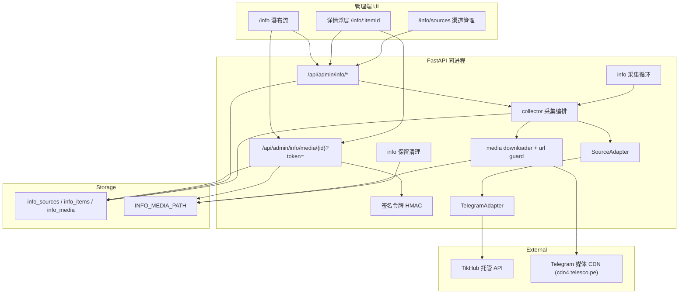

# 资讯收集（Info Collection）

Feature Name: 2026-10-04-info-collection
Updated: 2026-10-04

## Description

新增一个**独立功能**（不注册进能力平面、不进 MCP 广场、不涉及 MCP Key）：把多个外部渠道的内容采集进本地库，在管理端以**小红书式瀑布流**浏览，每一条都有图片、视频或纯文字封面。

首个采集渠道是 **Telegram 公开频道**，通过已有的 TikHub 托管 API（`GET /api/v1/telegram/web/fetch_channel_posts`）增量拉取。渠道层做成适配器，后续接 RSS、微博、公众号等只需新增一个 adaptor。

核心取舍：

- **不做成 MCP 能力**：路由挂在 `/api/admin/info/*`，鉴权用管理员 JWT（`Depends(get_current_admin)`），与 `capabilities/`、`mcp_keys`、调用日志完全解耦。
- **媒体必须转存**：Telegram 媒体直链（`cdn4.telesco.pe`）带签名且会过期，官方明确要求"尽快下载/转存"。因此采集时把图片/视频落盘到数据卷，由平台稳定地址提供，前端永远不直连上游。
- **增量而非全量**：用 `fetch_channel_posts` 的 `after` 游标做增量轮询，首次采集回填固定条数后只取更新的消息，避免每次重拉历史。
- **必须有内容**：一条内容若既无媒体也无文本（表情包、服务消息、空转发），采集阶段直接丢弃。
- **纯文字用 CSS 封面**：没有媒体时不再去抓配图，而是按内容的稳定哈希选一套配色与比例，统一用「引言」版式、纯 CSS 生成封面，保证瀑布流有节奏感、不塌陷、不重复。

范围限制：只做"公开渠道的内容采集与浏览"。不抓私密频道（TikHub 接口只支持 public channel，且需要频道有 username）、不做任何写操作、不绕过平台风控。使用范围限定为个人合规留存，部署方自行确认内容使用授权。

关键约束：

- 外部输入是频道标识与上游返回的媒体直链，两者都会触发外部请求，必须有 **SSRF 防护**（主机白名单 + 逐跳校验 + 私有/回环 IP 拒绝）与**大小上限**。
- 媒体直链来自上游返回，**不可信**：只允许 http/https、按白名单校验主机、逐跳复核重定向。
- 浏览器 `` 无法携带 JWT 头，媒体地址必须用**签名令牌**（复用抖音下载的 HMAC 方案）。

## Architecture



**决策**

| 项 | 选择 | 理由 |
|----|------|------|
| 功能定位 | 独立功能，非 MCP 能力 | 用户明确要求；不引入 MCP Key、白名单与调用日志 |
| 模块位置 | `backend/app/info/` + `backend/app/routers/admin_info.py` | 与 `capabilities/` 隔离，避免被 `ensure_defaults()` 注册进 MCP |
| 协议面 | 只有 `/api/admin/info/*`，管理员 JWT | 无对外 REST/MCP 需求，最小暴露面 |
| 渠道抽象 | `SourceAdapter` 协议 + `adapters/telegram.py` | 后续接 RSS/微博只加适配器，采集编排不动 |
| 采集方式 | 定时循环（asyncio task）+ `after` 游标增量 | 与 `site_retention`/`douyin_retention` 同构；游标保证不重复拉历史 |
| 媒体处理 | 采集时转存落盘，平台签名地址分发 | 上游直链会过期，不能作为稳定交付物 |
| 媒体鉴权 | HMAC 签名令牌（`?token=`），绑定 media_id + 过期 | 浏览器 `` 无法带 JWT 头（沿用抖音方案） |
| 纯文字封面 | 前端按 `cover_seed` 纯 CSS 生成，不落图片 | 零存储、零请求、稳定可复现 |
| 瀑布流实现 | JS 最短列装箱 + 预留宽高比占位 | CSS `columns` 会让"最新"落在列底，阅读顺序错乱 |
| TikHub 凭据 | 抽出 `services/tikhub_config.py`，复用现有加密存储 | 一个账号一个 token，跨平台通用，避免两处配置 |
| 导航入口 | PC 侧栏新增；移动端底栏**保持 5 项** | `MEMORY.md` 明确底栏不超过 5 项 |

## Components and Interfaces

### 1. 目录结构

```text
backend/app/info/
  __init__.py
  collector.py        # 采集编排：轮询、去重入库、游标推进、媒体下载调度
  sources.py          # 渠道 CRUD、启用/停用、立即采集、采集日志
  items.py            # 内容查询（瀑布流分页游标）、收藏/隐藏、详情
  media.py            # 媒体落盘、探测、sha256、清理
  urlguard.py         # SSRF 校验 + 逐跳重定向校验（与抖音同构）
  tokens.py           # 媒体签名令牌生成/校验
  errors.py           # InfoError
  adapters/
    __init__.py       # build_adapter(kind) 注册表
    base.py           # SourceAdapter 协议 + FetchedPost / FetchedMedia 数据类
    telegram.py       # TikHub fetch_channel_posts 适配器
backend/app/routers/admin_info.py     # /api/admin/info/*
backend/app/services/info_loop.py     # 采集循环（lifespan 挂载）
backend/app/services/info_retention.py# 媒体保留清理
backend/app/services/tikhub_config.py # TikHub 凭据读取（新增，抖音与本功能共用）
```

### 2. 渠道适配器契约

```python
class SourceAdapter(Protocol):
    kind: str
    def normalize(self, raw: str) -> str: ...          # "https://t.me/xxx" / "@xxx" -> "xxx"
    def preview(self, identifier: str) -> SourcePreview: ...  # 添加渠道时取频道信息
    def fetch(
        self, identifier: str, *, after: int | None, limit: int
    ) -> FetchedPage: ...                              # 增量拉取

@dataclass(frozen=True)
class FetchedMedia:
    kind: str            # image | video | poster（视频封面单独一项）
    remote_url: str
    duration_ms: int | None

@dataclass(frozen=True)
class FetchedPost:
    external_id: str          # Telegram post_id
    text: str
    published_at: datetime | None
    permalink: str
    author_name: str
    source_type: str          # 上游 type：text | photo | video
    views_text: str | None    # 原文 "1.65M"，解析后的数字另行计算
    reactions: list[dict]     # 原样保留（emoji/count/paid）
    is_forwarded: bool
    link_preview: dict | None
    media: list[FetchedMedia]

@dataclass(frozen=True)
class FetchedPage:
    posts: list[FetchedPost]
    after_cursor: int | None      # 下一页增量游标（本页最大 post_id）
    before_cursor: int | None
```

`telegram.py` 调用 `GET {base}/api/v1/telegram/web/fetch_channel_posts`，参数 `channel` / `limit` / `after`，头 `Authorization: Bearer <key>`，超时 60s。

> **字段映射已用真实响应固化**（2026-10-04 实测，`durov` 与 `telegram` 两个频道）：
> 真实响应存档在 `backend/tests/fixtures/telegram_channel_posts.json`（含 link_preview / reactions / video）与 `telegram_channel_photos.json`（含 `type=photo`）。可用 `scripts/telegram_probe.py` 重新拉取。

**已验证的上游结构**

```jsonc
{
  "code": 200,
  "data": {
    "channel": "telegram",
    "channel_info": {
      "username": "telegram", "title": "Telegram News", "verified": true,
      "description": "…", "photo": "https://cdn1.telesco.pe/file/….jpg",
      "subscribers": "9.4M",
      "counters": { "subscribers": "9.4M", "photos": "16", "videos": "228", "links": "378" }
    },
    "messages": [
      {
        "id": 458,                                   // post_id，int，增量游标依据
        "channel": "telegram",
        "url": "https://t.me/telegram/458",
        "type": "text | photo | video",
        "date": "2026-08-26T19:12:34+00:00",         // ISO8601 带时区
        "text": "…", "text_html": "…",
        "views": "1.65M",                            // ← 带单位字符串，不是数字
        "author": "Telegram News",
        "is_forwarded": false, "forwarded_from": null, "reply_to": null,
        "link_preview": { "url": "…", "site_name": "…", "title": "…", "description": "…" },
        "media": {
          "photos": ["https://cdn1.telesco.pe/file/….jpg"],   // ← 纯 URL 字符串数组
          "videos": [ { "url": "…mp4", "thumb": "…jpg", "duration": "0:20" } ],
          "has_unsupported": false
        },
        "reactions": [ { "emoji": "⭐", "count": "21.2K", "paid": true } ]
      }
    ],
    "pagination": { "before_cursor": 451, "after_cursor": 460, "has_more_before": true, "count": 10, "limit": 10, "pages_fetched": 1 }
  }
}
```

**映射规则（含实测坑）**

| 上游 | 我们的字段 | 处理 |
|------|-----------|------|
| `messages[].id` | `external_id` | 转字符串；增量游标用 `max(id)` |
| `pagination.after_cursor` | 下一页 `after` | 直接用（本页最大 id） |
| `messages[].type` | 参考 | **不单独作为分类依据**，与媒体数组交叉判定 |
| `media.photos[]` | `info_media`（`kind=image`） | 元素就是 URL 字符串 |
| `media.videos[].url` / `.thumb` | `info_media`（`kind=video` / `poster`） | 封面用 `thumb`，播放用 `url` |
| `media.videos[].duration` | `duration_ms` | `"0:20"` → 毫秒；兼容 `"1:02:03"` |
| `views` | `views` + `views_text` | `"1.65M"` → 解析为 1650000（近似），原文另存供展示 |
| `reactions[].count` | `reactions_total` + `reactions_json` | 同样带单位；原始数组存 JSON 供详情页展示 |
| `channel_info.subscribers` | `subscriber_count_text` | 字符串原样存（`"9.4M"`），不强行解析 |
| `channel_info.photo` | `avatar_url` | **不转存**：前端 `` 失败时回退首字母圆形头像 |
| `link_preview` | `link_preview_json` | 存 JSON，详情页可展示卡片 |
| `has_unsupported` | 忽略 | 实测不可靠（`durov` 的纯文本帖也为 `true`），不作为分类依据 |

> **上游不返回图片宽高**。瀑布流需要宽高比来预留占位，因此在**转存落盘时用 Pillow 探测**真实尺寸并写入 `info_media.width/height`（Pillow 已随 markitdown 依赖安装）；视频用其 `thumb` 封面图的尺寸。这样前端拿到的是精确宽高比，不会因图片加载而抖动。


### 3. 采集编排（collector.py）

`collect_source(db, source, *, backfill=False)`：

1. 读游标：`after = None if backfill else source.cursor_after`。
2. `adapter.fetch(identifier, after=after, limit=...)`；首次采集（`cursor_after is None`）走**回填**：
   用 `before` 游标向更老方向翻页，直到取满 `INFO_BACKFILL_LIMIT`（默认 30）或上游
   `has_more_before=false`，最多 4 页（`_fetch_backfill`）。之后每轮拉 `INFO_POLL_LIMIT`（默认 20）条。
   > 这里必须区分方向：上游语义里 `after` 是「取更新」、`before` 才是「取更老」。
   > 只发 `after` 是拿不到历史的——首轮回填会被"最新 N 条"卡住，第 N+1 条以前永远进不来。
3. 逐条过滤并入库：
   - **内容规则**：`text.strip()` 为空且 `media` 为空 → 丢弃（不满足"必须有其一"）。
   - 归一化 `text`（去零宽字符、折叠空行）；`excerpt` 取前 200 字（剥离 URL 后）。
   - `kind` 判定：有 video → `video`；有 image 且无 video → `image`；无媒体有文本 → `text`；图文视频混合 → `mixed`。
   - 以 `(source_id, external_id)` 唯一约束去重，已存在则跳过（`INSERT OR IGNORE` 语义）。
   - 写入 `info_items`，`cover_seed = crc32(f"{source_id}:{external_id}")`。
4. 为新增条目的媒体建 `info_media` 行（`status=pending`），提交后交后台下载。
5. 推进游标：`source.cursor_after = max(本轮 post_id, 原游标)`；**只有本轮全部成功才推进**，失败则保留原游标下轮重试。
6. 更新 `last_polled_at` / `last_success_at` / `last_error` / `consecutive_failures`。

`INFO_MAX_CONCURRENT_SOURCES`（默认 2）限制并发采集的渠道数；`INFO_MAX_CONCURRENT_DOWNLOADS`（默认 3）限制媒体下载并发。

失败退避：连续失败 `n` 次后，该渠道的实际轮询间隔 = `poll_interval_seconds * min(2**n, 8)`，避免上游故障时持续打点。

> **必须遵守：网络 I/O 不能放在数据库事务里**
>
> 实测踩过这个坑：媒体 worker 最初一口气「查 pending → 逐个下载 → 逐个 flush」，
> 结果第 1 项写完后的写事务跨到了第 2 项的下载期间。下载视频要几十秒，SQLite 的写锁
> 被占住，其它写操作（最明显的是登录更新 `last_login_at`）直接 `database is locked` 500。
> 项目虽然开了 WAL 且 `busy_timeout=10000`，但几十秒的占用远超等待上限。
>
> 因此定下两条硬规则：
> 1. **worker 形态**：短读拿快照 → 释放事务 → 事务外下载 → 每项一次短事务写回
>    （`pending_media_snapshot` / `apply_media_result`）。
> 2. **采集形态**：`collect_source` 在调用上游前 `db.rollback()` 结束事务，拿到响应后
>    重新 `db.get()` 取回实例继续写；失败分支同样先取回再记错误。


### 4. 采集循环（services/info_loop.py）

仿 `site_retention.py`，每 `INFO_TICK_SECONDS`（默认 60）唤醒一次，选出 `enabled=1` 且 `now - last_polled_at >= 生效间隔` 的渠道逐个采集。在 `backend/app/main.py` 的 lifespan 内追加：

```python
background_tasks.append(asyncio.create_task(info_collect_loop()))
background_tasks.append(asyncio.create_task(info_retention_loop()))
```

启动时调用 `reconcile_stuck_media(session)`，把残留的 `pending` 媒体重新排队或置 `failed`（照抄 `reconcile_stuck_douyin_jobs`）。

### 5. Admin API（`/api/admin/info/*`，`Depends(get_current_admin)`）

| Method | Path | 说明 |
|--------|------|------|
| GET | `/sources` | 渠道列表（含状态、条数、最近采集时间、错误） |
| POST | `/sources/preview` | body `{"raw": "https://t.me/xxx"}`；返回频道信息供确认 |
| POST | `/sources` | body `{"raw","title"?,"poll_interval_seconds"?,"enabled"?}` |
| PATCH | `/sources/{id}` | 改标题/间隔/启用状态 |
| DELETE | `/sources/{id}` | 删渠道。默认（不传 `purge_items`）**只删渠道、保留已采集内容与媒体文件**（内容的 `source_id` 置空）；`?purge_items=true` 才连带删除内容、媒体行与磁盘文件 |
| POST | `/sources/{id}/collect` | 立即采集一次；**成功与采集失败都返回 `200`**，失败信息放在 `error` 字段（`{"type","message"}`），便于前端给分类提示。渠道不存在仍是 404 |
| GET | `/items` | 瀑布流分页：`cursor`、`limit`、`source_id`、`kind`、`q`、`favorite`、`hidden` |
| GET | `/items/{id}` | 详情 + 媒体列表（含带令牌地址） |
| POST | `/items/{id}/favorite` | 收藏 / 取消收藏 |
| POST | `/items/{id}/hidden` | 隐藏 / 取消隐藏 |
| GET | `/media/{media_id}` | **公开**（仅令牌鉴权）：返回媒体字节 |
| GET | `/stats` | 总览：渠道数、内容数、媒体占用字节、最近采集结果 |

分页用**游标**而非 offset：`cursor` = 上一页最后一条的 `(published_at, id)` 复合游标编码，按 `published_at DESC, id DESC` 取，避免采集过程中新内容插入导致的重复/漏项。

媒体地址：列表与详情返回 `url`（`/api/admin/info/media/{id}?token=...`），`token = base64url(media_id.exp).hmac_sha256(app_secret_key)`，有效期 `INFO_MEDIA_TOKEN_TTL_SECONDS`（默认 43200 = 12h），每次列表响应重新签发，前端直接用 ``。**先验令牌再查库**：未授权时无论 `media_id` 是否存在都返回 401，不给枚举存在性的机会（令牌有效但记录不存在才是 404）。响应带 `Cache-Control: private, max-age=3600` 与 `X-Content-Type-Options: nosniff`。

### 6. 配置（config.py）

| 变量 | 默认 | 说明 |
|------|------|------|
| `INFO_MEDIA_PATH` | 数据目录下 `info` | 媒体落盘目录（`_resolve_data_path` 解析） |
| `INFO_TICK_SECONDS` | 60 | 采集循环唤醒间隔 |
| `INFO_BACKFILL_LIMIT` | 30 | 新增渠道首次回填条数 |
| `INFO_POLL_LIMIT` | 20 | 每轮增量拉取条数 |
| `INFO_MAX_CONCURRENT_SOURCES` | 2 | 并发采集渠道数 |
| `INFO_MAX_CONCURRENT_DOWNLOADS` | 3 | 并发媒体下载数 |
| `INFO_MAX_ITEM_BYTES` | 200MB | 单个媒体文件上限 |
| `INFO_MAX_MEDIA_PER_ITEM` | 20 | 单条内容媒体数上限 |
| `INFO_MEDIA_TOKEN_TTL_SECONDS` | 43200 | 媒体令牌有效期 |
| `INFO_RETENTION_DAYS` | 0 | 媒体保留天数，0 = 永久 |
| `INFO_HTTP_TIMEOUT_SECONDS` | 30 | 媒体下载超时 |
| `INFO_MAX_REDIRECTS` | 5 | 媒体重定向最大跳数 |
| `INFO_TIKHUB_BASE_URL` | `https://api.tikhub.io` | 兜底；优先读共享凭据 |
| `INFO_TIKHUB_API_KEY` | 空 | 兜底；优先读共享加密凭据 |

### 7. TikHub 凭据（services/tikhub_config.py）

新建共享模块，读取顺序：**数据库加密配置 → 环境变量**。数据库那一份复用抖音已有存储，避免用户配置两次：

1. 优先读 `douyin_settings.tikhub_base_url` + `tikhub_api_key_encrypted`（已有表与页面，Key 已加密）。
2. 读不到再回退 `INFO_TIKHUB_API_KEY` / `DOUYIN_TIKHUB_API_KEY` 环境变量。

资讯页只**展示**凭据状态（`configured` / `has_key` / 来源 / 更新时间）并提示"与抖音下载共用 TikHub 凭据"，修改仍去抖音设置页（或后续两处都可写）。

> 命名债说明：`douyin_settings` 表名与该功能的耦合是历史原因。也可选做一次重命名为 `tikhub_settings` 的迁移（保留读旧表兜底），但这会动到已验证的抖音链路，**建议 v1 不动，仅抽共享读取函数**。

## API 响应契约（前后端冻结）

以下 JSON 形状是实现契约，前端按此编写、后端按此返回。字段一律为 camel/snake 混合中的 **snake_case**（与项目现有接口一致）。

**`GET /api/admin/info/items`**

查询参数：`cursor`（可选，上一页的 `next_cursor`）、`limit`（默认 24，最大 60）、`source_id`、`kind`（见下）、`q`、`favorite`（`1`）、`include_hidden`（默认不返回隐藏项）、`order`（`desc` 默认 = 最新优先，`asc` = 最早优先）。

> **实现后确认的参数细节**
>
> - `kind` 支持**逗号分隔的多类型**，例如「图文」筛选传 `kind=image,mixed`。
> - `order=asc` 时游标比较方向同步翻转（`>` / `id >`），保证升序翻页不重复不漏项。
> - `media_count` **只统计可展示媒体**（`image` / `video`），视频封面 `poster` 不计入，
>   因此单视频条目的角标是 `1/1` 而不是 `1/2`。
> - `cover.video_url`：视频条目的封面取的是 poster（Telegram 的 `thumb`，实测为 320×320
>   方图），后端额外给出可播放地址，供桌面端 hover 静音预览；浏览器只在真正挂载
>   `<video>` 时才取字节，不会预加载。


```json
{
  "items": [
    {
      "id": "0f0c1c4e-...",
      "source": { "id": "b1...", "title": "Telegram News", "username": "telegram",
                  "kind": "telegram", "avatar_url": "https://cdn1.telesco.pe/file/....jpg" },
      "kind": "image",
      "text": "完整正文…",
      "excerpt": "剥离链接后的摘要…",
      "permalink": "https://t.me/telegram/458",
      "author_name": "Telegram News",
      "published_at": "2026-08-26T19:12:34+00:00",
      "views": 1650000,
      "views_text": "1.65M",
      "reactions_total": 56200,
      "reactions": [ { "emoji": "⭐", "count": "21.2K", "paid": true } ],
      "media_count": 1,
      "cover_seed": 948271,
      "cover": {
        "media_id": "7a...", "kind": "image",
        "url": "/api/admin/info/media/7a...?token=eyJ...",
        "width": 1280, "height": 1707, "duration_ms": null
      },
      "status": "ready",
      "is_favorite": false,
      "is_hidden": false,
      "is_forwarded": false,
      "link_preview": { "url": "…", "site_name": "…", "title": "…", "description": "…" },
      "collected_at": "2026-10-04T08:29:00+00:00"
    }
  ],
  "next_cursor": "MTc2MTc2MDAwMDAwMHwwZjBjMWM0ZQ",
  "total": 1284
}
```

- `cover` 为 `null` 时表示纯文字条目 → 前端用 `cover_seed` 生成 CSS 封面。
- `cover.width/height` 为 `null` 时（极少数探测失败的图）前端回退到 `4:5` 占位。
- `next_cursor` 为 `null` 表示没有更多。

**`GET /api/admin/info/items/{id}`**：在列表项基础上多一个 `media` 数组：

```json
{
  "media": [
    { "id": "7a...", "kind": "image", "index_no": 0, "url": "/api/admin/info/media/7a...?token=…",
      "width": 1280, "height": 1707, "duration_ms": null, "status": "ready", "error_message": null },
    { "id": "8b...", "kind": "video", "index_no": 1, "url": "…", "duration_ms": 20000,
      "status": "ready", "poster_url": "/api/admin/info/media/9c...?token=…" }
  ]
}
```

**`GET /api/admin/info/sources`**

```json
{
  "sources": [
    { "id": "b1...", "kind": "telegram", "identifier": "telegram", "title": "Telegram News",
      "username": "telegram", "description": "…", "avatar_url": "…", "subscriber_count_text": "9.4M",
      "enabled": true, "poll_interval_seconds": 1800, "cursor_after": 460,
      "last_polled_at": "2026-10-04T08:29:00+00:00", "last_success_at": "2026-10-04T08:29:00+00:00",
      "last_error": null, "consecutive_failures": 0, "item_count": 412,
      "created_at": "2026-10-04T07:00:00+00:00" }
  ],
  "provider": { "configured": true, "has_key": true, "source": "page", "base_url": "https://api.tikhub.io" }
}
```

**`POST /api/admin/info/sources/preview`** → `{ "identifier": "telegram", "title": "Telegram News", "username": "telegram", "description": "…", "avatar_url": "…", "subscriber_count_text": "9.4M", "already_added": false }`

**`POST /api/admin/info/sources`** body `{ "raw": "https://t.me/telegram", "title"?: "...", "poll_interval_seconds"?: 1800 }` → `201` + 渠道对象（同上）。

**`POST /api/admin/info/sources/{id}/collect`** → `200` + `{ "source_id": "…", "fetched": 6, "created": 4, "skipped": 2, "error": null }`（同步执行一轮，便于「立即采集」即时反馈）。

**`GET /api/admin/info/stats`** → `{ "source_count": 4, "item_count": 1284, "media_bytes": 5368709120, "last_collect_at": "…", "provider_configured": true }`

**收藏 / 隐藏**：`POST /items/{id}/favorite`、`POST /items/{id}/hidden` 接受三种 body ——
`{"favorite": true}` / `{"hidden": true}`（前端用的显式目标态，幂等）、通用 `{"value": true}`，
以及**完全不传 body**（表示翻转当前状态）。响应返回更新后的条目对象。


**错误体**沿用项目约定：`{ "detail": "…" }`。

## Data Models

表 `info_sources`：

| 列 | 类型 | 说明 |
|----|------|------|
| id | varchar(36) pk | uuid |
| kind | varchar(16) | 适配器标识，v1 固定 `telegram`，唯一约束 `(kind, identifier)` |
| identifier | varchar(128) | 频道用户名（不含 `@`） |
| title | varchar(256) | 显示名 |
| username | varchar(128) | 上游用户名 |
| description | text | 频道简介 |
| avatar_url | varchar(1024) | 频道头像原始地址 |
| subscriber_count_text | varchar(16) null | 订阅数原文（上游是 `"9.4M"` 这种带单位字符串，不强行解析为数字） |
| enabled | boolean | 是否参与定时采集 |
| poll_interval_seconds | int | 采集间隔，默认 1800（30 分钟） |
| cursor_after | int null | 增量游标（已采到的最大 post_id） |
| last_polled_at / last_success_at | datetime null | 最近采集 / 最近成功 |
| last_error | text null | 最近一次失败原因 |
| consecutive_failures | int | 连续失败次数（用于退避） |
| item_count | int | 已入库条数 |
| created_at / updated_at | datetime | 时间戳 |

表 `info_items`：

| 列 | 类型 | 说明 |
|----|------|------|
| id | varchar(36) pk | uuid |
| source_id | varchar(36) null fk | `ON DELETE SET NULL`，索引。**可空**：删除渠道但保留内容时置空 |
| external_id | varchar(64) | 上游 post_id，唯一约束 `(source_id, external_id)` |
| kind | varchar(16) | `text` / `image` / `video` / `mixed` |
| text | text | 完整正文 |
| excerpt | varchar(512) | 去链接后的摘要（列表与封面用） |
| permalink | varchar(512) | 原帖地址（`https://t.me/{channel}/{post_id}`） |
| author_name | varchar(128) | 作者/频道名 |
| published_at | datetime null | 发布时间，索引 `(published_at DESC, id DESC)` |
| edited_at | datetime null | 上游编辑时间 |
| views | int null | 阅读量（由 `"1.65M"` 近似解析而来，用于排序/筛选） |
| views_text | varchar(16) null | 阅读量原文，供展示（避免解析失真） |
| reactions_total | int null | 表情回应总数（同样由带单位字符串相加近似） |
| reactions_json | text null | 回应原始数组 JSON（emoji/count/paid），详情页展示用 |
| is_forwarded | boolean | 是否转发 |
| link_preview_json | text null | 链接预览 JSON（url/site_name/title/description） |
| media_count | int | **已就绪且可展示**的媒体数（`image`/`video` 且 `ready` 且未清理）；`poster` 与失败项不计入，媒体状态变化时在 `refresh_item_media_state` 复算 |
| cover_media_id | varchar(36) null | 封面媒体（首图或视频封面） |
| cover_seed | int | 纯文字封面的稳定随机种子 |
| status | varchar(16) | `ready` / `media_pending` / `media_partial` / `failed`（无任何可用媒体） |
| is_favorite / is_hidden | boolean | 用户状态 |
| collected_at / created_at | datetime | 时间戳 |

表 `info_media`：

| 列 | 类型 | 说明 |
|----|------|------|
| id | varchar(36) pk | uuid，即媒体地址里的 `media_id` |
| item_id | varchar(36) fk | 级联删除，唯一约束 `(item_id, index_no)` |
| index_no | int | 展示顺序 |
| kind | varchar(16) | `image` / `video` / `poster` |
| remote_url | varchar(1024) | 上游原始直链 |
| filename | varchar(256) | 平台生成文件名 |
| content_type | varchar(128) | 落盘时探测 |
| size_bytes | int | 文件字节数 |
| width / height | int null | 尺寸（瀑布流占位用，未知则前端回退固定比例） |
| duration_ms | int null | 视频时长 |
| sha256 | varchar(64) null | 内容摘要（相同媒体可复用，去重） |
| status | varchar(16) | `pending` / `ready` / `failed` |
| error_message | text null | 单项失败原因 |
| purged | int | 文件已清理 |
| created_at | datetime | 时间戳 |

索引：`info_sources(kind, identifier)` 唯一、`info_sources(enabled, last_polled_at)`；`info_items(source_id, external_id)` 唯一、`info_items(published_at, id)`、`info_items(is_favorite)`、`info_items(is_hidden)`；`info_media(item_id, index_no)` 唯一。

模型追加到 `backend/app/models.py`（参考 `DocParseJob`、`SiteVersion`）；新表由 `Base.metadata.create_all` 自动创建，无需写迁移；后续加列走 `db.py::_ensure_columns`。

## UI 设计

### 信息架构

| 路由 | 页面 | 说明 |
|------|------|------|
| `/info` | 瀑布流 | 主入口：筛选 + 无限滚动卡片流 |
| `/info/:itemId` | 详情浮层 | 在瀑布流之上叠加，可分享/可后退（移动端手势返回） |
| `/info/sources` | 渠道管理 | 渠道增删改、启用、间隔、立即采集、状态与错误 |

导航：PC 侧栏 `links` 增加 `{ to: '/info', label: '资讯收集', icon: Newspaper }`；**移动端底栏维持现有 5 项不变**（`MEMORY.md` 约定 ≤5），走抽屉进入。若后续希望移动端直达，建议替换现有某一项而不是加到 6 项。

### 瀑布流主页面

PC（≥1024px，内容区最大宽度 1280px，4 列）：

```
┌──────────────────────────────────────────────────────────────────────┐
│ 资讯收集                            总 1,284 条 · 4 个渠道   [+ 添加渠道] │
├──────────────────────────────────────────────────────────────────────┤
│ [全部渠道 ▾]  类型:(全部)(图文)(视频)(纯文字)  [☑收藏]  [搜索框]  [最新▾] │
├──────────────────────────────────────────────────────────────────────┤
│ ┌────────┐ ┌────────┐ ┌────────┐ ┌────────┐                          │
│ │ 图片    │ │ 文字封面│ │ 视频    │ │ 图片    │                          │
│ │ 4:5    │ │ 1:1    │ │ 16:9   │ │ 3:4    │                          │
│ │        │ │ “引用…” │ │ ▶ 02:14│ │        │                          │
│ ├────────┤ ├────────┤ ├────────┤ ├────────┤                          │
│ │标题两行 │ │  频道/时间│ │标题两行 │ │标题两行 │                          │
│ │频道·3小时│ │        │ │频道·昨天│ │频道·2天 │                          │
│ └────────┘ └────────┘ └────────┘ └────────┘                          │
│ ┌────────┐ ┌────────┐ ┌────────┐ ┌────────┐   ← 自动加载下一页          │
└──────────────────────────────────────────────────────────────────────┘
```

移动端（2 列，间距 8px，边到边留 8px）：

```
┌───────────────────────┐
│ 资讯收集        [渠道] │  ← 吸顶：标题 + 筛选按钮
├───────────────────────┤
│ (全部)(图文)(视频)(文字)│  ← 类型 chips 横滑
├───────────────────────┤
│ ┌──────┐ ┌──────┐     │
│ │ 图 4:5│ │文字封面│     │
│ ├──────┤ ├──────┤     │
│ │标题   │ │频道·3h │     │
│ └──────┘ └──────┘     │
│ ┌──────┐ ┌──────┐     │
└───────────────────────┘
```

**筛选栏**（吸顶，`lg:` 单行工具栏，移动端两行）：渠道下拉、类型 chips、收藏开关、搜索框、排序（最新 / 最早）。遵循 `MEMORY.md`：小屏分层不挤压，大屏保持单行与信息密度。

### 卡片设计

| 类型 | 媒体区 | 角标 | 卡片主体 |
|------|--------|------|----------|
| 单图 | `object-cover`，按存储宽高比预留 | — | 标题（2 行截断） |
| 多图 | 首图铺满 | 右上 `1/9` 胶片角标 | 标题 |
| 视频 | 封面图 + 中央播放钮 | 右下时长 `02:14` | 标题 |
| 纯文字 | **CSS 生成封面**（见下） | 左上 `文字` 微标 | 通常省略（文本已在封面内） |

统一页脚：`频道头像 + 频道名 · 相对时间`，右侧收藏心形（点击不进入详情）。

交互：
- 点击卡片 → 打开详情浮层（路由切换，可后退）。
- 桌面 hover：卡片轻微上浮 + 视频卡片静音预览 2 秒（`prefers-reduced-motion` 下禁用）。
- 视频卡片不预加载视频字节，只用封面 ``；点击才加载 `<video>`。
- 无限滚动：底部 sentinel + `IntersectionObserver`，`useInfiniteQuery` 按游标取下一页；加载中插入 6 张等高骨架卡（预留同样比例，避免跳动）。
- 性能：卡片 `content-visibility: auto` + `contain-intrinsic-size`，超过 300 张时只保留最近 300 个节点（或后续引入虚拟滚动）。

### 纯文字封面（核心）

**确定性**：确认码 `seed = crc32(source_id + ":" + external_id)`，同一内容在任何设备、任何刷新后都得到同一张封面（不会"每次刷新换一张"）。后端只存 `cover_seed`，样式全在前端。

- 配色：`PALETTES[seed % 6]`
- 比例：`ASPECTS[(seed >> 6) % 3]` → `3:4` / `1:1` / `4:5`
- 版式：**统一为「引言」一种**（见下）

> 最初设计了 4 种版式（居中引言 / 顶部标题 / 大编号 / 标签卡）按 seed 轮换，实装后按用户反馈**收敛为单一引言版式**：
> 一是「大编号」的 `01–99` 与内容无关，容易被误读成序号；二是「顶部标题」只是把同一段文字换个排法，造成的差异更像不稳定而不是丰富；
> 三是「标签卡」在正文没有 `#话题` 时会退化成"取前两个词"，产生假标签。
> 现在统一版式，**标签改为"真的有 #话题才出现"**，放到底部页脚上方；错落感仍由配色与比例提供（6 × 3 = 18 种组合）。

**版式（单一引言版式 + 可选标签行）**

```
无标签                        有 #话题
┌────────────┐               ┌────────────┐
│            │               │            │
│     “      │               │     “      │
│  正文摘要   │               │  正文摘要   │
│            │               │            │
│            │               │ #话题 #标签 │  ← 页脚上方、居中
│ 频道 · 3h   │               │ 频道 · 3h   │
└────────────┘               └────────────┘
```

**配色（6 套，均以现有 token 色相为底、做深色适配）**

| 名称 | 背景渐变 | 强调色 | 用途 |
|------|----------|--------|------|
| signal | `#1b2410 → #0f1408` | `#c8f542` | 默认，品牌色 |
| info | `#0f1d26 → #0a1218` | `#6ec8ff` | 科技/资讯 |
| warn | `#241c0f → #16110a` | `#f5b942` | 提醒/榜单 |
| danger | `#241016 → #160a0d` | `#f25f6d` | 争议/警告 |
| ok | `#0f2418 → #0a1610` | `#4ade80` | 正向/增长 |
| neutral | `#171b23 → #0e1116` | `#e8edf5` | 兜底 |

**实现要点**

- 底：`linear-gradient(160deg, bg1, bg2)`。
- 光晕：`radial-gradient(120% 80% at 100% 0%, accent/18%, transparent 60%)` 叠加，让每张封面有方向感。
- 纹理：3% 不透明度的 24px 网格 `repeating-linear-gradient`。
- 版式：竖排 flex —— 摘要区 `flex-1` 居中（引号 `“` + `line-clamp-4` 正文）→ 可选标签行 → 页脚
  「频道 · 时间」；页脚改为文档流布局（原先绝对定位），因此不会与标签重叠。
- 标签：仅取正文里真实存在的 `#话题`（正则 `#[\p{L}\p{N}_]{2,16}`，去重、最多 3 个），
  强调色描边 + 8% 填充的小圆角 chip，居中排在页脚上方。**没有话题就不渲染这一行**。
- 文本：`line-clamp-4`；带 `text-wrap: balance` 让中文断行更均匀；字号 15px、`leading-snug`、`font-medium`。
- 摘要生成：剥离 URL 与纯 emoji 行后取前 40–80 字（后端 `excerpt` 已处理），不足 12 字时降低字号、加大留白，避免"孤字卡片"。
- CJK：沿用现有 `--font-sans`（IBM Plex + PingFang SC / 微软雅黑兜底），不做 `hyphens`。
- 无障碍：封面是**装饰**，真实文本仍以可读文本存在于 DOM（`aria-hidden` 只加在装饰层），保证屏幕阅读器与页内搜索可用。

### 详情浮层

```
┌───────────────────────────────────────────────┐
│ ✕                                    收藏 隐藏  │
│ ┌───────────────────────────┐ ┌─────────────┐ │
│ │                           │ │ 频道名 + 头像 │ │
│ │      媒体轮播 1/9          │ │ 发布时间      │ │
│ │   ‹  图片 / 视频播放器  ›   │ │ ─────────── │ │
│ │                           │ │ 正文全文      │ │
│ └───────────────────────────┘ │（可滚动）     │ │
│         ● ○ ○ ○ ○ ○ ○ ○ ○      │ 阅读 1.2万    │ │
│                               │ [打开原帖]    │ │
│                               │ [复制链接]    │ │
└───────────────────────────────────────────────┘
```

- PC：左媒体右信息（双栏，媒体区最大 60% 宽）；移动端：上媒体下信息，媒体 `aspect-ratio` 自适应，支持左右滑动切图，`ESC` 关闭，`←/→` 切换。
- 视频：`<video controls playsInline preload="metadata" poster>`；只读不下载。
- 媒体加载失败（转存失败或已清理）：回退到该条目的纯文字封面，不出现破图。
- 多图：缩略指示点 + 键盘/手势切换。

### 渠道管理页

```
┌────────────────────────────────────────────────────────────┐
│ 渠道管理                                      [+ 添加渠道]   │
├────────────────────────────────────────────────────────────┤
│ ┌────────────────────────────────────────────────────────┐ │
│ │ (TG) 科技早知道  @tech_daily         [已启用 ●]         │ │
│ │ 30 分钟 · 1,284 条 · 最近采集 3 分钟前 · 新增 6 条        │ │
│ │                              [立即采集] [编辑] [删除]    │ │
│ └────────────────────────────────────────────────────────┘ │
│ ┌────────────────────────────────────────────────────────┐ │
│ │ (TG) AI 快报  @ai_express   ⚠ 连续失败 3 次：上游 401     │ │
│ │ 30 分钟 · 402 条 · 最近成功 2 小时前                      │ │
│ │                              [立即采集] [编辑] [删除]    │ │
│ └────────────────────────────────────────────────────────┘ │
└────────────────────────────────────────────────────────────┘
```

添加流程：粘贴 `https://t.me/xxx` 或 `@xxx` → 「预览」调 `fetch_channel_info` 展示头像/名称/简介/订阅数 → 确认后保存并立即回填 30 条。凭据未配置时页面顶部显示提示条与跳转抖音设置页的链接。

### 空状态与异常

| 情况 | 表现 |
|------|------|
| 无任何渠道 | 居中插画 + 「还没有采集渠道，先添加一个 Telegram 频道」+ 按钮 |
| 渠道无内容 | 「该渠道暂无可展示内容」+ 立即采集 |
| TikHub 未配置 | 顶部提示条：需要 TikHub API Key（与抖音共用） |
| 媒体转存失败 | 卡片回退纯文字封面；详情页标注「媒体转存失败」角标 |
| 令牌过期 | 图片失败时该卡片**回退纯文字封面**（不会出现空卡片或破图）；刷新页面即拿到新令牌。**不做**自动重签发 |

## Correctness Properties

- 每条入库内容必满足"有文本 或 有媒体"至少其一；两者皆空的条目在采集阶段被丢弃，库中不存在空条目。
- `(source_id, external_id)` 唯一：同一渠道重复采集同一 post 不产生重复行，采集幂等。
- 增量游标单调不减：`cursor_after` 只在本轮全部成功时推进，且新值 ≥ 旧值；失败不推进。
- 落盘路径始终位于 `{INFO_MEDIA_PATH}/{item_id}/` 内，文件名由系统生成，上游文件名不参与路径拼接。
- 媒体要么产出完整文件并置 `ready`，要么不落盘并置 `failed`，不存在半成品被当作成功。
- 条目 `status` 为 `ready` 当且仅当其所有媒体项 `ready`；`media_partial` 表示至少一项 `ready` 且至少一项 `failed`（或已清理）；全部不可用时为 `failed`。
- `media_count` 恒等于「已就绪且未清理的 `image`/`video` 媒体项数」，媒体失败或过期清理后必须随之下降。
- 删除渠道默认不改变内容与媒体文件：内容的 `source_id` 变为空，媒体仍可正常访问；只有 `purge_items=true` 才删除内容、媒体行与磁盘文件。
- 采集失败（上游不可用等）时 `/sources/{id}/collect` 仍返回 200，`error` 字段非空且 `created=0`，渠道游标不推进。
- 媒体直链请求逐跳校验：每跳主机必须在白名单内且解析 IP 非私有/回环，超出跳数即中止。
- 媒体令牌 HMAC 绑定 `media_id` 与过期时间；篡改或过期一律 401；`purged=1` 或文件缺失返回 410。
- 纯文字封面由 `cover_seed` 唯一决定：同一 `seed` 在任意设备/刷新下得到同一配色与比例；标签只由正文里是否真有 `#话题` 决定，不随 seed 变化。
- 瀑布流分页为游标分页，同一 `cursor` 重复请求返回同一页；采集期间新增内容不会导致已翻页重复。
- 所有 `/api/admin/info/*` 路由（除 `/media/{id}` 令牌路由）无有效管理员 JWT 时一律 401。
- TikHub API Key 明文不出现在任何响应、日志或错误信息中。

## Error Handling

| 场景 | 状态 | 对用户 |
|------|------|--------|
| 频道标识无法解析 | 400 | 无法识别的频道，请填 `@name` 或 `t.me/name` |
| 频道不存在 / 非公开 | 422 | `channel_unavailable` |
| 重复添加同一渠道 | 409 | 该渠道已在列表中 |
| TikHub 未配置 Key | 400 | `provider_unavailable`，提示先配置 |
| TikHub 401/403 | 502 + 渠道标记 | 凭据无效或过期，页顶提示条 |
| TikHub 超时/5xx | 502 | 本轮跳过，游标不推进，按退避重试 |
| 单条媒体超上限 | 该项 `failed` | 详情标注，其余照常展示 |
| 媒体 `Content-Type` 非图片/视频 | 该项 `failed` | `unsupported_content_type` |
| 媒体重定向到非白名单主机 | 该项 `failed` | `blocked_host` |
| 媒体令牌缺失/无效/过期 | 401 | 前端自动重新签发后重试 |
| 媒体已清理 | 410 | 卡片回退纯文字封面 |
| 未登录访问接口 | 401 | 跳登录 |
| 进程重启残留 `pending` 媒体 | 启动时重排或置 `failed` | 提示重新采集 |

## Test Strategy

后端在 `backend/` 下执行 `PYTHONPATH=. python -m pytest tests/test_info.py`：

- **渠道解析**：`https://t.me/xxx`、`t.me/xxx`、`@xxx`、`xxx` 归一化一致；非法输入 400；重复添加 409。
- **Telegram 适配器**：mock `httpx.get` 返回固化 fixture `telegram_channel_posts.json`，断言 URL 路径、查询参数（`channel`/`limit`/`after`）与 `Authorization` 头，以及 `messages[]` → `FetchedPost` 的字段映射（含缺失字段容错）。
- **内容规则**：无文本无媒体的消息被丢弃；纯文本、纯图、纯视频、混合四种 `kind` 判定正确；`excerpt` 正确剥离 URL。
- **幂等与游标**：同一 fixture 连采两次不产生重复行；`cursor_after` 为最大 post_id；上游报错时游标不变；退避间隔随 `consecutive_failures` 递增。
- **媒体落盘**：mock 下载，断言文件落在 `{item_id}/{index}.ext`、`size_bytes`/`sha256` 正确、超限与非法 `Content-Type` 置 `failed`；`status` 汇总为 `ready`/`media_partial`。
- **SSRF**：伪造 `http://127.0.0.1/x`、`http://10.0.0.1/x`、`https://evil.com/x` 与跳转到私有地址的重定向，逐一断言拒绝。
- **令牌鉴权**：无令牌 401、错误令牌 401、过期令牌 401、有效令牌 200、`purged=1` 410。
- **分页**：游标分页在插入新内容后不重复不遗漏；`source_id`/`kind`/`q`/`favorite` 过滤生效。
- **收藏/隐藏**：状态翻转与列表过滤一致。
- **保留清理**：伪造旧媒体触发清理，断言 `purged=1`、文件删除、列表回退封面。
- **启动恢复**：残留 `pending` 媒体在启动后被重排或置 `failed`。
- **前端**：`cd frontend && npx tsc -b`；`npm run lint`。

## Open Questions

1. **移动端底栏**：资讯收集是否需要直达？若需要，替换现有 5 项中的哪一项（建议替换「记录」以外影响最小的一项），还是保持从抽屉进入？
2. **收藏的用途**：仅做浏览标记，还是后续要导出/分享收藏夹（会影响是否现在就建 `info_collections`）？
3. **采集范围**：除 Telegram 外，第二个渠道优先做哪个（RSS 成本最低）？
4. **内容保留**：媒体默认永久保留会持续占盘，是否需要默认 `INFO_RETENTION_DAYS=90`？
5. **是否需要自动标签/摘要**：站内已有上游模型，可对纯文字内容生成一句话摘要或标签增强封面——v1 不做，确认是否要排入 v2。

## References

[^1]: (Filename#L46) - 建表与加列迁移入口 `backend/app/db.py`
[^2]: (Filename#L97) - lifespan 内挂载后台循环的位置 `backend/app/main.py`
[^3]: (Filename#L11) - PC 侧栏导航项定义 `frontend/src/components/Layout.tsx`
[^4]: (Filename#L28) - 移动端底栏 5 项约束 `frontend/src/components/Layout.tsx`
[^5]: (Filename#L36) - 现有配色 token（ink/panel/line/mist/paper/signal 等）`frontend/src/index.css`
[^6]: (Filename#L113) - 启动恢复残留任务样板 `backend/app/main.py`
[^7]: (Filename#L23) - 每日保留清理循环样板 `backend/app/services/site_retention.py`
[^8]: (Filename#L687) - 任务型数据模型参考 `backend/app/models.py`
[^9]: (Filename#L34) - TikHub 调用的现有实现（Bearer 头/超时/错误映射）`backend/app/capabilities/douyin/extractor/tikhub.py`
[^10]: (Filename#L239) - 媒体签名令牌方案 `backend/app/capabilities/douyin/tokens.py`
[^11]: (Filename#L34) - 内容字段容错映射参考 `backend/app/capabilities/douyin/extractor/aweme.py`
