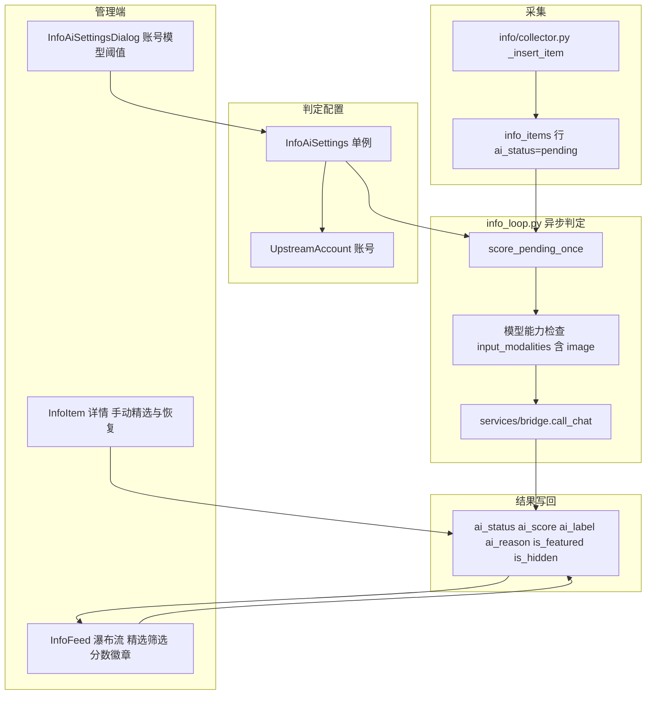

# 资讯 AI 打分与过滤

Feature Name: info-ai-scoring
Updated: 2026-10-05

## Description

在资讯采集链路后增加异步 AI 判定：内容先全部入库（`ai_status = pending`），后台 worker 用管理员配置的上游账号与模型对每条内容做结构化判定，产出：

- **广告识别**：`is_ad` 为真时写入 `ai_label = ad`，并按配置置 `is_hidden = true`，默认列表过滤但数据保留、可恢复。
- **价值打分**：0-100 整数分数与短理由、分类标签；分数达到阈值自动置 `is_featured`。
- **多模态输入**：判定模型的有效输入能力包含 `image` 时，附带条目的 ready 媒体图片；否则纯文本。

判定配置、手动覆盖（精选/隐藏）、以及前端精选筛选/分数展示共同构成完整闭环。

## Architecture



## Components and Interfaces

### 后端

| 组件 | 位置 | 职责 |
|------|------|------|
| 条目 AI 字段 | `backend/app/models.py` `InfoItem` | 判定状态、分数、标签、理由、精选、模型、错误 |
| 判定配置单例 | `backend/app/models.py` `InfoAiSettings` | 启用、账号、模型、阈值、传图、隐藏广告 |
| 列迁移 | `backend/app/db.py` `_ensure_info_item_ai_columns` | 幂等补 `info_items` 新列并建索引 |
| 判定服务 | `backend/app/services/info_ai.py` | 配置读写、能力判断、消息构造、调用、解析、写回 |
| 判定 worker | `backend/app/services/info_loop.py` | `score_pending_once`、`score_worker_loop`、启动恢复 stuck |
| 管理接口 | `backend/app/routers/admin_info.py` | 配置、重新判定、精选切换、筛选扩展 |
| 序列化 | `backend/app/info/items.py` | `serialize_item` 暴露 AI 字段；筛选参数扩展 |

判定输入构造（复用既有 `services/bridge.call_chat` 与 `services/credentials.require_upstream_credential`）：

```python
messages = [
    {
        "role": "user",
        "content": [
            {"type": "text", "text": prompt_text},
            # 仅当模型有效 input_modalities 含 image 且有 ready 图片时追加
            {"type": "image_url", "image_url": {"url": "data:image/jpeg;base64,..."}},
        ],
    }
]
response = await call_chat(account, messages, model, False, {}, credential)
```

模型返回约定 JSON：

```json
{"is_ad": false, "score": 86, "label": "valuable", "tags": ["工具推荐"], "reason": "推荐了可直接使用的开源工具"}
```

解析失败即判定 `failed`。模型带思考输出时，沿用 `services/skills.py` 的"从 content 中提取 JSON"策略。

图片能力判断：读取账号 + 模型的有效 caps，检查 `input_modalities` 含 `image`（参考 `backend/app/services/ccswitch.py` 的 vision 派生方式）。媒体字节来自本地存储，逐张读取并 base64 编码，受 `max_image_bytes` 限制。

### 管理接口

| Method | Path | 说明 |
|--------|------|------|
| GET | `/api/admin/info/ai/settings` | 返回判定配置（含解析出的账号名） |
| PUT | `/api/admin/info/ai/settings` | 保存判定配置，校验账号与阈值范围 |
| POST | `/api/admin/info/ai/rescore` | 重新判定，body `{scope, ids?, include_done?}`，重置为 pending |
| GET | `/api/admin/info/items` | 新增 `featured`、`label`、`min_score`、`ai_status` 筛选 |
| POST | `/api/admin/info/items/{id}/featured` | 手动设置精选，置 `ai_featured_manual` |
| POST | `/api/admin/info/items/{id}/hidden` | 已有接口，改为同时置 `ai_hidden_manual` |
| GET | `/api/admin/info/stats` | 增加 `ai_pending`、`ai_failed`、`featured_count` |

### 前端

| 组件 | 位置 | 职责 |
|------|------|------|
| 配置弹窗 | `frontend/src/components/InfoAiSettingsDialog.tsx` | 选择账号/模型、阈值、启用、传图上限 |
| 瀑布流 | `frontend/src/pages/InfoFeed.tsx` | 精选 / 最低分 / AI 标签筛选，分数与精选徽章 |
| 详情 | `frontend/src/pages/InfoItem.tsx` | 分数、理由、标签、精选与恢复操作 |
| API/工具 | `frontend/src/lib/api.ts`、`frontend/src/lib/info.ts` | 类型、请求方法、标签文案 |

## Data Models

### InfoItem 新增列

| 字段 | 类型 | 默认 | 说明 |
|------|------|------|------|
| `ai_status` | String(16) | `pending` | pending / processing / done / failed / skipped |
| `ai_label` | String(32) | `''` | ad / valuable / general / other |
| `ai_score` | Integer | NULL | 0-100 |
| `ai_reason` | Text | `''` | 判定理由 |
| `ai_tags_json` | Text | NULL | 标签数组 JSON |
| `ai_model` | String(128) | `''` | 判定所用模型 |
| `ai_error` | Text | `''` | 最近一次错误 |
| `ai_attempts` | Integer | 0 | 已尝试次数 |
| `ai_scored_at` | DateTime | NULL | 最近判定时间 |
| `is_featured` | Boolean | false | 精选 |
| `ai_featured_manual` | Boolean | false | 精选人工覆盖，置真后判定不再改写 |
| `ai_hidden_manual` | Boolean | false | 隐藏人工覆盖，置真后判定不再改写 |

索引：`(ai_status)` 用于 pending 扫描，`(is_featured)` 用于精选筛选。

### InfoAiSettings 单例（表 `info_ai_settings`，固定 id=1）

| 字段 | 类型 | 默认 | 说明 |
|------|------|------|------|
| `enabled` | Boolean | false | 是否启用判定 |
| `account_id` | Integer FK NULL | NULL | 上游账号 |
| `model` | String(128) | `''` | 空则取账号首个模型 |
| `vision_max_images` | Integer | 3 | 传图张数上限 |
| `max_image_bytes` | Integer | 5242880 | 单张图片字节上限 |
| `feature_threshold` | Integer | 80 | 精选阈值 0-100 |
| `hide_ads` | Boolean | true | 广告是否自动隐藏 |
| `max_attempts` | Integer | 3 | 失败重试上限 |
| `prompt_template` | Text | `''` | 自定义提示词，空则用内置 |
| `updated_at` | DateTime | NULL | |

配置来源：内置默认 + 单例行覆盖。运行时新增配置项 `info_ai_tick_seconds`、`info_ai_batch_size`、`info_ai_max_concurrent` 写入 `backend/app/config.py`。

## Correctness Properties

1. **不丢内容**：每条采集条目先以 `pending` 落库；判定失败只改状态，不删除条目或媒体。
2. **广告精选互斥**：`ai_label == "ad"` 的条目 `is_featured` 恒为 false。
3. **人工优先**：`ai_featured_manual` / `ai_hidden_manual` 为真的条目，后续判定不改写对应字段。
4. **视觉门控**：仅当模型有效 `input_modalities` 含 `image` 且存在 ready 媒体时才发送图片 part。
5. **状态收敛**：worker 每轮把 `processing` 旧条目恢复为 `pending`；条目最终停在 `done` 或 `failed`。
6. **幂等迁移**：新增列/索引重复执行不报错、不改写已有数据。
7. **凭据不外泄**：判定经既有凭据机制调用，条目字段与接口响应不含上游 API Key 或原始响应体。

## Error Handling

| 场景 | 行为 |
|------|------|
| 判定配置未启用 | worker 跳过，不发上游调用，保留 pending |
| 未选账号或模型不存在的账号 | 保存接口 400；worker 视为配置无效并跳过 |
| 模型输出非 JSON 或缺字段 | 条目 `failed`，`ai_attempts += 1`，写 `ai_error` |
| 上游超时 / 5xx | 同上计失败；达到 `max_attempts` 后停在 failed，等待手动重新判定 |
| 条目无 ready 媒体 | 纯文本判定，不报错 |
| 图片读取失败或超限 | 跳过该图片，其余图片与文本照常判定 |
| 启动时存在 processing 残留 | 恢复为 pending |
| 判定过程中条目被删除 | 写回时忽略缺失条目 |

## Test Strategy

后端（`backend/tests`，pytest）：

- 迁移：`_ensure_info_item_ai_columns` 连续执行两次不报错，列存在；存量条目默认 `pending`、`is_featured=false`。
- 服务：monkeypatch `call_chat` 返回固定 JSON，广告条目被置 `ai_label=ad` 且 `is_hidden=true`；高分数条目 `is_featured=true`。
- 解析失败：返回非 JSON 时条目 `failed`、`ai_attempts` 递增。
- 视觉门控：能力不含 image 时消息无 image part；含 image 且有媒体时含 image part。
- 人工覆盖：手动精选后重新判定不改变 `is_featured`；手动恢复隐藏后判定不重新隐藏。
- 接口：配置 GET/PUT 校验（空账号 400、阈值越界 400）；`items` 的 `featured`/`min_score`/`label` 筛选；`rescore` 把 done 条目重置为 pending；stats 计数。
- 恢复：预置 `processing` 条目，启动流程后变 `pending`。

前端：`eslint`、`tsc -b` 静态校验；手动验证精选筛选、分数/精选徽章、配置弹窗账号模型下拉、详情页手动精选与恢复。

## References

[^1]: (spec) - 资讯收集设计（采集链路与 items 查询）[design.md](../2026-10-04-info-collection/design.md)
[^2]: (`backend/app/models.py`) - InfoItem / InfoSource 定义 [models.py](../../../backend/app/models.py)
[^3]: (`backend/app/info/collector.py`) - `_insert_item` 入库点 [collector.py](../../../backend/app/info/collector.py)
[^4]: (`backend/app/info/items.py`) - 查询、筛选与序列化 [items.py](../../../backend/app/info/items.py)
[^5]: (`backend/app/services/info_loop.py`) - 采集与媒体异步 worker 模式 [info_loop.py](../../../backend/app/services/info_loop.py)
[^6]: (`backend/app/services/bridge.py`) - `call_chat` 上游调用 [bridge.py](../../../backend/app/services/bridge.py)
[^7]: (`backend/app/services/skills.py`) - 账号+模型调用与 JSON 解析参考 [skills.py](../../../backend/app/services/skills.py)
[^8]: (`backend/app/services/model_caps.py`) - 模型能力与 `input_modalities` [model_caps.py](../../../backend/app/services/model_caps.py)
[^9]: (`backend/app/services/ccswitch.py`) - vision 能力派生参考 [ccswitch.py](../../../backend/app/services/ccswitch.py)
[^10]: (`frontend/src/pages/InfoFeed.tsx`) - 瀑布流筛选与卡片 [InfoFeed.tsx](../../../frontend/src/pages/InfoFeed.tsx)
[^11]: (`frontend/src/pages/InfoItem.tsx`) - 详情与隐藏操作 [InfoItem.tsx](../../../frontend/src/pages/InfoItem.tsx)
