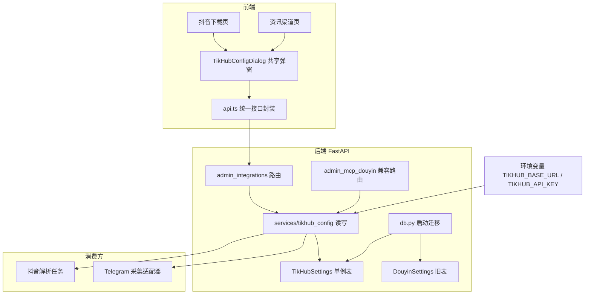
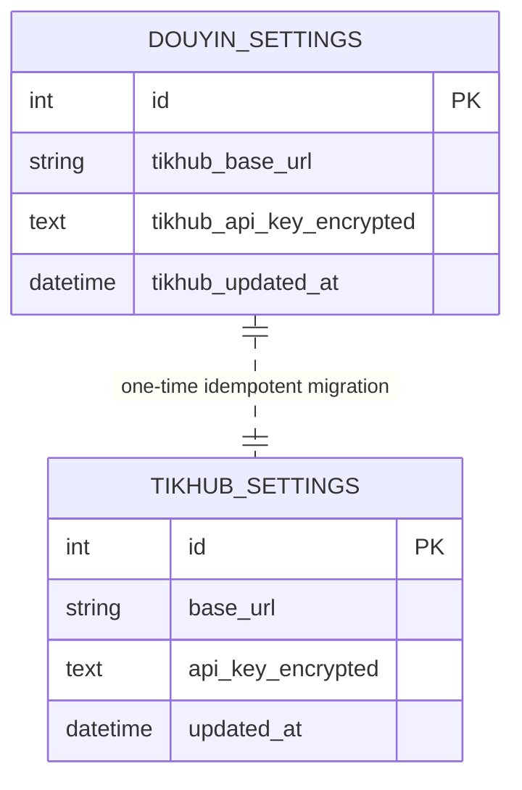

# TikHub 凭据统一配置

Feature Name: tikhub-config-unification
Updated: 2026-10-05

## Description

抖音下载与资讯收集共用同一个 TikHub 账号。当前凭据只落在 `douyin_settings` 单例表、只由抖音下载页写入，资讯页只读并跳转回抖音页，导致入口割裂和表名耦合。

本设计把 TikHub 凭据抽为一份全局共享配置：

- 后端新增中立的 `tikhub_settings` 单例表与统一管理接口 `/api/admin/integrations/tikhub`，并从旧 `douyin_settings` 幂等迁移数据。
- 凭据读取统一收敛到 `services/tikhub_config.py`，抖音下载与资讯收集都经此模块取用，环境变量保留兜底。
- 前端新增唯一的 `TikHubConfigDialog` 组件，抖音下载页、资讯渠道页均可打开，实现「统一弹窗 + 多入口」并允许两处读写。

## Architecture



数据流：管理员在任意入口打开共享弹窗 → 前端调用统一接口读写 → 后端经 `services/tikhub_config.py` 落地 `tikhub_settings` 单例表（Key 加密）。消费方（抖音解析任务、Telegram 适配器）都调用同一读取函数，环境变量仅在持久化记录缺失或解密失败时兜底。

## Components and Interfaces

### 后端

| 组件 | 位置 | 职责 |
|------|------|------|
| `TikHubSettings` | `backend/app/models.py` | 单例表 `tikhub_settings`：`base_url`、`api_key_encrypted`、`updated_at` |
| 共享读写服务 | `backend/app/services/tikhub_config.py` | `get_tikhub_credentials`、`tikhub_status`、`set_tikhub_config`、`clear_tikhub_config` |
| 统一管理路由 | `backend/app/routers/admin_integrations.py` | `/api/admin/integrations/tikhub` 的 GET / PUT / DELETE |
| 启动迁移 | `backend/app/db.py` | `_migrate_douyin_settings_to_tikhub`，幂等迁移旧记录 |
| 兼容路由 | `backend/app/routers/admin_mcp_douyin.py` | 旧 `/provider` 三个方法委托共享服务 |

统一接口：

```
GET    /api/admin/integrations/tikhub   -> TikHubStatus
PUT    /api/admin/integrations/tikhub   -> TikHubStatus   body: { base_url?, api_key? }
DELETE /api/admin/integrations/tikhub   -> TikHubStatus
```

`TikHubStatus`：

```json
{
  "base_url": "https://api.tikhub.io",
  "configured": true,
  "has_key": true,
  "source": "page",
  "shared_with_douyin": true,
  "updated_at": "2026-10-05T00:00:00Z"
}
```

`source` 取值：`page`（持久化记录）、`env`（环境变量兜底）、空串（均未配置）。响应不含明文 API Key。

环境变量读取优先级（Base URL 与 API Key 各自独立解析）：

1. `TIKHUB_BASE_URL` / `TIKHUB_API_KEY`（新增，中立命名）
2. `DOUYIN_TIKHUB_BASE_URL` / `DOUYIN_TIKHUB_API_KEY`（旧兼容）
3. `INFO_TIKHUB_BASE_URL` / `INFO_TIKHUB_API_KEY`（旧兼容）

### 前端

| 组件 | 位置 | 职责 |
|------|------|------|
| `TikHubConfigDialog` | `frontend/src/components/TikHubConfigDialog.tsx` | 唯一的凭据展示与编辑弹窗，内部完成查询、保存、清除 |
| 查询封装 | `frontend/src/lib/api.ts` | `tikhubStatus` / `saveTikhub` / `clearTikhub` |
| 抖音入口 | `frontend/src/pages/McpDouyin.tsx` | 展示状态，点「配置 TikHub」打开弹窗 |
| 资讯入口 | `frontend/src/pages/InfoSources.tsx` | 未配置提示条与「配置 TikHub」打开弹窗 |

弹窗接口：

```ts
type TikHubConfigDialogProps = {
  open: boolean
  onClose: () => void
}
```

弹窗以 `['tikhub-config']` 作为 react-query 缓存 key，保存或清除成功后调用
`queryClient.invalidateQueries({ queryKey: ['tikhub-config'] })`，使所有挂载入口同步刷新。

## Data Models



`tikhub_settings` 为单例表（固定 `id = 1`）：

| 字段 | 类型 | 约束 | 说明 |
|------|------|------|------|
| `id` | Integer | PK | 固定 1 |
| `base_url` | String(256) | NOT NULL, default `''` | 明文 |
| `api_key_encrypted` | Text | NULL | Fernet 密文，密钥由 `APP_SECRET_KEY` 派生 |
| `updated_at` | DateTime | NULL | 最近一次写入时间 |

迁移流程（`init_db` 内，`Base.metadata.create_all` 之后）：

1. 若 `douyin_settings` 表存在且 `tikhub_settings` 中不存在任何记录，读取旧记录 `id = 1`。
2. 旧记录含非空 `tikhub_base_url` 或 `tikhub_api_key_encrypted` 时，写入新表。
3. 迁移保留旧表与旧数据，供回滚使用。
4. 重复启动时新表已有记录，迁移直接跳过。

清除语义与迁移的配合：`clear_tikhub_config` **保留** `tikhub_settings` 的单例记录，仅把 `base_url` 置空、`api_key_encrypted` 置 `NULL`。这样迁移的判定条件「新表不存在任何记录」在清除后仍为假，旧 `douyin_settings` 数据不会被重新导入；若清除时删除记录，重启会将旧凭据复活，使「清除」失效。

## Correctness Properties

1. **唯一性**：任一时刻 `tikhub_settings` 至多一条记录，抖音下载与资讯收集读取到完全相同的凭据。
2. **机密性**：数据库中 `api_key_encrypted` 为密文；所有接口响应与日志都不含明文 API Key。
3. **幂等迁移**：任意次数启动后，迁移产生的记录集合与首次启动一致。
4. **清除可持久**：清除后再启动，共享存储保持已清空状态，旧 `douyin_settings` 凭据不被重新导入。
5. **兜底可预期**：`configured == bool(base_url and api_key)`，且 `base_url` 永不为空串（无配置时返回默认值）。
6. **来源一致**：`source` 与实际取值来源一致；`page` 优先于 `env`。
7. **多入口同步**：任一处保存 / 清除成功后，其他已挂载入口的状态查询返回同样的新状态。

## Error Handling

| 场景 | 行为 |
|------|------|
| Base URL 非空且不以 `http://` / `https://` 开头 | PUT 返回 400，错误类型 `invalid_request`，不落库 |
| PUT 携带空 API Key | 返回 400，不落库 |
| 未携带 `api_key` 字段（仅改 Base URL） | 保留原有 API Key，仅更新 Base URL |
| API Key 解密失败 | 视为未配置该来源，回退环境变量，不抛异常阻断读取 |
| 未登录 / Token 失效 | 返回 401（沿用 `get_current_admin` 依赖） |
| 旧 `/provider` 接口 | 行为与新接口一致，返回同一状态结构 |

## Test Strategy

后端（`backend/tests`，沿用 pytest）：

- 服务层：`set_tikhub_config` 后 `get_tikhub_credentials` 返回明文 Key；`tikhub_status` 的 `configured` / `has_key` / `source` 正确；`clear` 后回退环境变量。
- 加密：断言 `api_key_encrypted` 不等于明文，且响应体不含明文。
- 校验：非法 Base URL 与空 API Key 被拒。
- 迁移：预置旧表记录 → 执行迁移 → 新表存在同值密文；连续执行迁移两次仍只有一条记录（幂等）。
- 清除 + 迁移：预置旧表记录 → 迁移 → 清除 → 再次执行迁移 → 共享记录保持已清空，旧凭据未被重新导入。
- 路由：新接口 GET / PUT / DELETE 的鉴权与响应结构；旧 `/provider` 与新接口写入同一份记录。

前端：对 `TikHubConfigDialog` 做组件级验证（未配置 / 已配置 / 保存中禁用三态），并验证抖音页与资讯页均能打开同一弹窗且保存后状态同步。沿用现有 `npm run build` 与 lint 作为静态校验。

## References

[^1]: (spec) - 资讯收集设计（TikHub 命名债与共享读取说明）[design.md](../2026-10-04-info-collection/design.md)
[^2]: (spec) - 抖音下载器需求（TikHub 解析配置）[requirements.md](../2026-10-03-douyin-downloader/requirements.md)
[^3]: (`backend/app/services/tikhub_config.py`) - 现有共享读取实现 [tikhub_config.py](../../../backend/app/services/tikhub_config.py)
[^4]: (`backend/app/capabilities/douyin/provider_config.py`) - 旧单例配置读写 [provider_config.py](../../../backend/app/capabilities/douyin/provider_config.py)
[^5]: (`backend/app/routers/admin_mcp_douyin.py`) - 旧 provider 接口 [admin_mcp_douyin.py](../../../backend/app/routers/admin_mcp_douyin.py)
[^6]: (`frontend/src/pages/McpDouyin.tsx`) - 现有配置区块 [McpDouyin.tsx](../../../frontend/src/pages/McpDouyin.tsx)
[^7]: (`frontend/src/pages/InfoSources.tsx`) - 资讯页状态提示 [InfoSources.tsx](../../../frontend/src/pages/InfoSources.tsx)
[^8]: (`backend/app/db.py`) - 启动迁移入口 `init_db` [db.py](../../../backend/app/db.py)
