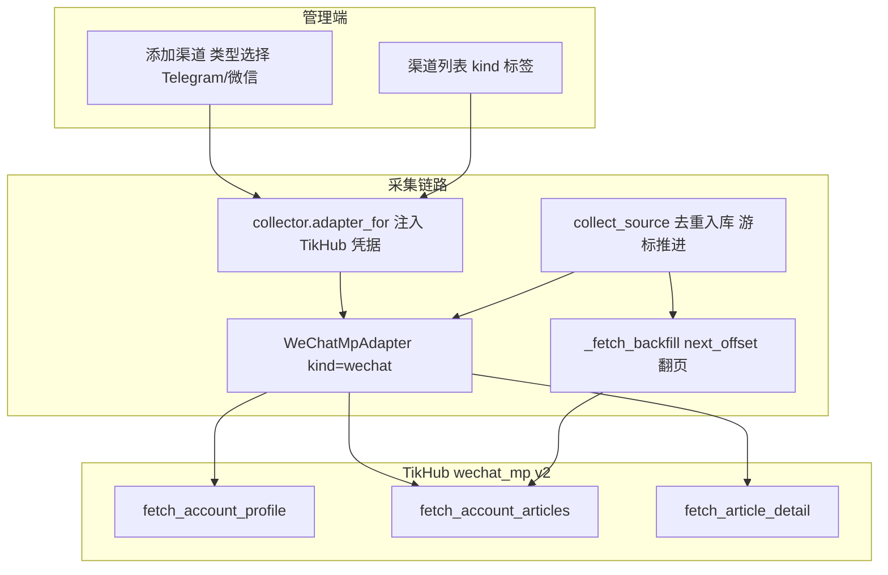

# 微信公众号信源支持

Feature Name: wechat-source
Updated: 2026-10-05

## Description

在资讯收集里新增微信公众号渠道（`kind = wechat`），复用现有 TikHub 凭据与采集链路。上游使用 TikHub `wechat_mp v2`：

- `POST /api/v1/wechat_mp/v2/fetch_account_profile`（body `{username, raw:false}`）：公众号资料（昵称、原创数、认证主体；简介/头像该接口取不到）。
- `POST /api/v1/wechat_mp/v2/fetch_account_articles`（body `{username, offset?, page_size?}`）：历史发文**单页**列表，返回 `next_offset`（base64 游标）与 `is_end`；`page_size` 被上游忽略，翻页靠 `offset`。
- `POST /api/v1/wechat_mp/v2/fetch_article_detail`（body `{url, raw:false}`）：文章正文/标题/作者/封面/发布时间；也可从 `content.user_name` 解析出公众号 `username`。

鉴权与 Telegram 相同：`Authorization: Bearer <TikHub Key>`，默认 `https://api.tikhub.io`。因此**不需要新的 provider 配置**，`collector.adapter_for` 已对所有 kind 注入共享 TikHub 凭据。

## Architecture



## Components and Interfaces

### 后端

| 组件 | 位置 | 职责 |
|------|------|------|
| `WeChatMpAdapter` | `backend/app/info/adapters/wechat.py`（新增） | 上游调用、字段映射、游标映射 |
| 适配器注册 | `backend/app/info/adapters/__init__.py` | `_ADAPTERS["wechat"] = WeChatMpAdapter` |
| 渠道标识归一化 | `backend/app/info/urlguard.py` | 新增 `normalize_wechat(raw)`；媒体白名单加微信主机 |
| 采集游标泛化 | `backend/app/info/collector.py` | 游标支持 `int \| str`；首次采集判定改为 `last_success_at is None` |
| 渠道创建 | `backend/app/info/sources.py` | 若 `preview.identifier` 非空则以其为准（解析文章链接得到 username） |
| 媒体下载 | `backend/app/info/media.py` | 下载微信图片时带 `Referer` |
| 全文补全 worker | `backend/app/services/info_loop.py` | `enrich_wechat_content_once`：对 `content_status=pending` 的微信条目调用详情并写回 |
| 探针脚本 | `scripts/wechat_mp_probe.py`（新增） | 固化真实响应结构，产出 fixtures |

全文模式流程（异步，避免采集轮被慢接口拖住）：

1. 列表页入库时，微信条目置 `content_status="pending"`、`ai_status="skipped"`（先不打分），封面图照常入库。
2. `enrich_wechat_content_once` 取一批 `content_status="pending"` 的条目，调用 `fetch_article_detail` 拿正文与正文图片。
3. 写回：`text/excerpt` 更新为正文，正文图片经既有 `pending→ready` 媒体链路入库；置 `content_status="done"`、`ai_status="pending"`（此时才进入 AI 判定）。
4. 失败置 `content_status="failed"` 并累加 `content_attempts`，达到上限后停在该状态，等待手动重判。

适配器新增全文方法（不属于 `SourceAdapter` 必需契约，由 worker 按 `kind` 调用）：

```python
def fetch_article(self, url: str) -> tuple[str, list[FetchedMedia]]:
    """返回 (正文文本, 正文图片列表)。"""
```

适配器接口（沿用 `SourceAdapter`）：

```python
class WeChatMpAdapter:
    kind = "wechat"
    def available(self) -> bool: ...
    def normalize(self, raw: str) -> str: ...            # 保留清洗后的输入
    def preview(self, identifier: str) -> SourcePreview: ...
    def fetch(self, identifier: str, *, after, limit, before=None) -> FetchedPage: ...
```

`fetch` 语义映射：

- `before` 为空：请求 `offset=null`，取最新一页。
- `before` 非空：把 `before` 当作 opaque `offset`，取更老一页。
- 返回 `before_cursor = next_offset`、`has_more_before = not is_end`。
- `after`（增量）对微信不使用，增量靠「取最新页 + 去重」。

字段映射（列表页 → `FetchedPost`）：

| FetchedPost | 来源 |
|-------------|------|
| `external_id` | 文章稳定标识（`mid_+_idx` / 链接 token），≤64 字符 |
| `text` | 列表页摘要；全文补全后替换为正文 |
| `published_at` | 上游时间戳/时间串经 `parse_datetime` |
| `permalink` | `https://mp.weixin.qq.com/s/…` |
| `author_name` | 作者/公众号名 |
| `source_type` | `"wechat"` |
| `media` | 封面图（全文模式再加正文图片），`kind="image"` |
| `views_text/reactions` | 有则填，无则空 |

### 前端

| 组件 | 位置 | 职责 |
|------|------|------|
| 添加渠道 | `frontend/src/pages/InfoSources.tsx` | 类型下拉（Telegram/微信公众号）、占位与提示随类型变化、预览卡片 |
| 渠道列表 | `frontend/src/pages/InfoSources.tsx` | 类型标签由 `kind` 渲染 |
| API | `frontend/src/lib/api.ts` | `infoSourcePreview(raw, kind)`、创建带 `kind` |

## Data Models

不新增表；复用 `info_sources` / `info_items`：

- `info_sources.kind = "wechat"`，`identifier` 为公众号 `username`。
- `info_sources.cursor_after` 仅 Telegram 使用；微信游标是 opaque 字符串，增量不依赖它（去重即可）。**v1 不引入 `cursor_token`**：微信增量必须从最新页拉取再去重，字符串游标不会带来「比 X 新」的精确语义，只对「跨轮断点回填」有用，而回填有页数上限一次即完，收益低。
- `info_items.external_id` 为字符串标识（已 `String(64)`），无需迁移。
- `info_items` 新增 `content_status: String(16) default '' not null`（`''` / `pending` / `done` / `failed`）与 `content_attempts: Integer default 0`，用于全文异步补全；仅微信渠道使用。需在 `db.py` 加幂等列迁移。

`SourceAdapter`/`FetchedPage` 的类型泛化（影响 telegram）：

- `FetchedPage.after_cursor: int | str | None`、`before_cursor: int | str | None`
- `fetch(after: int | str | None, before: int | str | None)`
- `_fetch_backfill` 的 `before: int | str | None`

`collect_source` 关键改动：

1. `first_run = source.last_success_at is None`（原为 `cursor_after is None`），避免字符串游标渠道每轮重复回填。
2. `highest = int(source.cursor_after or 0)` 逻辑不变；微信 `external_id` 非数字时 `post_id=None`，不推进整数游标。
3. 回填走 `_fetch_backfill` 的 `before` 链，微信适配器把 `next_offset` 交给 `before_cursor`。

## Correctness Properties

1. **去重幂等**：同一 `(source_id, external_id)` 始终只入库一条，重复采集只增 `skipped`。
2. **不重复回填**：渠道一旦成功采集过，后续走增量，不再次历史回填。
3. **游标不透传解读**：上游 base64 游标原样保存与回传，不解析其含义。
4. **凭据复用**：微信与 Telegram 使用同一 TikHub 凭据，密钥不出现在响应与日志。
5. **回退安全**：全文/正文图片任一失败，列表字段仍已入库，条目标注媒体状态。
6. **类型兼容**：Telegram 行为不变（整数游标、after/before 语义）。
7. **判定顺序**：微信条目在 `content_status=done`（正文补全完成）前不进入 AI 判定。
8. **补全幂等**：同一文章重复补全不产生重复媒体行；正文只更新一次。

## Error Handling

| 场景 | 行为 |
|------|------|
| 未配置 TikHub Key | `provider_unavailable` 400，前端提示配置凭据 |
| 401/403 | `provider_unauthorized` 502，提示检查 Key |
| 上游超时（接口本身慢） | 超时设为 ≥30s；失败保留游标，按渠道退避重试 |
| `is_end` 为真 | 停止翻页 |
| 文章详情失败（全文模式） | 该条按摘要入库，正文缺省，不阻断整轮 |
| 链接不是 mp.weixin.qq.com | 归一化报 `invalid_channel` |
| 图片引荐校验失败 | 带 Referer 重试一次，仍失败则条目媒体 `failed` |

## Test Strategy

- 探针：新增 `scripts/wechat_mp_probe.py`，用真实 Key 抓 `profile/articles/detail` 响应，落 `backend/tests/fixtures/wechat_*.json`，固化字段映射（沿用 Telegram 的做法）。
- 适配器单测：`map_article` 字段映射、`normalize` 接受 username 与文章链接、`fetch` 游标映射（`next_offset`/`is_end`）。
- 采集单测：mock 适配器，验证首次回填按 `before` 翻页、增量去重、`first_run` 判定与 Telegram 行为不变。
- 全文补全单测：mock `fetch_article`，验证 `content_status` pending→done、正文与图片写回、失败累加 `content_attempts`、完成前 `ai_status` 不为 pending。
- 路由/前端：`eslint` + `tsc -b`；手动验证类型下拉、预览、渠道标签。

## Decisions

1. 采集粒度：**全文模式**。列表页入库后由异步 worker 调 `fetch_article_detail` 补全正文与图片，完成后才进入 AI 判定。
2. 增量：**不引入 `cursor_token`**。Telegram 维持精确整数游标；微信用「最新页 + 去重」。原因见 Data Models。

新增运行时配置（`config.py` + `.env.example`）：`INFO_WECHAT_DETAIL_BATCH_SIZE`、`INFO_WECHAT_DETAIL_INTERVAL_SECONDS`、`INFO_WECHAT_DETAIL_MAX_ATTEMPTS`。

## References

[^1]: (spec) - 资讯收集设计（适配器契约与采集链路）[design.md](../2026-10-04-info-collection/design.md)
[^2]: (`backend/app/info/adapters/telegram.py`) - TikHub 适配器实现参考 [telegram.py](../../../backend/app/info/adapters/telegram.py)
[^3]: (`backend/app/info/adapters/base.py`) - FetchedPost/FetchedPage/SourceAdapter 契约 [base.py](../../../backend/app/info/adapters/base.py)
[^4]: (`backend/app/info/collector.py`) - `collect_source` / `_fetch_backfill` [collector.py](../../../backend/app/info/collector.py)
[^5]: (`backend/app/info/urlguard.py`) - 媒体主机白名单与标识归一化 [urlguard.py](../../../backend/app/info/urlguard.py)
[^6]: (OpenAPI) - TikHub `wechat_mp v2`：fetch_account_profile / fetch_account_articles / fetch_article_detail
[^7]: (`frontend/src/pages/InfoSources.tsx`) - 添加渠道与渠道列表 [InfoSources.tsx](../../../frontend/src/pages/InfoSources.tsx)
