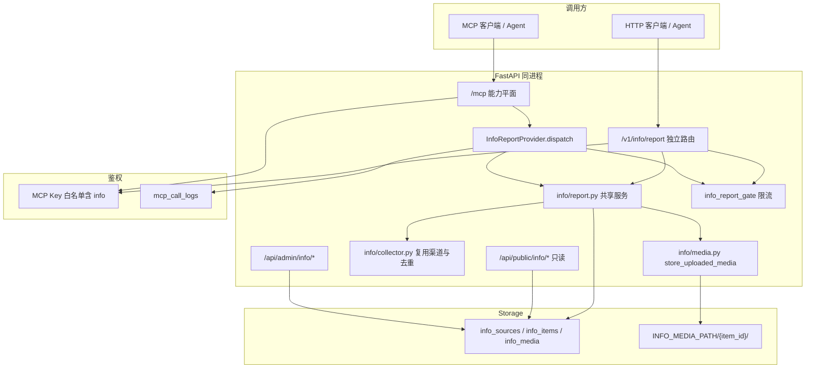

# 资讯上报能力（Info Report Capability）

Feature Name: 2026-10-09-info-report-capability
Updated: 2026-10-09

## Description

在现有能力平面（MCP 广场后端）新增 `capability_id = info` 的能力「资讯上报」，让外部 Agent 用一把 MCP Key，经 MCP 工具或 REST 接口把资讯（文本 + 可选媒体字节）写入平台资讯库。

设计要点与已确认决策：

- **媒体字节上送**：Agent 上传图片/视频字节，平台直写本地媒体目录并置 `ready`，全程不发上游网络请求。这样绕开现有 `MEDIA_HOSTS` 白名单对任意远程 URL 的限制，交付地址由平台签名令牌稳定提供。
- **归属内置「其他」渠道**：复用 `sources.ensure_manual_source()`，不按 Key 分渠道；来源写进 `author_name`。
- **可见性走常规 AI 判定**：入库 `is_featured = false`、`is_hidden = false`、`ai_status = "pending"`，不写 `ai_featured_manual` / `ai_hidden_manual`，交由现有 AI 判定 worker（`services/info_ai.py`，只处理 `pending`/`failed`）按分数决定精选与隐藏，与自动采集同一条逻辑。
- **护栏**：全局总开关 `info_report_enabled` + 按 Key 限流 + 单文件/单条/批量/文本上限。

`backend/app/info/__init__.py` 与 `2026-10-04-info-collection` 设计文档记载「资讯功能不注册进能力平面」。本需求针对「上报」这一条写入路径**有意反转**该约束，读取与浏览链路保持原样；实现时同步更新 `app/info/__init__.py` 的说明。

## 风险与缓解（本轮调整）

能力平面已免费提供 MCP+REST+Key 白名单+调用审计，独立路由规避了通用入口遮蔽，架构层无更优替代。加固集中在安全与资源三个方面：

| 风险 | 影响 | 缓解 |
|------|------|------|
| R1 公开写入口被滥用 | 违规内容即时公开、存储被塞满 | 能力白名单是主闸，**持签发 Key 者视为可信来源**，不引入内容审查；按 Key 限流；`INFO_REPORT_ENABLED` 总开关；保留现有手动隐藏下架 |
| R2 上传字节导致存储型 XSS | 同源媒体路由回吐可执行内容（`image/svg+xml` 等） | 媒体类型严格白名单并排除 SVG；图片用 Pillow 解码校验、视频嗅探魔数；入库 `content_type` 用检测结果而非客户端头；媒体路由已带 `X-Content-Type-Options: nosniff` |
| R3 重复/失败写入产生孤儿文件 | 磁盘泄漏 | 先查去重键再落盘；插入撞唯一约束或媒体写入失败时调用 `storage.purge_item(item_id)` |
| R4 内存限流仅单进程 | 多 worker 下限流失效 | 沿用 `login_gate` 约定：文档标注，建议在反代再限一次 |
| R5 共享「其他」渠道跨 Agent 去重冲突 | 同一文本被不同 Agent 上报时命中同一条 | 用户已选择共享渠道，接受该行为 |

关于 R1：能力白名单即信任边界，签发 Key 的管理员为内容负责，本能力**不做内容审查**。项目 `services/content_audit.py` 的敏感词检测会经 `load_lexicon` → `_ensure_cached_lexicon` 触发词典下载/编译，也不适合放在写请求热路径。若后续需要审核，作为独立需求另议。

## Architecture



## Components and Interfaces

### 1. 目录结构与改动清单

```text
backend/app/capabilities/info/
  __init__.py            # 新增：导出 InfoReportProvider
  provider.py            # 新增：能力定义（MCP 工具 + dispatch，JSON/base64 路径）
  errors.py              # 新增：InfoReportError
backend/app/info/
  report.py              # 新增：上报共享服务（校验、去重、入库、批量）
  media.py               # 修改：新增 store_uploaded_media（直存字节，不联网）
backend/app/routers/
  info_report_public.py  # 新增：/v1/info/report 与 /v1/info/report/batch
backend/app/services/
  info_report_gate.py    # 新增：按 MCP Key 的内存滑窗限流
backend/app/config.py    # 修改：新增 info_report_* 配置
backend/app/capabilities/registry.py  # 修改：ensure_defaults 注册 InfoReportProvider
frontend/src/pages/McpPlaza.tsx       # 修改：iconMap 增加 newspaper 图标
```

### 2. 能力 Provider（`capabilities/info/provider.py`）

沿用 `capabilities/knowledge/provider.py`、`capabilities/site/provider.py` 的样板：

```python
class InfoReportProvider:
    spec = CapabilitySpec(
        capability_id="info",
        name="资讯上报",
        description="外部 Agent 上送资讯（文本 + 图片/视频字节），入库后由 AI 判定可见性",
        version="1.0.0",
        category="content",
        status="enabled",
        admin_path="/info",           # 广场卡片进入现有资讯瀑布流
        icon="newspaper",
        input_schema={...},
        integration={
            "rest_endpoints": [
                {"method": "POST", "path": "/v1/info/report",
                 "summary": "上报单条资讯（multipart 可带媒体）",
                 "content_type": "multipart/form-data"},
                {"method": "POST", "path": "/v1/info/report/batch",
                 "summary": "批量上报（JSON，媒体用 base64）",
                 "content_type": "application/json"},
            ],
            "notes": [
                "text 与媒体至少其一；单文件 ≤ INFO_REPORT_MAX_FILE_BYTES",
                "MCP 工具的 media 用 base64，单文件解码后 ≤ INFO_REPORT_MAX_MCP_FILE_BYTES",
                "external_id 缺省时按 url+text 内容摘要去重",
                "入库后由 AI 判定精选/隐藏；重复去重键返回 duplicate=true",
            ],
        },
    )
```

`list_mcp_tools()` 暴露：

| 工具 | operation | 说明 |
|------|-----------|------|
| `info_report` | `report` | 单条上报，`media` 为 `{filename, content_base64, kind?}` 数组 |
| `info_report_batch` | `report_batch` | `items` 数组，逐条独立处理 |
| `info_report_config` | `config` | 返回开关状态与各项上限，供 Agent 自检 |

`dispatch(operation, payload, ctx)`：要求 `ctx.mcp_key` 非空，校验白名单（`invoke_capability` 已做），调用 `services/mcp_logs.begin_mcp_call` 记录；把 `media` 数组里的 base64 解码为字节（`validate=True`，解码后校验 `info_report_max_mcp_file_bytes`），组装成 `info.report.ReportInput` 交给共享服务。

### 3. 上报共享服务（`info/report.py`）

MCP（base64）与 REST（multipart）两条入口共用同一服务，避免逻辑分叉。

```python
@dataclass(frozen=True)
class MediaFile:
    filename: str
    content_type: str
    data: bytes
    duration_ms: int | None = None

@dataclass(frozen=True)
class ReportInput:
    text: str = ""
    title: str = ""
    url: str = ""
    author: str = ""
    published_at: datetime | None = None
    external_id: str = ""
    media: list[MediaFile] = field(default_factory=list)

def save_report(db, *, mcp_key, item: ReportInput) -> dict
def save_reports(db, *, mcp_key, items: list[ReportInput]) -> dict
def limits() -> dict          # 供 config 操作与 REST 展示
```

`save_report` 流程：

1. 总开关校验：`info_report_enabled` 为假时抛 `service_disabled`。
2. 规范化输入：`text` 去零宽字符并截断到 `info_report_max_text_chars`；`title` 截断；`published_at` 解析失败回落 `utcnow()`；`author_name = (author or mcp_key.name)[:128]`。
3. 内容硬约束：`text.strip()` 与 `media` 同时为空 → `invalid_request`。
4. 媒体校验：项数 ≤ `info_report_max_files_per_item`；单文件 ≤ `info_report_max_file_bytes`；按 `content_type`（或 `kind`）判定 image/video，否则 `unsupported_content_type`；总字节 ≤ `info_report_max_item_bytes`。
5. 去重键：`external_id` 非空取 `[:64]`，否则 `sha256(f"{url}\n{text}")[:32]`。
6. 取内置「其他」渠道：`sources.ensure_manual_source(db)`。
7. 先在渠道内查去重键；命中则返回 `{id, duplicate: True, ...}`，不写库、不落盘。
8. 生成 `item_id = uuid4()`，逐个媒体调用 `media.store_uploaded_media(...)` 落盘并得到 `FetchedFile`；写 `InfoItem` 与 `InfoMedia(status="ready")`，计算 `cover_media_id`（首图，其次视频）与 `media_count`（`image`/`video` 计数），`status` 置 `ready`。
9. 可见性字段：`is_featured=False`、`is_hidden=False`、`ai_status="pending"`，不写 `ai_featured_manual` / `ai_hidden_manual`；`cover_seed = cover_seed_for(source.id, external_id)`。
10. 唯一约束兜底：写入撞 `UNIQUE(source_id, external_id)` 时回滚并返回 `duplicate=True`（含已存在 id）。
11. 更新渠道 `item_count` / `updated_at`，返回 `{id, source_id, status, duplicate, media_count, is_featured}`。

`save_reports` 逐条调用 `save_report`，单条异常只记入该条结果；返回 `{created, duplicates, failed, items}`。

### 4. 媒体直存（`info/media.py` 新增）

```python
def store_uploaded_media(item_id, *, index_no, filename, content_type, data, kind) -> FetchedFile:
    # 复用 _resolve_content_type 的兜底、extension_for、final_filename、probe_image_size
    # 直接写 {INFO_MEDIA_PATH}/{item_id}/{index:03d}.{ext}，无网络请求、无 urlguard
```

与 `fetch_media`（`media.py:116`）的差异：不做逐跳重定向与 `MEDIA_HOSTS` 白名单校验（无远程请求），改为**严格类型白名单 + 字节校验**：

- 图片允许 `image/jpeg`、`image/png`、`image/webp`、`image/gif`；用 Pillow `Image.open(BytesIO(data))` 打开并 `verify()`，打不开则 `unsupported_content_type`。**显式排除 `image/svg+xml`**（可携带脚本，是存储型 XSS 载体）。
- 视频允许 `video/mp4`、`video/webm`、`video/quicktime`；按魔数（MP4/MOV 的 `ftyp` box、WebM 的 EBML `1A45DFA3`）嗅探校验，不匹配则拒绝。
- 入库 `content_type` 使用检测结果（归一化后的白名单值），**不直接采用客户端提交的 `Content-Type`**，防止伪造头配合媒体路由回吐可执行内容。
- 文件命名、`sha256`、Pillow 宽高探测与现有一致。

### 5. REST 路由（`routers/info_report_public.py`）

```python
router = APIRouter(prefix="/v1/info", tags=["info-report"])

@router.post("/report")          # multipart/form-data 或 application/json
@router.post("/report/batch")    # application/json
@router.get("/report/config")    # 上限与开关
```

鉴权复用 `capabilities_public._mcp_key_dep`（Header `Authorization: Bearer` 或 `x-api-key`），并显式 `assert_capability_allowed(mcp_key, "info")`。`/report` 按 `Content-Type` 分支：multipart 时用 `await request.form()` 取标量字段与 `UploadFile`（字段名 `files`，可重复）；JSON 时读取 body 并把 `media[].content_base64` 解码。调用 `report.save_report`，用 `begin_mcp_call` 记录 `capability_id="info"`、`operation="report"`。错误统一转 `{"error": {"type", "message"}}`。

### 6. 路由冲突说明（关键发现）

通用入口 `POST /v1/capabilities/{capability_id}/{operation}`（`capabilities_public.py:61`）在路由表中**先于**任何同形 3 段专用路由注册，Starlette 按顺序取首个 FULL 匹配。实测 `/v1/capabilities/docparse/jobs` 命中通用入口（`operation="jobs"`）而非 `docparse_create_job`，即现有 docparse 的 multipart 专用路由被遮蔽。

因此本能力**不复用** `/v1/capabilities/info/report`（3 段，必被遮蔽），改用与站点部署同构的独立公共路由 `/v1/info/report`（`routers/info_report_public.py`），参考 `sites_public.router` 的 `/v1/sites`。MCP 侧仍通过能力平面走 `invoke_capability`。

> 现有 docparse 被遮蔽的 multipart 路由不在本需求范围内，仅作为设计依据记录；如需修复应单独排期。

### 7. 限流（`services/info_report_gate.py`）

复用 `login_gate.LoginGate` 的滑动窗口思路（`threading.Lock` + 时间戳列表），键为 `mcp_key.id`，窗口 60 秒，上限 `info_report_rate_per_minute`。超限抛 `InfoReportError(status_code=429, error_type="rate_limited")`。文档标注与 `login_gate` 相同的约束：单进程内存限流，多 worker 时需在反代再限一次。

### 8. 管理端

- 上报条目进入现有 `/info` 瀑布流与 `/info/sources`（内置「其他」渠道 `item_count` 增长），无需新页面。
- MCP 广场服务目录自动出现卡片（`catalog_payload`），`admin_path="/info"` 直达资讯页；`McpPlaza.tsx:14` 的 `iconMap` 增加 `newspaper`。
- 接入中心（`/mcp-plaza/docs`）按 `integration` 自动生成 REST/MCP 说明（`mcpIntegration.ts`）。
- 可选（非必需）：在 `/info/sources` 或能力卡片展示开关状态；开关通过环境变量/配置控制。

## API 契约

### REST

**`POST /v1/info/report`**（`multipart/form-data`）

| 字段 | 类型 | 说明 |
|------|------|------|
| `text` | string | 正文，`text` 与 `files` 至少其一 |
| `title` | string | 可选标题 |
| `url` | string | 可选原链接 |
| `author` | string | 可选作者；缺省用 MCP Key 名 |
| `published_at` | string | 可选 ISO8601 |
| `external_id` | string | 可选去重键 |
| `files` | file[] | 可选，重复字段，图片/视频字节 |

响应 200：

```json
{
  "id": "0f0c1c4e-...",
  "source_id": "b1...",
  "status": "ready",
  "duplicate": false,
  "media_count": 2,
  "is_featured": false
}
```

**`POST /v1/info/report/batch`**（`application/json`）：body `{"items": [ReportItem, ...]}`，`ReportItem` 的 `media` 为 `[{filename, content_base64, kind?}]`。响应 200：

```json
{
  "created": 2,
  "duplicates": 1,
  "failed": 1,
  "items": [
    {"index": 0, "id": "0f...", "duplicate": false},
    {"index": 1, "id": "b1...", "duplicate": true},
    {"index": 2, "error": {"type": "unsupported_content_type", "message": "..."}}
  ]
}
```

**`GET /v1/info/report/config`** → `{"enabled": true, "max_file_bytes": ..., "max_files_per_item": ..., "max_item_bytes": ..., "max_text_chars": ..., "batch_max_items": ..., "rate_per_minute": ...}`

### MCP

- `info_report(text?, title?, url?, author?, published_at?, external_id?, media?)`：`media` 为 `{filename, content_base64, kind?}` 数组。
- `info_report_batch(items)`：`items` 为上述对象数组。
- `info_report_config()`：返回 `GET /v1/info/report/config` 同形结果。

### 错误体

沿用项目约定 `{"error": {"type", "message"}}`；错误类型：`invalid_request`、`unsupported_content_type`、`too_large`、`duplicate`（仅批量内明细）、`rate_limited`、`service_disabled`、`permission_error`、`authentication_error`。

## Data Models

**复用现有表，无新增表。**

- `info_sources`：使用内置「其他」渠道（`kind=manual`、`identifier=other`），由 `sources.ensure_manual_source` 幂等创建。
- `info_items`：新增字段全部为既有列——`external_id`（去重键）、`text`、`excerpt`、`permalink`、`author_name`、`published_at`、`kind`、`media_count`、`cover_media_id`、`cover_seed`、`status`、`is_featured`、`is_hidden`、`ai_status`、`ai_featured_manual`、`ai_hidden_manual`、`collected_at`。`InfoItem` 无独立 title 列，`title` 入参折进正文首行（`"标题\n\n正文"`），瀑布流摘要随之带上。
- `info_media`：`status="ready"` 直写，`filename`/`content_type`/`size_bytes`/`sha256`/`width`/`height`/`duration_ms` 由 `store_uploaded_media` 填充。

**新增配置（`config.py`）：**

| 变量 | 默认 | 说明 |
|------|------|------|
| `INFO_REPORT_ENABLED` | `true` | 上报总开关 |
| `INFO_REPORT_MAX_TEXT_CHARS` | `20000` | 正文长度上限 |
| `INFO_REPORT_MAX_TITLE_CHARS` | `256` | 标题长度上限 |
| `INFO_REPORT_MAX_FILE_BYTES` | `20971520` (20MB) | REST 单文件上限 |
| `INFO_REPORT_MAX_MCP_FILE_BYTES` | `5242880` (5MB) | MCP base64 单文件解码后上限 |
| `INFO_REPORT_MAX_FILES_PER_ITEM` | `9` | 单条媒体项数量上限 |
| `INFO_REPORT_MAX_ITEM_BYTES` | `62914560` (60MB) | 单条媒体总字节上限 |
| `INFO_REPORT_BATCH_MAX_ITEMS` | `20` | 单次批量条数上限 |
| `INFO_REPORT_RATE_PER_MINUTE` | `30` | 每 MCP Key 每分钟上报次数上限 |

## Correctness Properties

- 每条入库条目满足「`text` 非空 或 媒体项非空」；两者皆空在写库前被拒。
- `(source_id, external_id)` 唯一：同去重键重复上报返回 `duplicate=true` 且不新增行、不落盘；并发上报由唯一约束兜底。
- 去重键在 `external_id` 缺省时由 `url` 与 `text` 唯一决定，同一内容多次上报稳定命中。
- 媒体项要么完整落盘并置 `ready`，要么该条上报整体失败；不产生半成品文件（先写临时名再改名）。
- 媒体类型严格落在白名单内，`image/svg+xml` 一律拒绝；入库 `content_type` 恒为检测结果，与客户端提交头无关。
- 重复上报或写入失败时，该次尝试落盘的媒体目录被清理，磁盘不残留孤儿文件。
- 落盘路径始终位于 `{INFO_MEDIA_PATH}/{item_id}/` 内，文件名由系统生成，Agent 提供的 `filename` 不参与路径拼接。
- 上报条目录入为 `ai_status="pending"`、`is_featured=false`、`is_hidden=false`，且不写人工覆盖标记；精选与隐藏完全由 AI 判定按分数决定。
- 上报条目立即出现在管理端 `/api/admin/info/items`；在 AI 判定为精选前不出现在公开页 `/api/public/info/items`（公开页默认只取精选）。
- 总开关关闭时任何上报被拒（503），既有数据不受影响。
- 同一 MCP Key 在窗口内超过 `INFO_REPORT_RATE_PER_MINUTE` 次上报被拒（429）。
- 媒体上送过程不发起任何上游网络请求（`store_uploaded_media` 不含 httpx 调用）。
- 未授权 `info` 能力的 MCP Key 上报被拒（403）；无效/停用 Key 被拒（401）。
- 每次成功或失败的上报都写入一条 `mcp_call_logs`，能力为 `info`。

## Error Handling

| 场景 | 状态 | 错误体 | 对用户 |
|------|------|--------|--------|
| `text` 与媒体同时为空 | 400 | `invalid_request` | 请提供正文或媒体 |
| 文本/标题超上限 | 400 或截断 | `invalid_request` | 按配置决定拒绝或截断 |
| 媒体类型非图片/视频 | 400 | `unsupported_content_type` | 仅支持 image/* 与 video/* |
| 单文件/单条超上限 | 413 | `too_large` | 超出大小上限 |
| 批量条目数超上限 | 400 | `invalid_request` | 减少单次条数 |
| base64 非法 | 400 | `invalid_request` | 媒体编码不合法 |
| 重复去重键 | 200 | 无（`duplicate=true`） | 幂等命中，返回已存在 id |
| 超上报频率 | 429 | `rate_limited` | 稍后重试 |
| 总开关关闭 | 503 | `service_disabled` | 上报功能未开放 |
| 未授权能力 | 403 | `permission_error` | 该 Key 未授权 info |
| Key 无效/停用 | 401 | `authentication_error` | 检查鉴权头 |
| 未预期的内部错误 | 500 | `internal_error` | 稍后重试 |

## Test Strategy

后端在 `backend/` 下执行 `PYTHONPATH=. python -m pytest`（环境用全局 Python 3.11，见 `MEMORY.md`）。新增 `backend/tests/test_info_report.py`：

- **能力注册**：`ensure_defaults()` 后目录含 `info`；`/api/admin/mcp/catalog` 返回该能力与两台 REST 端点；MCP `tools/list` 在该 Key 授权时含 `info_report`。
- **鉴权**：无 Key 401；有 Key 但白名单不含 `info` 403；有效 Key 200。
- **单条上报**：multipart 带 1 图 + 文本，断言 200、`info_items` 落一条、`info_media` 一条 `ready`、文件在 `{item_id}/000.png`、`cover_media_id`/`media_count` 正确、`is_featured=false`、`ai_status="pending"`。
- **纯文本**：无媒体上报成功，`status=ready`、`cover=None`。
- **内容约束**：`text` 与媒体皆空 400。
- **媒体校验**：非法类型（`application/pdf`）400；超单文件上限 413；超条数上限 400。
- **去重**：显式 `external_id` 二次上报 `duplicate=true` 且条目数不变；缺省键按 `url+text` 复现。
- **批量**：3 条中 1 条重复、1 条非法，断言 `created/duplicates/failed` 与逐条明细，且合法条目已入库。
- **总开关**：`INFO_REPORT_ENABLED=false` 时 503。
- **限流**：把 `INFO_REPORT_RATE_PER_MINUTE` 调小，连续调用断言 429；重置 `info_report_gate`。
- **可见性**：新增条目出现在 `/api/admin/info/items`；未精选时不出现在 `/api/public/info/items`（公开页默认只取精选）。
- **审计**：`mcp_call_logs` 出现 `capability_id="info"` 的成败记录。
- **MCP 路径**：经 MCP `_run_registered_tool` 调 `info_report`（base64 媒体）成功；超过 MCP 上限报错并提示走 REST。
- **SSRF 无回归**：`store_uploaded_media` 不触发任何 httpx 调用（monkeypatch 断言）。
- **前端**：`cd frontend && npx tsc -b`（成功无输出）。

## Open Questions

1. **AI 关闭时的可见性**：AI 判定未启用时上报条目停留在 `pending`、不会进入公开页，需要管理员手动精选；确认这是期望行为。
2. **限流维度**：当前按 MCP Key。是否需要叠加按 IP 或全局总量限流。
3. **手动下架入口**：沿用现有 `/info` 的隐藏按钮即可，是否需要为上报内容单独加「批量下架/清理」。

## References

[^1]: (backend/app/capabilities/base.py) - Provider / CallContext / CapabilitySpec 契约
[^2]: (backend/app/capabilities/registry.py#L77) - ensure_defaults 注册内置能力入口
[^3]: (backend/app/capabilities/site/provider.py) - 含 multipart 与 base64 双通道的能力样板
[^4]: (backend/app/routers/capabilities_public.py#L61) - 通用能力 REST 入口（路由遮蔽来源）
[^5]: (backend/app/routers/capabilities_public.py#L122) - 被遮蔽的 docparse multipart 专用路由
[^6]: (backend/app/mcp_server.py#L165) - MCP 工具按 schema 自动注册与白名单过滤
[^7]: (backend/app/info/collector.py#L65) - _insert_item 入库样板（本设计参照它写直存路径）
[^8]: (backend/app/info/sources.py#L137) - ensure_manual_source 内置「其他」渠道
[^9]: (backend/app/info/media.py#L116) - fetch_media 联网转存（对比直存差异）
[^10]: (backend/app/info/urlguard.py#L23) - MEDIA_HOSTS 白名单（字节上送绕开的原因）
[^11]: (backend/app/info/tokens.py) - 媒体签名令牌，公开页媒体地址
[^12]: (backend/app/models.py#L902) - InfoItem / InfoMedia / InfoSource 字段
[^13]: (backend/app/services/mcp_auth.py) - allowed_capability_ids 与 Key 校验
[^14]: (backend/app/services/mcp_logs.py) - begin_mcp_call 调用审计
[^15]: (backend/app/login_gate.py) - 内存滑窗限流样板（限流复用）
[^16]: (backend/app/services/info_ai.py#L288) - AI worker 只处理 pending/failed（上报条目走 pending 的依据）
[^17]: (frontend/src/pages/McpPlaza.tsx#L14) - 广场卡片 iconMap
[^18]: (frontend/src/lib/mcpIntegration.ts) - 接入中心按 integration 生成说明
[^19]: (.monkeycode/specs/2026-10-04-info-collection/design.md) - 资讯收集既有设计（本需求反转其「不进能力平面」约束）
