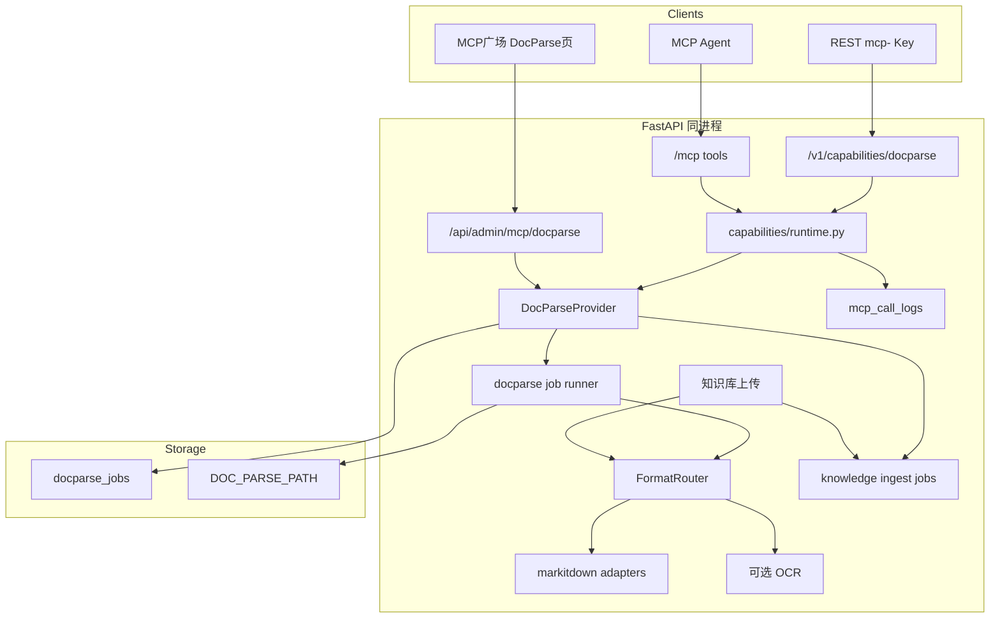

# MCP 广场文档转 Markdown

Feature Name: doc-to-markdown
Updated: 2026-09-25

## Description

在现有能力平面上新增 `docparse`：管理端和已授权 MCP Key 提交 Word、PDF、Excel、PPT、HTML，异步转换成 Markdown。同一转换器同时服务两条入口：

1. 知识库单文件上传与目录批量入库直接接受这些格式，转换后再进采集队列。
2. `docparse` 注册进现有 FastMCP，挂在已对外提供的 `/mcp`，不新开端口。

知识库目录上传今天会把 `.pdf`、`.doc`、`.docx`、`.xls`、`.xlsx`、`.ppt`、`.pptx` 当作二进制跳过（`backend/app/services/knowledge/text_files.py` 的 `BINARY_EXTENSIONS`）。本设计把这些扩展名从「直接跳过」改为「交给 DocParse 同步转换」。转换仍在采集任务创建之前完成，采集热路径只接收 Markdown 文本。

## Architecture



**决策**

| 项 | 选择 | 理由 |
|----|------|------|
| 能力标识 | `docparse` | 与 `knowledge` 并列，工具名前缀 `docparse_` |
| 执行方式 | 异步任务 | PDF/OCR 可能超过 MCP 单次调用时限 |
| 解析库 | `markitdown[pdf,docx,xlsx,pptx]` | 一个入口覆盖 OOXML、PDF、HTML；MIT |
| 旧版 Office | 可选 `libreoffice --headless` | `.doc/.xls/.ppt` 先转 OOXML，未安装则 400 |
| PDF 文本层 | `pdfminer.six`，经 markitdown | 数字 PDF 不走 OCR |
| 扫描页 | 默认占位；`DOC_PARSE_OCR=1` 时用系统 `tesseract` | OCR 是部署可选件，不做成硬依赖 |
| 存储 | SQLite 元数据 + 本地文件 | 与 skills/chroma 一样落在数据目录 |
| 鉴权 | 复用 `mcp_keys` 与 `invoke_capability` | 聊天 Key 继续 401，未授权 403 |
| 对外 MCP | 注册到现有 `FastMCP`，端点仍是 `/mcp` | `register_all_tools()` 已按 registry 动态挂工具 |
| 知识库 | 上传路径调用同一 `FormatRouter`，成功后 `create_job(kind=ingest)` | 检索、分块、向量化不改 |

## Components and Interfaces

### 1. Provider

路径：`backend/app/capabilities/docparse/`

```text
capabilities/docparse/
  provider.py     # CapabilitySpec + dispatch
  jobs.py         # 建任务、查任务、取消、重试、读结果
  convert.py      # FormatRouter 与适配器
  storage.py      # 源文件与结果落盘
```

```python
spec = CapabilitySpec(
    capability_id="docparse",
    name="文档转 Markdown",
    description="将 Word、PDF、Excel、PPT、HTML 转为 Markdown",
    version="1.0.0",
    category="document",
    status="enabled",
    admin_path="/mcp-plaza/docparse",
    icon="file-text",
)
```

在 `capabilities/registry.py` 的 `ensure_defaults()` 追加 `register(DocParseProvider())`。`runtime._normalize_error` 增加 `DocParseError`，映射方式与 `KnowledgeError` 相同。

### 1.1 对外 MCP

不新建 MCP 进程。`backend/app/mcp_server.py` 的 `register_all_tools()` 会遍历 `list_tool_defs()`，因此 Provider 注册后，三个工具自动出现在现有端点：

```text
URL: https://站点/mcp
传输: Streamable HTTP
Header: Authorization: Bearer mcp-xxx
```

`McpAuthMiddleware` 继续拒绝聊天 `sk-`。`list_tools` 只展开该 Key 白名单内的工具，未授权 `docparse` 时列表中不出现 `docparse_*`。`tools/call` 走 `invoke_tool` → `invoke_capability`，与 REST 共用 `dispatch`。

| Tool | operation | 入参 | 返回 |
|------|-----------|------|------|
| `docparse_convert` | `convert` | `filename`、`content_base64` | `job_id`、`status` |
| `docparse_job` | `job` | `job_id` | 状态、阶段、百分比、错误、warnings |
| `docparse_result` | `result` | `job_id` | `markdown`；超过 1MB 时 `truncated=true` 并给出 REST 下载路径 |

`content_base64` 解码后走与 multipart 相同的大小、扩展名和转换校验。MCP 单次入参上限 20MB（base64 膨胀后仍低于 30MB 源文件上限）。更大的文件走 REST multipart，MCP 工具说明里写明这一限制。

接入说明页 `/mcp-plaza/docs` 增加 DocParse 小节：端点、Header、三个工具名、一次转换加一次轮询的调用顺序。

REST（均需 `docparse` 授权，挂在现有 capabilities router）：

| Method | Path | 说明 |
|--------|------|------|
| POST | `/v1/capabilities/docparse/jobs` | `multipart/form-data`，字段 `file` |
| GET | `/v1/capabilities/docparse/jobs/{job_id}` | 仅任务所属 Key |
| GET | `/v1/capabilities/docparse/jobs/{job_id}/result` | JSON：`markdown`、`truncated` |
| GET | `/v1/capabilities/docparse/jobs/{job_id}/download` | `text/markdown` 附件 |

Admin（`Depends(get_current_admin)`）：

| Method | Path | 说明 |
|--------|------|------|
| POST | `/api/admin/mcp/docparse/jobs` | 上传 |
| GET | `/api/admin/mcp/docparse/jobs` | 分页列表 |
| GET | `/api/admin/mcp/docparse/jobs/{id}` | 详情 |
| POST | `/api/admin/mcp/docparse/jobs/{id}/cancel` | 取消 |
| POST | `/api/admin/mcp/docparse/jobs/{id}/retry` | 失败重试 |
| GET | `/api/admin/mcp/docparse/jobs/{id}/download` | 下载 Markdown |
| POST | `/api/admin/mcp/docparse/jobs/{id}/ingest` | body：`kb_id`，创建知识库采集任务 |

### 2. FormatRouter

按扩展名分发，统一输出 `ConvertResult(markdown, images, page_count, warnings)`。

| 扩展名 | 适配器 | 失败时 |
|--------|--------|--------|
| `.docx` `.xlsx` `.pptx` `.html` `.htm` | markitdown | `failed`，保留异常摘要 |
| `.pdf` | markitdown PDF；空文本页记入 `warnings` | 加密 PDF：`failed`，提示需密码 |
| `.doc` `.xls` `.ppt` | LibreOffice 转 OOXML 后再走上一行 | 未安装转换器：400 `converter_unavailable` |
| 其他 | 不建任务 | 400，列出允许扩展名 |

结构规则：

- Word：标题映射 `#` 到 `######`，表格用 GFM，链接保留目标 URL。
- PDF：每页前插入 `<!-- page: N -->`，文本按 pdfminer 阅读顺序拼接。
- Excel：每个 sheet 一个 `##` 标题，空表跳过并写入 warning。
- PPT：每张幻灯片一个 `##` 标题，文本框按从上到下、从左到右输出。
- 图片：抽出到 `result/media/`，Markdown 使用相对路径 `media/<name>`。

限制（设置项，默认如下）：

- `DOC_PARSE_MAX_BYTES=31457280`
- `DOC_PARSE_MAX_PDF_PAGES=200`
- `DOC_PARSE_TIMEOUT_SECONDS=180`
- `DOC_PARSE_RETENTION_DAYS=7`
- `DOC_PARSE_OCR=0`

OCR 开启且系统存在 `tesseract` 时，仅对无文本层的 PDF 页渲染后识别，语言默认 `chi_sim+eng`。识别失败的页保留占位：`[扫描页 N，OCR 失败]`。

### 3. 任务执行

复用知识库采集的后台循环模式（`services/knowledge_jobs.py`）：单 worker、`queued` 领取、`attempts` 最多 3 次。进程内状态放在 `docparse_jobs`，不新引入队列中间件。

阶段：`pending` → `stored` → `converting` → `writing` → `done`。

取消只对 `queued` 与 `running` 生效。运行中任务在适配器返回后检查取消标记，已取消则不写结果文件。

文件布局：

```text
${DOC_PARSE_PATH:-data/docparse}/{job_id}/
  source{ext}
  result.md
  media/*
```

`DOC_PARSE_PATH` 默认与 `DATABASE_PATH` 同级的 `docparse/`。每日清理沿用 MCP retention 定时任务，删除过期任务目录，行保留，`purged=1`。

### 4. 知识库直接支持

`text_files.py` 增加 `OFFICE_EXTENSIONS`：`.pdf`、`.doc`、`.docx`、`.xls`、`.xlsx`、`.ppt`、`.pptx`、`.html`、`.htm`。这些扩展名不再走「非文本文件」跳过。

知识库上传（单文件与 `upload-batch`）在 `is_text_file` 之前分流：

1. 扩展名属于 `OFFICE_EXTENSIONS`：调用 `convert_bytes(name, raw)`，同步得到 Markdown。
2. 转换成功：`create_job(kind="ingest", text=markdown, source_name=改后缀.md)`。
3. 转换失败：单文件上传返回 400；批量入库写入 `skipped`，`reason` 为转换错误摘要，继续下一个文件。
4. 其余文件仍按现有文本规则处理。

同步转换复用 `DOC_PARSE_TIMEOUT_SECONDS` 与大小、页数限制。批量入库里单个办公文档失败不回滚已创建的文本任务。

DocParse 页的「送入知识库」读取已有 `result.md`，不再二次转换。`source_name` 同样改为 `.md`，任务写入 `ingest_job_id`。知识库不存在返回 404，不改 DocParse 状态。

知识库前端上传说明改为：支持纯文本，以及 Word、PDF、Excel、PPT。采集任务列表对办公文档来源显示「已转为 Markdown」。

## Data Models

表 `docparse_jobs`：

| 列 | 类型 | 说明 |
|----|------|------|
| id | varchar(36) pk | uuid |
| mcp_key_id | int null | 协议面任务所属 Key；管理端任务为空 |
| created_by | varchar(16) | `admin` 或 `key` |
| source_name | varchar(256) | 原始文件名 |
| source_ext | varchar(16) | 小写扩展名 |
| source_size | int | 字节 |
| status | varchar(16) | queued/running/succeeded/failed/cancelled |
| stage | varchar(16) | pending/stored/converting/writing/done |
| percent | int | 0-100 |
| message | varchar(256) | 当前阶段文案 |
| warnings_json | text | 扫描页、空表等 |
| error_message | text null | 失败原因 |
| markdown_bytes | int | 结果大小 |
| page_count | int | PDF/PPT 页或幻灯片数，其他为 0 |
| ingest_job_id | int null | 送入知识库后的采集任务 |
| attempts | int | 已执行次数 |
| purged | int | 文件已清理 |
| created_at / started_at / finished_at | datetime | 时间戳 |

索引：`(status, created_at)`、`(mcp_key_id, created_at)`。

协议响应沿用能力平面错误体：

```json
{"error":{"type":"invalid_request","message":"...","code":"unsupported_type"}}
```

`type` 使用既有集合，并增加 `converter_unavailable`。

## Correctness Properties

- 同一 `job_id` 的结果只由成功路径写入一次；重试覆盖前先把状态改回 `queued`。
- 协议面查询必须同时匹配 `job_id` 与 `mcp_key_id`。
- 未授权与聊天 Key 的拒绝发生在转换之前，不落源文件。
- 扩展名校验在落盘前完成；落盘路径只使用 `job_id` 与白名单扩展名，不使用用户路径。
- Markdown 为 UTF-8。空结果且无 warning 视为失败。
- 送入知识库只接受 `succeeded` 且文件未清理的任务。
- 知识库入库的原文是转换后的 Markdown，原始办公文档字节不写入 `knowledge_chunks`。
- `tools/list` 的 `docparse_*` 可见性等于该 Key 的 `docparse` 授权；`tools/call` 再次校验授权。

## Error Handling

| 场景 | 状态 | 对用户 |
|------|------|--------|
| 扩展名不支持、超大小、超页数 | 不建任务，400 | 说明限制 |
| 旧版 Office 且无 LibreOffice | 不建任务，400 | `converter_unavailable` |
| 加密或损坏文件 | `failed` | 保存解析器摘要，可重试 |
| 转换超时 | `failed` | 提示超时秒数 |
| OCR 未启用的扫描页 | `succeeded` + warning | 页内占位，不把整份任务打失败 |
| 查他人任务 | 404 | 不泄露存在性 |
| 送入时知识库不存在 | 404 | 不改 DocParse 状态 |

## Test Strategy

在 `backend/` 下执行：`PYTHONPATH=. python3 -m pytest tests/test_docparse.py`。

- 用最小 `.docx`（标题、列表、表格、链接）、单表 `.xlsx`、两页文本 PDF fixture 断言 Markdown 结构。
- 伪造 201 页 PDF 头或在路由层注入页数，断言 400。
- 未授权 Key 403，`sk-` 401，跨 Key 查任务 404。
- mock 转换器抛错，断言 `failed` 与重试后可再次进入 `queued`。
- 成功任务 `ingest` 后，知识库采集队列出现对应 `source_name`。
- 知识库单文件与批量上传提交 `.docx` fixture，采集任务原文包含转换出的标题，来源名以 `.md` 结尾。
- 批量上传中一份损坏 PDF 与一份 `.txt` 同时提交：文本任务创建成功，PDF 出现在 `skipped`。
- 已授权 Key 对 `/mcp` 发 `tools/list` 能看到 `docparse_convert`；未授权 Key 看不到。`tools/call` 提交同一 fixture 后，`docparse_result` 与 REST 结果一致。
- 前端：`cd frontend && npx tsc -b`。页面沿用广场卡片进应用页，PC 双栏（列表+预览），窄屏上下堆叠。

## References

[^1]: (Filename#L19) - 知识库当前跳过的二进制扩展名 `backend/app/services/knowledge/text_files.py`
[^2]: (Filename#L10) - 能力规格与 dispatch 契约 `backend/app/capabilities/base.py`
[^3]: (Filename#L161) - 现有对外 MCP 挂载 `backend/app/main.py`
[^4]: (Website) - markitdown 支持的文件类型 [microsoft/markitdown](https://github.com/microsoft/markitdown)
