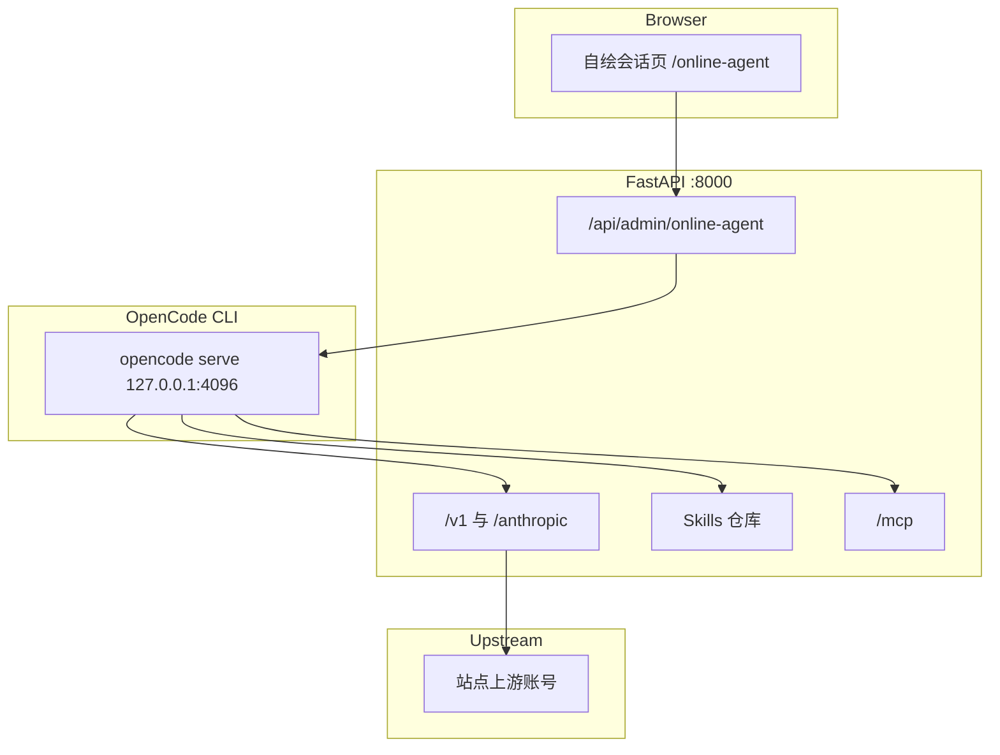

# 在线 Agent（OpenCode Web）

Feature Name: online-agent
Updated: 2026-09-25

## Description

管理后台新增「在线 Agent」：不自研 Agent 循环，也不嵌入 OpenCode 页面。站点用 CLI 拉起 `opencode serve`，后端只做进程管理和 API 转发，前端按事件流自己渲染会话、工具调用和模型切换。模型请求打回本站网关，从而使用站点已配置的全部上游账号和已启用模型。站点 Skills 与 MCP 广场能力可按开关注入，默认都关闭。

现有 `/agents` 是「网关代理」（本机中继），名称和路由保持不变。新入口使用 `/online-agent`。

## Tab 取舍

移动端底部仍保持 5 项。在线 Agent 放正中，作为主操作。其余四项按使用频率保留：看状态、配账号、发 Key、查调用。Skills、MCP、测速、榜单、语音房、网关代理留在侧栏，PC 不受影响。

| 位置 | 现 Tab | 新 Tab | 理由 |
|------|--------|--------|------|
| 1 | 概览 `/` | 概览 `/` | 登录后的状态首页 |
| 2 | 账号 `/accounts` | 账号 `/accounts` | Agent 要用的上游从这里来 |
| 3 | Key `/keys` | 在线 Agent `/online-agent` | 主操作放到中间 |
| 4 | Skills `/skills` | Key `/keys` | 对外发 Key 仍是高频管理动作 |
| 5 | 记录 `/logs` | 记录 `/logs` | 核对 Agent 和客户端调用 |

PC 侧栏在「API Key」前增加「在线 Agent」。底部 Tab 仅 `lg:hidden`，PC 继续用侧栏。

## Architecture



浏览器不访问 OpenCode 端口，也不加载 OpenCode 页面。`opencode serve` 只监听 `127.0.0.1:4096`。前端请求打到站点的 `/api/admin/online-agent/*`，后端再调用本机 OpenCode HTTP API，并把 `GET /event` 的 SSE 转成管理端可订阅的事件流。

## Components and Interfaces

### 1. 进程

Docker 运行时镜像增加 Node.js 和 git，并用 `npm install -g opencode-ai` 安装 CLI。数据目录使用 `/data/opencode`，随现有 `./data` 卷持久化。git 用于后续在会话目录里克隆代码，镜像构建阶段不克隆任何仓库。

启动时不自动拉起。管理员第一次打开页面，或调用 `POST /api/admin/online-agent/start` 时，后端执行：

```text
opencode serve --hostname 127.0.0.1 --port 4096
```

这是无界面服务，不使用 `opencode web`，前端也不挂 iframe。整个站点同一时间只跑一个 `opencode serve`。发消息、切换模型、开关 Skill 都打到这个进程上的既有会话，不为每条消息新开进程或新开实例。发送使用 OpenCode 的异步 prompt：后端收到后立即返回，会话在 serve 进程里继续执行。浏览器关闭、刷新或事件流断开，都不调用 abort，也不停止 serve。管理员重新打开页面后，读取 `last_session_id` 和 `selected_model`，重连事件流并拉取该会话消息，回到离开前的会话、模型开关和已完成内容。该会话已不存在时，打开会话列表中的最近一条。正在执行的任务不重新发送，只补齐当前消息。Skills 与 MCP 开关从 `online_agent_toggles` 恢复。只有「重启 Agent」、站点进程退出或容器退出才会中断正在跑的任务。配置写入 `/data/opencode/opencode.json`。进程异常退出后，页面显示离线，并提供重新启动。站点进程退出时终止 OpenCode 子进程。

每个会话有独立工作目录：`/data/opencode/workspaces/<session_id>`。创建会话时只建空目录，不执行 `git init`，也不克隆仓库。该目录作为这次会话的 `directory` 传给 OpenCode。用户需要拉代码时，由 OpenCode 在这个目录里自己执行 clone、pull 或其他 git 操作。会话之间不共享工作区。重置对话会新建空目录给新会话，旧目录保留到管理员删除该会话。删除会话时同时删除对应目录。

首次用户消息发送前，后端用当前选中的站点模型额外发起一次短请求，只根据这条消息生成不超过 20 个字的会话标题，再调用 OpenCode `PATCH /session/:id` 写入。标题生成失败时保留「新会话」，不阻塞正式对话。同一会话只生成一次标题。

### 2. 账号与模型

不把上游密钥写进 OpenCode。网关为在线 Agent 单独签发一把内部 `sk-`，绑定全部可用上游账号。OpenCode 只配置一个自定义 provider：

```json
{
  "provider": {
    "gateway": {
      "npm": "@ai-sdk/openai-compatible",
      "name": "站点模型",
      "options": {
        "baseURL": "http://127.0.0.1:8000/v1",
        "apiKey": "<internal sk->"
      }
    }
  }
}
```

模型列表来自这些账号已启用的模型。模型 ID 使用站点现有前缀，避免不同账号同名冲突。管理员在账号页增删账号或开关模型后，调用 `POST /api/admin/online-agent/sync` 刷新 provider 配置。前端模型下拉读取 `GET /api/admin/online-agent/models`，发送消息时把所选 `{providerID, modelID}` 放进 prompt body。切换只影响后续消息。

内部 Key 只允许从 `127.0.0.1` 调用。管理端可轮换，轮换后同步写回 OpenCode 配置。

### 3. Skills

站点 Skill 仍以目录形式存放，根目录有 `SKILL.md`。在线 Agent 设置里每个 Skill 一个开关，默认关闭。

开启时，把该 Skill 目录链接到 `/data/opencode/skills/<name>`，并由 OpenCode 全局配置读取。关闭时移除链接，不删除站点仓库中的原目录。Skill 不放进某个会话目录，避免换会话后丢失开关。OpenCode 按自身 Skill 发现规则加载，站点不解析 Skill 指令。

### 4. MCP

在线 Agent 设置列出 MCP 广场已启用能力。每项一个开关，默认关闭。开启时在 `opencode.json` 写入远程 MCP：

```json
{
  "mcp": {
    "gateway": {
      "type": "remote",
      "url": "http://127.0.0.1:8000/mcp",
      "enabled": true,
      "headers": {
        "Authorization": "Bearer <mcp-key>"
      }
    }
  }
}
```

这把 `mcp-` Key 由在线 Agent 专用，白名单等于当前打开的能力。全部关闭时 `enabled` 为 false，或移除该 MCP 项。聊天 `sk-` 不用于 `/mcp`。

### 5. 前端

页面自己渲染，不嵌入 OpenCode UI。交互参考编程 Agent 工作台：会话在左，对话在中，输入固定在对话底部，工具调用作为消息里的步骤，Skills/MCP 收在右侧抽屉。

- PC：左栏会话列表，中间消息流，右栏默认收起。顶栏只保留状态、当前会话标题和少量图标操作。
- 窄屏：会话列表改为顶部抽屉，右栏改为全屏抽屉。输入框留在消息区底部，避开底部 Tab。
- 用户消息靠右，Agent 消息靠左。工具调用折叠在对应消息下，不单独占一整块设置区。
- 模型选择放在输入框下方，和发送按钮同一行。Enter 发送，Shift+Enter 换行。

事件来自 `GET /api/admin/online-agent/events`，后端转发 OpenCode `GET /event`。发送走 `POST /api/admin/online-agent/sessions/{id}/prompt`，body 只含本站需要的文本、模型 ID 和附件引用，由后端转换成 OpenCode 的 `parts`。历史消息用 `GET /session/:id/message` 回填，刷新页面后不丢已完成内容。

未启动时只显示状态和启动按钮，不建立事件流。

### 6. 管理 API

均要求管理员登录。

| Method | Path | 说明 |
|--------|------|------|
| GET | `/api/admin/online-agent` | 状态、账号数、模型数、Skills/MCP 开关 |
| POST | `/api/admin/online-agent/start` | 写配置并启动 |
| POST | `/api/admin/online-agent/stop` | 停止进程 |
| POST | `/api/admin/online-agent/sync` | 按当前账号、模型、开关重写配置 |
| PUT | `/api/admin/online-agent/skills` | body：`{skill_id, enabled}` |
| PUT | `/api/admin/online-agent/mcp` | body：`{capability_id, enabled}` |
| GET | `/api/admin/online-agent/models` | 当前可切换的站点模型 |
| GET | `/api/admin/online-agent/sessions` | 转发 OpenCode session list |
| POST | `/api/admin/online-agent/sessions` | 创建会话和独立工作目录 |
| GET | `/api/admin/online-agent/sessions/{id}/messages` | 回填消息 |
| POST | `/api/admin/online-agent/sessions/{id}/prompt` | 异步发送，立即返回 |
| GET | `/api/admin/online-agent/events` | 管理员登录后订阅，后端转发 OpenCode SSE |
| POST | `/api/admin/online-agent/restart` | 停掉当前 `opencode serve`，沿用已落盘配置重新拉起 |
| POST | `/api/admin/online-agent/sessions/{id}/compact` | 调用 OpenCode compact，用摘要替换当前会话的可压缩历史 |
| POST | `/api/admin/online-agent/sessions/{id}/reset` | 中止进行中的回复，删除当前会话并创建一个同标题的空会话 |

## Data Models

表 `online_agent_settings`：

| 列 | 类型 | 说明 |
|----|------|------|
| id | int pk | 固定单行 |
| status | varchar(16) | stopped / starting / running / failed |
| internal_key_id | int null | 绑定全部账号的网关 Key |
| mcp_key_id | int null | MCP 专用 Key |
| last_error | text null | 最近一次启动或同步错误 |
| selected_model | varchar(256) null | 上次选中的公开模型 ID |
| last_session_id | varchar(128) null | 上次打开的 OpenCode 会话 |
| updated_at | datetime | 最近同步时间 |

表 `online_agent_toggles`：

| 列 | 类型 | 说明 |
|----|------|------|
| id | int pk | |
| kind | varchar(16) | skill / mcp |
| target_id | varchar(64) | Skill ID 或 capability_id |
| enabled | int | 默认 0 |

OpenCode 的会话历史留在 `/data/opencode`，不复制进 SQLite。工作目录与会话的对应关系记在 `online_agent_sessions`。

表 `online_agent_sessions`：

| 列 | 类型 | 说明 |
|----|------|------|
| session_id | varchar(128) pk | OpenCode 会话 ID |
| workspace_path | varchar(512) | `/data/opencode/workspaces/<session_id>` |
| title_generated | int | 1 表示已经用首条消息生成过标题 |
| created_at | datetime | 创建时间 |

三个会话级操作的边界：

- **压缩会话**：只处理当前选中的会话。后端转发 OpenCode 的 compact。完成后重新拉取该会话消息，前端用返回结果替换本地消息列表。压缩期间输入框不可发送。没有选中会话时按钮不可用。
- **重启 Agent**：停止并重新执行 `opencode serve`，不删除 `/data/opencode` 里的会话。重启完成后前端重连事件流，并重新加载会话列表。进行中的回复会中断，已完成消息保留。
- **重置对话**：只作用于当前会话。先调用 abort，再删除该会话，最后创建一条新的空会话并选中它。其他会话不动。重置前前端弹出确认。

## Correctness Properties

- 未开启的 Skill 不会出现在 OpenCode workspace 的 skills 目录。
- 未开启的 MCP 能力不会出现在专用 MCP Key 白名单。
- OpenCode 配置中的 base URL 指向本机网关，不指向任何上游地址。
- 上游密钥只存在于现有账号表，不写入 `opencode.json`。
- 内部聊天 Key 从非本机地址调用时返回 401。
- 底部 Tab 在小于 `lg` 的宽度为 5 项，第三项是 `/online-agent`。
- 重置对话只删除被选中的会话，会话列表中的其他 ID 保持不变。
- 重启 Agent 后，重启前已经完成的会话仍能通过 session list 读到，且工作目录路径不变。
- 两个会话的 `workspace_path` 不相同。
- 标题生成只在该会话的第一条用户消息发生一次。

## Error Handling

| 场景 | 行为 |
|------|------|
| 未安装 opencode | 状态 `failed`，提示安装命令，页面不挂 iframe |
| 端口被占用 | 停止旧的站点托管进程后重试一次，仍失败则显示端口错误 |
| 没有可用账号或模型 | 允许启动，模型列表为空，顶栏提示先在账号页启用模型 |
| 同步时 OpenCode 未就绪 | 配置仍落盘，进程恢复后下次启动读取 |
| 事件流中断 | 前端提示已断开，并提供重连；重连后拉取当前会话消息补齐 |
| OpenCode 返回工具错误 | 消息区显示工具名和错误文本，会话保持可继续发送 |
| Skill 原目录缺失 | 该开关保存失败，返回 404 |
| 压缩时没有选中会话 | 返回 400，前端按钮保持不可用 |
| 压缩或重置时 OpenCode 离线 | 返回 503，不创建新会话 |
| 重启时端口仍被占用 | 等待旧进程退出后重试一次，仍失败则保持 `failed` |

## Test Strategy

- 配置生成测试：给定两个账号和三个模型，断言 provider 只有 gateway，模型 ID 带站点前缀。
- 开关测试：默认查询结果全部关闭；打开一个 Skill 后仅该目录被链接；打开一个 MCP 能力后专用 Key 白名单只含该能力。
- 鉴权测试：内部 Key 从测试客户端的非本机地址调用 `/v1/models` 返回 401。
- 前端：`npx tsc -b`。Tab 顺序用常量断言第三项为 `/online-agent`。消息渲染测试覆盖文本 part 和工具 part，不加载 OpenCode 静态资源。
- 不在单元测试中真实启动 OpenCode 或拉取上游模型。用假的 serve 响应断言转发路径、prompt body、compact 路径，以及 reset 会先 abort、再 delete、再 create。

## Docker

运行阶段从仅 Python 镜像改为安装 Node.js 20+ 和 git，再全局安装 `opencode-ai`。`/data/opencode` 位于现有数据卷。镜像构建不启动 `opencode serve`，也不克隆仓库。

## References

[^1]: (Filename#L28) - 当前移动端 Tab `frontend/src/components/Layout.tsx`
[^2]: (Filename#L14) - 现有 `/agents` 是网关代理，不是对话 Agent `frontend/src/components/Layout.tsx`
[^3]: (Website) - 无界面服务与事件流 [OpenCode Server](https://opencode.ai/docs/server)
[^4]: (Website) - 远程 MCP 配置 [OpenCode MCP servers](https://opencode.ai/docs/mcp-servers)
